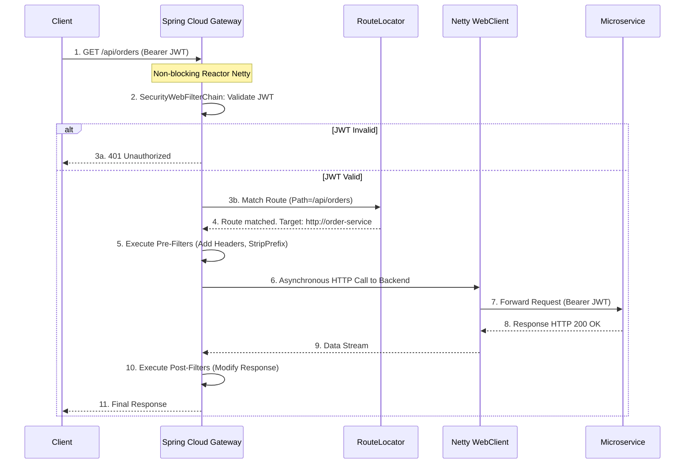

> [!NOTE]
> **Category:** Theory
> **Goal:** Hiểu sâu về vai trò của Spring Cloud Gateway trong kiến trúc Microservices, cách nó tương tác với Keycloak ở vị trí tiền đồn (Edge Service) và cơ chế Non-blocking I/O.

## 1. Lý thuyết chuyên sâu (Detailed Theory)
Trong kiến trúc Microservices, Client (Web, Mobile) hiếm khi gọi trực tiếp từng dịch vụ Backend (như User Service, Order Service). Thay vào đó, chúng kết nối tới một **API Gateway** đóng vai trò là điểm truy cập duy nhất (Single Entry Point). **Spring Cloud Gateway (SCG)** là một giải pháp API Gateway hiện đại xây dựng trên Spring WebFlux, Project Reactor và Netty, hỗ trợ kiến trúc Non-blocking (Không chặn luồng).

Khi tích hợp SCG với **Keycloak**, Gateway thường đảm nhận vai trò **OAuth2 Resource Server** hoặc **OAuth2 Client (BFF - Backend for Frontend)**. Nó giải quyết các bài toán sau:
- **Routing:** Định tuyến Request đến đúng Microservice dựa trên URL, Header.
- **Authentication/Authorization (Tiền đồn):** Xác thực Token JWT từ Keycloak trước khi cho phép Request đi sâu vào hệ thống nội bộ.
- **Cross-Cutting Concerns:** Xử lý CORS, Rate Limiting, Logging, và Retry tập trung tại một nơi thay vì lặp lại code ở hàng chục Microservice.

## 2. Luồng nội bộ & Cơ chế cấp thấp (Internal Workflow & Low-level Mechanisms)
Cách Spring Cloud Gateway xử lý một Request chứa JWT và định tuyến đến Backend:



**Step-by-step Giải thích:**
1. Client gửi Request kèm Token đến SCG. Netty tiếp nhận trên một Event Loop Thread.
2. Tầng Security (WebFlux) kiểm tra chữ ký Token (gọi JWKS của Keycloak nếu cần).
3. SCG tìm kiếm Route (tuyến đường) khớp với URL `/api/orders`.
4. SCG xác định đích đến là `http://order-service`.
5. Pre-filters thực thi (ví dụ: `StripPrefix` để xóa `/api` ra khỏi URL gốc).
6. SCG sử dụng WebClient phi đồng bộ (Asynchronous) để gọi Backend. Luồng xử lý không bị chặn (Thread is free).
7. Khi Backend xử lý xong và trả kết quả về, Event Loop được đánh thức.
8. SCG chạy các Post-filters (ví dụ: thêm Header CORS) và trả Response cho Client.

## 3. Thực hành tốt nhất & Bảo mật (Best Practices & Security)

> [!IMPORTANT]
> **Không chặn luồng (No Blocking):** SCG chạy trên nền tảng WebFlux. TUYỆT ĐỐI KHÔNG sử dụng các thư viện chặn luồng (như `RestTemplate`, JDBC, `Thread.sleep`) trong Gateway Filters. Nếu làm vậy, toàn bộ Gateway sẽ bị sập (Resource Exhaustion) khi có tải cao. Phải dùng `WebClient` và R2DBC.

> [!WARNING]
> **Tránh xử lý Logic kinh doanh tại Gateway:** Gateway chỉ nên làm nhiệm vụ định tuyến và bảo mật chung. Không để Gateway gọi cơ sở dữ liệu hay tổng hợp dữ liệu (Data Aggregation) phức tạp, điều đó phá vỡ nguyên lý Microservices.

- **Tích hợp Keycloak làm Resource Server:** Gateway nên được cấu hình là `oauth2ResourceServer().jwt()`. Nó chỉ cần biết Token có hợp lệ không (Stateless Verification) dựa trên Public Key từ Keycloak.
- **Sử dụng BFF Pattern cho SPA:** Nếu Client là ứng dụng React/Angular, Gateway nên đóng vai trò là `oauth2Login()`, lưu Token an toàn ở phía Server (Redis) và cấp phát Cookie mã hóa cho SPA, tránh rò rỉ JWT qua trình duyệt (XSS Attack).

## 4. Cấu hình minh họa thực tế (Configuration Examples)

**Cấu hình application.yml (Routing & Security):**
```yaml
spring:
  cloud:
    gateway:
      routes:
        - id: order-service-route
          uri: lb://order-service   # Load balancer dựa trên Eureka/Consul
          predicates:
            - Path=/api/orders/**
          filters:
            - StripPrefix=1         # Cắt '/api' -> gọi Backend: '/orders'
            - TokenRelay=           # Tự động forward JWT cho Backend
  security:
    oauth2:
      resourceserver:
        jwt:
          issuer-uri: https://auth.domain.com/realms/myrealm
```

## 5. Trường hợp ngoại lệ (Edge Cases)
- **Timeouts do Backend chậm:** Nếu Backend phản hồi quá chậm, kết nối ở Gateway sẽ bị giữ lại. Cần cấu hình `Response Timeout` (ví dụ 3 giây) và `Circuit Breaker` (Resilience4j) để Gateway ngắt kết nối ngay lập tức và trả về mã lỗi 504 (Gateway Timeout), tránh làm tắc nghẽn tài nguyên của Gateway.
- **Payload Request quá lớn:** Mặc định Netty giới hạn kích thước Request. Nếu Upload file trực tiếp qua Gateway, bạn có thể gặp lỗi `Payload Too Large`. Cấu hình `spring.codec.max-in-memory-size` hoặc định tuyến thẳng luồng Upload bỏ qua Gateway nếu không cần thiết.

## 6. Câu hỏi Phỏng vấn (Interview Questions)
1. **Junior:** API Gateway khác gì so với Load Balancer (như Nginx)?
   - *Đáp án:* Cả hai đều định tuyến, nhưng API Gateway xử lý logic ở tầng ứng dụng (L7) phức tạp hơn như: xác thực OAuth2/JWT, Rate Limiting theo User, và biến đổi Payload (Request/Response Modification), thường được code bằng ngôn ngữ linh hoạt như Java (Spring). Nginx chủ yếu làm Load Balancing, TLS Termination và Static Routing.
2. **Junior:** Tại sao SCG lại sử dụng Spring WebFlux thay vì Spring MVC?
   - *Đáp án:* Để hỗ trợ kiến trúc Non-blocking I/O. Với MVC (Tomcat), mỗi Request chiếm dụng 1 luồng (Thread), gây tốn RAM và thắt cổ chai khi gọi Backend bị trễ. WebFlux (Netty) sử dụng Event Loop, một vài luồng có thể xử lý hàng chục ngàn kết nối đồng thời.
3. **Senior:** Hậu quả của việc gọi `RestTemplate.getForObject(...)` bên trong một Custom Gateway Filter là gì?
   - *Đáp án:* `RestTemplate` là I/O chặn luồng (blocking). Việc gọi nó sẽ khóa chặt Event Loop Thread của Netty. Khi có nhiều request, toàn bộ Event Loop sẽ cạn kiệt, khiến Gateway treo cứng (Hung) dù CPU/RAM vẫn trống. Thay vào đó phải dùng `WebClient`.
4. **Senior:** BFF (Backend for Frontend) Pattern được cài đặt trên Spring Cloud Gateway kết hợp với Keycloak như thế nào để bảo vệ ứng dụng React/Vue?
   - *Đáp án:* Cấu hình SCG làm `oauth2Client/oauth2Login` thay vì `resourceServer`. Khi user đăng nhập, SCG làm luồng Authorization Code Flow với Keycloak. Keycloak trả Token cho SCG. SCG lưu Token vào Server-side Session (Redis) và gửi một HTTPOnly Cookie về cho React. React gửi Cookie lên SCG, SCG lấy lại Token từ Session và dùng `TokenRelay` Filter chèn JWT vào Header trước khi chuyển cho Backend. Cách này loại bỏ hoàn toàn JWT khỏi trình duyệt, chống XSS.
5. **Senior:** Làm thế nào để cấu hình SCG không lấy Public Key từ Keycloak mỗi lần có Request đến?
   - *Đáp án:* Mặc định Spring Security đã cache Public Key (JWKS) trong bộ nhớ dựa trên `issuer-uri`. Ta chỉ cần đảm bảo Gateway có kết nối mạng ổn định tới Keycloak lúc khởi động. Nếu Keycloak xoay vòng khóa (Key Rotation), SCG sẽ tự động re-fetch khi thấy thư viện Nimbus báo `kid` (Key ID) không tồn tại trong cache.

## 7. Tài liệu tham khảo (References)
- [Spring Cloud Gateway Official Documentation](https://spring.io/projects/spring-cloud-gateway)
- [Spring Security WebFlux](https://docs.spring.io/spring-security/reference/reactive/configuration/webflux.html)
- [OAuth 2.0 Best Current Practice for Browser-Based Apps (RFC 8252)](https://datatracker.ietf.org/doc/html/rfc8252)
