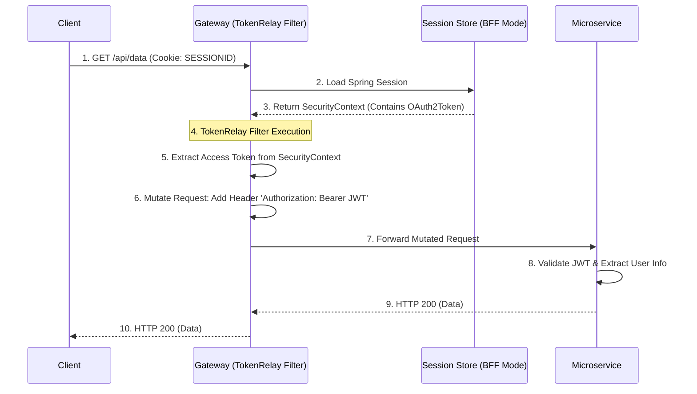

> [!NOTE]
> **Category:** Theory
> **Goal:** Hiểu sâu về cơ chế Token Relay (Chuyển tiếp Token) trong Spring Cloud Gateway, cách nó duy trì ngữ cảnh bảo mật giữa các Microservices và nguyên lý hoạt động nội bộ.

## 1. Lý thuyết chuyên sâu (Detailed Theory)
Trong kiến trúc Microservices phân tán, một chuỗi nghiệp vụ thường yêu cầu nhiều dịch vụ tương tác với nhau (Ví dụ: Gateway -> Order Service -> Inventory Service). Khi Client gửi một Request chứa **Access Token (JWT)**, làm thế nào để các dịch vụ đứng sau Gateway biết được "Ai đang thực hiện hành động này?" để áp dụng quyền hạn (Authorization)?

**Token Relay (Chuyển tiếp Token)** là cơ chế tự động trích xuất Token từ Request đầu vào tại Gateway (hoặc BFF), và đính kèm (inject) lại Token đó vào Header (`Authorization: Bearer <token>`) của Request chuẩn bị được gửi đi (Forward/Proxy) tới các dịch vụ Downstream.

Nhờ Token Relay, mọi Microservice trong chuỗi đều nhận được cùng một JWT chứa các Claims (User ID, Roles, Email), đảm bảo **Security Context (Ngữ cảnh bảo mật)** được duy trì xuyên suốt mà không yêu cầu Client phải gửi trực tiếp token cho từng dịch vụ riêng lẻ.

## 2. Luồng nội bộ & Cơ chế cấp thấp (Internal Workflow & Low-level Mechanisms)
Trong Spring Cloud Gateway, cơ chế này được thực hiện thông qua `TokenRelayGatewayFilterFactory`.



**Step-by-step Giải thích (Trong ngữ cảnh BFF/OAuth2 Login):**
1. Client (SPA) gửi Request kèm theo Session Cookie. (Nếu là Mobile app, Client gửi thẳng JWT, lúc này SCG ở chế độ Resource Server, Filter chỉ việc pass-through header).
2. SCG đọc Session từ bộ nhớ lưu trữ tập trung (như Redis).
3. Trong Session chứa `SecurityContext`, bên trong lưu trữ `OAuth2AuthorizedClient` (chứa Access Token và Refresh Token).
4. `TokenRelay` Filter được kích hoạt cho tuyến đường tương ứng.
5. Filter trích xuất Access Token (chuỗi JWT). Nếu Token hết hạn, nó có thể tự động gọi Keycloak lấy Token mới bằng Refresh Token.
6. Filter chỉnh sửa (Mutate) đối tượng Request gửi đi, chèn thêm Header `Authorization: Bearer <Access_Token>`.
7. Gateway gọi Backend với Request mới đã chứa JWT.
8. Backend (là một Resource Server) xác minh chữ ký Token và cấp quyền thực thi logic.

## 3. Thực hành tốt nhất & Bảo mật (Best Practices & Security)

> [!IMPORTANT]
> **Bảo vệ Token trên đường truyền:** Token Relay đồng nghĩa với việc JWT chứa thông tin nhạy cảm được truyền đi giữa các Microservices nội bộ. Bạn **BẮT BUỘC** phải cấu hình mTLS (Mutual TLS) hoặc kết nối HTTPS trong mạng nội bộ (Internal VPC) để tránh bị nghe lén (Sniffing) bằng các cuộc tấn công MITM.

> [!WARNING]
> **Lỗ hổng Token Bleeding (Rò rỉ Token):** Nếu bạn cấu hình Gateway định tuyến một Request ra một dịch vụ bên ngoài (External 3rd-party API), TUYỆT ĐỐI KHÔNG được đính kèm `TokenRelay` filter. Nếu làm vậy, bạn sẽ rò rỉ (leak) Access Token của người dùng cho bên thứ ba. Chỉ Relay token vào các dịch vụ nội bộ do bạn kiểm soát.

- **Tự động làm mới Token (Auto-Refresh):** Khi sử dụng Token Relay trong mô hình `oauth2Login` (BFF), Spring Security tự động xử lý Refresh Token. Nếu Access Token hết hạn, Gateway sẽ ngầm liên hệ với Keycloak lấy token mới, cập nhật Session và chuyển tiếp token mới. Đảm bảo Scope `offline_access` hoặc tính năng Refresh Token được bật trên Keycloak.

## 4. Cấu hình minh họa thực tế (Configuration Examples)

**Cấu hình Token Relay Filter trong Spring Cloud Gateway (`application.yml`):**
```yaml
spring:
  cloud:
    gateway:
      routes:
        - id: inventory-service
          uri: http://inventory-backend:8081
          predicates:
            - Path=/api/inventory/**
          filters:
            # Chỉ định TokenRelay filter cho route này
            - TokenRelay=
            - RemoveRequestHeader=Cookie # Xóa Cookie để tránh gửi rác sang Backend
```

**Mã Java tương đương (Nếu dùng Fluent API):**
```java
@Bean
public RouteLocator customRouteLocator(RouteLocatorBuilder builder) {
    return builder.routes()
        .route("inventory-service", r -> r.path("/api/inventory/**")
            .filters(f -> f.tokenRelay() // Kích hoạt Token Relay
                           .removeRequestHeader("Cookie"))
            .uri("http://inventory-backend:8081"))
        .build();
}
```

## 5. Trường hợp ngoại lệ (Edge Cases)
- **Token quá lớn gây lỗi 431 Request Header Fields Too Large:** Nếu bạn gán quá nhiều thông tin (Custom Claims, Role mapper) vào Token trên Keycloak, chuỗi JWT có thể lớn hơn 8KB. Khi Gateway đính header này gửi cho Backend (thường dùng Tomcat), Tomcat sẽ chặn lại và ném lỗi 431. Giải pháp: Tăng kích thước `max-http-header-size` trên Backend, hoặc dùng Opaque Token.
- **Mất Token khi chuyển qua WebClient trung gian:** Nếu Microservice A gọi Microservice B (không qua Gateway), Token sẽ bị rớt. Lúc này bạn phải cấu hình `FeignClient` interceptor hoặc `WebClient` filter tại Service A để tiếp tục *Relay* token từ Header của request đến Header của outbound request.

## 6. Câu hỏi Phỏng vấn (Interview Questions)
1. **Junior:** Token Relay giải quyết vấn đề gì trong Microservices?
   - *Đáp án:* Nó giúp tự động truyền Access Token từ Gateway vào các Microservices nội bộ, để các service này nhận diện được người dùng và thực hiện Authorization mà không bắt Client phải biết kiến trúc bên trong.
2. **Junior:** Cấu hình `TokenRelay=` trong Spring Cloud Gateway có ý nghĩa gì?
   - *Đáp án:* Đó là khai báo bộ lọc để Gateway lấy Token từ Security Context (hoặc Session) và thêm nó vào header `Authorization: Bearer` trước khi định tuyến Request đến dịch vụ đích.
3. **Senior:** Chuyện gì xảy ra nếu Access Token hết hạn khi Gateway chuẩn bị thực hiện TokenRelay (trong mô hình BFF)?
   - *Đáp án:* Spring Security (nếu cấu hình Client/Login mode) sẽ tự động kiểm tra thời gian hết hạn (Expiration). Nếu sắp hết hạn, nó sẽ dùng Refresh Token lưu trong `OAuth2AuthorizedClient` để gọi Keycloak lấy Access Token mới, cập nhật lại Security Context, và sau đó mới thực hiện Relay token mới. Client không hề hay biết quá trình này.
4. **Senior:** Tại sao chúng ta thường thêm Filter `RemoveRequestHeader=Cookie` đi kèm với `TokenRelay`?
   - *Đáp án:* Trong mô hình Backend For Frontend (BFF), Client gửi Session Cookie lên Gateway. Gateway dùng Cookie này tra cứu Token và dùng TokenRelay chèn JWT vào Header. Việc gửi cả Cookie chứa Session ID khổng lồ xuống Backend nội bộ (vốn là Stateless Resource Server, không dùng Cookie) là lãng phí băng thông và có nguy cơ bảo mật, nên ta cắt bỏ Cookie trước khi chuyển tiếp.
5. **Senior:** Làm thế nào để lan truyền (Propagate) JWT từ Service A sang Service B qua OpenFeign?
   - *Đáp án:* Tạo một bean `RequestInterceptor` cho OpenFeign. Interceptor này sử dụng `SecurityContextHolder` để trích xuất Token hiện tại từ luồng đang chạy, sau đó gọi phương thức `template.header("Authorization", "Bearer " + token)` để nhúng token vào Request gửi tới Service B.

## 7. Tài liệu tham khảo (References)
- [Spring Cloud Gateway Token Relay Documentation](https://docs.spring.io/spring-cloud-gateway/docs/current/reference/html/#the-tokenrelay-gatewayfilter-factory)
- [OAuth 2.0 Token Exchange (RFC 8693) - Khái niệm liên quan](https://datatracker.ietf.org/doc/html/rfc8693)
