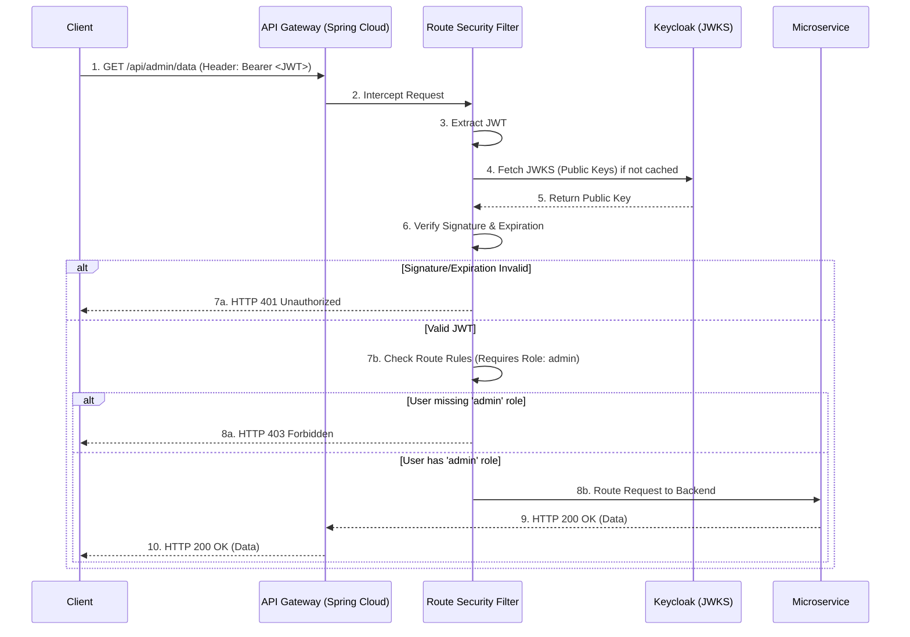

> [!NOTE]
> **Category:** Theory
> **Goal:** Tìm hiểu cách bảo mật các tuyến đường (Route Security) trong API Gateway, kiểm soát truy cập dựa trên Role/Scope và cách thức chặn các yêu cầu không hợp lệ ngay tại mép mạng (Edge).

## 1. Lý thuyết chuyên sâu (Detailed Theory)
Trong kiến trúc Microservices, **API Gateway** đóng vai trò là cửa ngõ duy nhất (Single Entry Point) cho tất cả các Request từ Client. Việc áp dụng **Route Security** tại Gateway giúp chúng ta thiết lập một lớp khiên bảo vệ, từ chối các truy cập trái phép ngay từ "vòng gửi xe" trước khi chúng chạm đến các dịch vụ Backend bên trong.

Bảo mật tuyến đường (Route Security) tại Gateway bao gồm:
1. **Xác thực (Authentication):** Kiểm tra xem Request có chứa Access Token (JWT) hợp lệ hay không.
2. **Phân quyền (Authorization - RBAC/ABAC):** Đảm bảo Client hoặc User sở hữu các Role, Scope, hoặc Claims cần thiết để truy cập một URI cụ thể (ví dụ: chỉ Role `admin` mới được gọi `/api/users/**`).
3. **Bảo vệ chống lạm dụng (Rate Limiting & WAF):** Ngăn chặn tấn công DDoS, quét tự động (Scanning) bằng cách giới hạn số lượng Request trên một tuyến đường theo IP hoặc User ID.

So với việc để từng Microservice tự kiểm tra quyền, việc áp dụng Route Security tại Gateway giúp tập trung hóa (Centralize) cấu hình bảo mật, giảm mã nguồn lặp lại (Boilerplate) ở Backend và tăng hiệu năng (từ chối sớm các Request xấu).

## 2. Luồng nội bộ & Cơ chế cấp thấp (Internal Workflow & Low-level Mechanisms)
Sử dụng Spring Cloud Gateway tích hợp với bộ lọc (Filter) bảo mật OAuth2 Resource Server.



**Step-by-step Giải thích:**
1. Client gửi một Request kèm theo Access Token (JWT) vào một Endpoint thông qua Gateway.
2. Spring Cloud Security tại Gateway đánh chặn (Intercept) Request này.
3. Bộ lọc kiểm tra JWT trích xuất chuỗi Token từ header `Authorization`.
4. Gateway sử dụng Public Key lấy từ Endpoint `/certs` của Keycloak để xác minh chữ ký mã hóa của Token.
5. Sau khi xác thực Token hợp lệ (chưa hết hạn, đúng Issuer), Gateway trích xuất các Claims (như `roles`, `scopes`).
6. Gateway kiểm tra các quy tắc Route Security đã định nghĩa (ví dụ: AntMatcher `/api/admin/**` yêu cầu `hasRole('ADMIN')`).
7. Nếu thỏa mãn, Gateway chuyển tiếp Request cho Backend. Nếu không, trả về HTTP 403 (Forbidden) hoặc 401 (Unauthorized).

## 3. Thực hành tốt nhất & Bảo mật (Best Practices & Security)

> [!IMPORTANT]
> **Nguyên tắc "Fail-Closed" (Deny by Default):** Luôn cấu hình hệ thống từ chối mọi tuyến đường theo mặc định (`anyRequest().denyAll()`). Chỉ cho phép (Permit) các tuyến đường được chỉ định rõ ràng. Điều này tránh rò rỉ dữ liệu khi lập trình viên quên khai báo bảo mật cho một API mới.

> [!WARNING]
> **Đừng biến Gateway thành điểm nghẽn (Bottleneck):** Gateway không nên thực hiện việc tính toán Authorization phức tạp (như kiểm tra quyền sở hữu Object trong cơ sở dữ liệu). Gateway chỉ nên kiểm tra Role/Scope cấp cao. Việc kiểm tra Fine-grained Authorization (ví dụ: "User này có phải là chủ bài viết số 123 không?") phải do Backend xử lý.

- **Caching JWKS:** Luôn cấu hình Gateway để cache các Public Keys (JWKS) từ Keycloak. Không gọi Keycloak ở mỗi Request để xác minh Token, điều này sẽ giết chết hiệu năng.
- **Path Traversal Mitigation:** Đảm bảo sử dụng các công cụ chuẩn hóa đường dẫn (Path Normalization) trước khi áp dụng AntMatchers để chống lại các thủ thuật vượt rào như `/api/users/../admin`.

## 4. Cấu hình minh họa thực tế (Configuration Examples)

**Cấu hình Spring Security WebFlux (Spring Cloud Gateway):**
```java
@Configuration
@EnableWebFluxSecurity
public class GatewaySecurityConfig {

    @Bean
    public SecurityWebFilterChain springSecurityFilterChain(ServerHttpSecurity http) {
        http
            .authorizeExchange(exchanges -> exchanges
                // Cho phép truy cập public
                .pathMatchers("/public/**").permitAll()
                
                // Yêu cầu Role 'admin' (được trích xuất từ JWT)
                .pathMatchers("/api/admin/**").hasRole("ADMIN")
                
                // Yêu cầu Scope 'read'
                .pathMatchers(HttpMethod.GET, "/api/data/**").hasAuthority("SCOPE_read")
                
                // Các Request khác yêu cầu đăng nhập
                .anyExchange().authenticated()
            )
            .oauth2ResourceServer(oauth2 -> oauth2
                .jwt(jwt -> jwt.jwtAuthenticationConverter(jwtAuthenticationConverter()))
            );
        return http.build();
    }
    
    // Converter để map Realm Roles của Keycloak thành Spring Security GrantedAuthorities
    private Converter<Jwt, Mono<AbstractAuthenticationToken>> jwtAuthenticationConverter() {
        JwtAuthenticationConverter converter = new JwtAuthenticationConverter();
        converter.setJwtGrantedAuthoritiesConverter(new KeycloakRoleConverter());
        return new ReactiveJwtAuthenticationConverterAdapter(converter);
    }
}
```

## 5. Trường hợp ngoại lệ (Edge Cases)
- **Token mang quá nhiều Role (JWT Bloat):** Nếu một hệ thống có hàng trăm Role, việc nhúng tất cả vào JWT sẽ làm kích thước Header phình to, vượt quá giới hạn của máy chủ web (thường là 8KB). Giải pháp: Chỉ yêu cầu (Request) các Scope/Role cần thiết cho phiên giao dịch hiện tại, hoặc để Backend gọi Keycloak qua API kiểm tra thay vì dùng JWT chứa mọi Role.
- **Route Overlapping (Chồng chéo tuyến đường):** Khi khai báo `.pathMatchers("/api/**").authenticated()` TRƯỚC `.pathMatchers("/api/admin/**").hasRole("ADMIN")`, Spring Security sẽ áp dụng quy tắc đầu tiên khớp (First Match Wins), làm cho thư mục `/admin` không được bảo vệ bằng Role. Khắc phục: Luôn khai báo các quy tắc cụ thể (Specific) TRƯỚC các quy tắc tổng quát (General).

## 6. Câu hỏi Phỏng vấn (Interview Questions)
1. **Junior:** Route Security ở Gateway khác gì so với Method Security ở Backend?
   - *Đáp án:* Route Security chặn ngay ở cổng vào (Edge) dựa trên URL Path và Role/Scope tổng quát, giúp giảm tải cho Backend. Method Security ở Backend đánh giá chuyên sâu hơn, có thể kiểm tra dữ liệu kinh doanh (như `userId` trong Database) qua các annotation `@PreAuthorize`.
2. **Junior:** "Deny by Default" là gì và tại sao nó quan trọng?
   - *Đáp án:* Là nguyên tắc chặn mọi thứ không được khai báo rõ ràng. Nó phòng ngừa việc lộ lọt API vô ý khi developer tạo một endpoint mới mà quên gắn cấu hình bảo mật.
3. **Senior:** Tại sao API Gateway lại dùng `ReactiveJwtAuthenticationConverterAdapter` (WebFlux) thay vì Web MVC chuẩn trong Spring Security?
   - *Đáp án:* Spring Cloud Gateway được xây dựng trên nền tảng Non-blocking (Project Reactor / Netty). Do đó, cấu hình Security phải sử dụng các API WebFlux (trả về Mono/Flux) để không làm block các luồng I/O (Thread-blocking), đảm bảo khả năng xử lý hàng chục ngàn kết nối đồng thời.
4. **Senior:** Nếu Access Token (JWT) bị rò rỉ, attacker có thể dùng nó gọi qua Gateway. Gateway làm sao để biết Token này đã bị thu hồi (Revoked) từ Keycloak nếu JWT tự thân nó là Stateless?
   - *Đáp án:* Mặc định Gateway chỉ xác minh chữ ký mã hóa (Stateless), nên không biết nó đã bị thu hồi. Để giải quyết, Gateway cần sử dụng Opaque Tokens (và gọi Introspection Endpoint của Keycloak) hoặc triển khai một danh sách đen (Blacklist / Redis Cache) lưu trữ các JTI của token bị thu hồi trong quá trình Logout, hoặc yêu cầu token có thời gian sống (TTL) cực ngắn (ví dụ: 5 phút).
5. **Senior:** Giải thích hiện tượng "First Match Wins" trong cấu hình bộ định tuyến bảo mật của Spring.
   - *Đáp án:* Spring Security kiểm tra các AntMatchers từ trên xuống dưới. Nếu một request khớp với matcher dòng số 1, nó sẽ áp dụng quy tắc đó và bỏ qua các dòng dưới. Do đó, các rule có tính cụ thể cao (`/api/admin`) phải đặt trước rule chung chung (`/api/**`).

## 7. Tài liệu tham khảo (References)
- [Spring Security Documentation: WebFlux Security](https://docs.spring.io/spring-security/reference/reactive/configuration/webflux.html)
- [OWASP: API Security Top 10](https://owasp.org/www-project-api-security/)
- [RFC 7519: JSON Web Token (JWT)](https://datatracker.ietf.org/doc/html/rfc7519)
