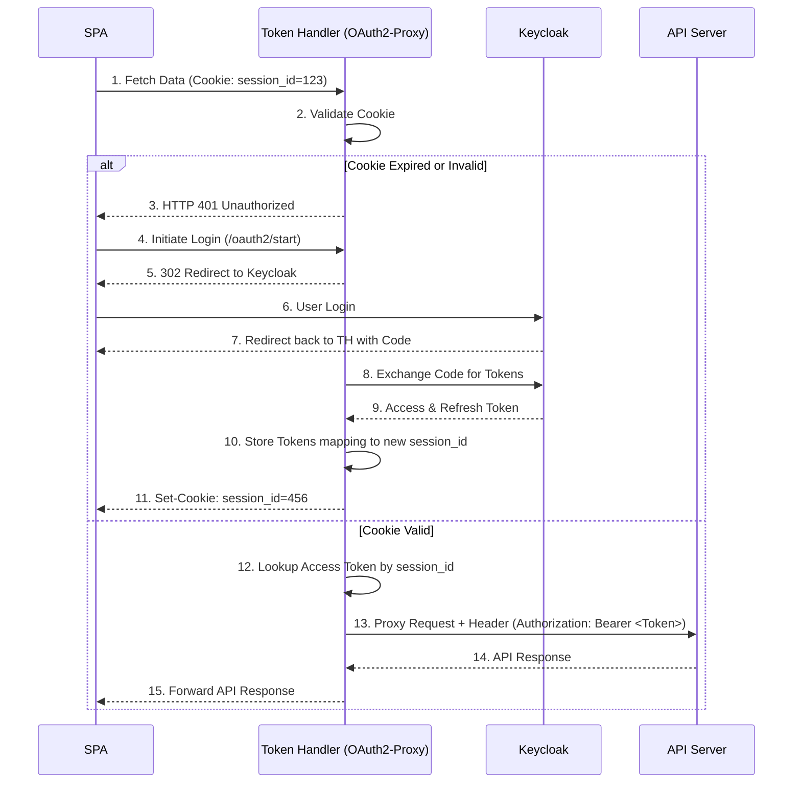

> [!NOTE]
> **Category:** Theory (Lý thuyết)
> **Goal:** Tìm hiểu chi tiết về Token Handler Pattern, một biến thể mạnh mẽ của BFF chuyên biệt cho việc quản lý bảo mật Token và Session, đảm bảo khả năng mở rộng.

## 1. Lý thuyết chuyên sâu (Detailed Theory)
Token Handler Pattern là một kiến trúc thiết kế mở rộng từ Backend-For-Frontend (BFF). Thay vì đặt tất cả logic nghiệp vụ và logic chuyển đổi Token vào cùng một service BFF duy nhất, Token Handler Pattern tách bạch rõ ràng phần "xử lý Token" ra một Proxy độc lập.

Kiến trúc này giới thiệu hai thành phần chính:
- **Token Handler:** Đóng vai trò là cổng giao tiếp (Gateway) cho Frontend. Nó chịu trách nhiệm lấy Token (thông qua Authorization Code Flow), lưu trữ Token phân tán, và dịch Session Cookie của trình duyệt thành `Authorization: Bearer <Token>` Header.
- **Stateless APIs (Resource Servers):** Hoàn toàn không biết về Session Cookie, chỉ thực hiện xác thực bằng Access Token.

**Vấn đề giải quyết:** 
Khi triển khai micro-frontends hoặc nhiều SPA, việc xây dựng một BFF khổng lồ dễ dẫn đến "BFF Monolith". Token Handler Pattern cho phép triển khai một lớp màng bảo vệ nhẹ (như Nginx với OAuth2-Proxy hoặc Envoy), giữ cho phần API phía sau hoàn toàn chuẩn hóa trên JWT Bearer Token.

## 2. Luồng nội bộ & Cơ chế cấp thấp (Internal Workflow & Low-level Mechanisms)



**Cơ chế cấp thấp:**
1. Trình duyệt liên tục giao tiếp với Token Handler thông qua Session Cookie.
2. Token Handler đóng vai trò như một Reverse Proxy. Tại mỗi request, nó tra cứu Session trong bộ nhớ nội bộ hoặc Redis.
3. Nếu tìm thấy Access Token tương ứng, Token Handler sẽ "tiêm" (inject) Token này vào `Authorization` header và xóa Session Cookie khỏi Request trước khi chuyển tiếp (forward) xuống API.
4. Token Handler tự động quản lý vòng đời của Refresh Token mà SPA không hề hay biết.

## 3. Thực hành tốt nhất & Bảo mật (Best Practices & Security)

> [!IMPORTANT]
> Token Handler phải loại bỏ (strip) Session Cookie và bất kỳ header nào nhạy cảm trước khi Forward request xuống API Server để tránh rò rỉ session id nội bộ.

- **Khớp nối lỏng lẻo (Loose Coupling):** Các API Servers không được phụ thuộc vào Session ID. Chúng chỉ được thiết kế để xác thực bằng Access Token (JWT).
- **Lưu trữ an toàn:** Trong Token Handler Pattern, không bao giờ được trả về Access Token cho SPA trong nội dung Response hay URL fragment. Mọi Token phải nằm tại máy chủ Token Handler.
- **Xử lý đăng xuất (Logout):** Khi có yêu cầu đăng xuất, Token Handler phải gọi Keycloak Backchannel Logout để vô hiệu hóa Token, sau đó xóa Session tại Token Handler và xóa Cookie trên trình duyệt.

## 4. Cấu hình minh họa thực tế (Configuration Examples)

Ví dụ cấu hình `oauth2-proxy` làm Token Handler tích hợp với Ingress Nginx trên Kubernetes:

```yaml
# oauth2-proxy deployment args
args:
  - --provider=keycloak-oidc
  - --client-id=my-frontend
  - --client-secret=super-secret
  - --oidc-issuer-url=https://auth.example.com/realms/myrealm
  - --redis-connection-url=redis://redis-cluster:6379
  - --cookie-secure=true
  - --cookie-httponly=true
  - --pass-access-token=true # Quan trọng: pass token đến upstream
  - --set-authorization-header=true # Thêm Authorization: Bearer
```

Cấu hình Ingress Annotation:

```yaml
apiVersion: networking.k8s.io/v1
kind: Ingress
metadata:
  annotations:
    nginx.ingress.kubernetes.io/auth-url: "https://$host/oauth2/auth"
    nginx.ingress.kubernetes.io/auth-signin: "https://$host/oauth2/start?rd=$escaped_request_uri"
    nginx.ingress.kubernetes.io/auth-response-headers: "Authorization" # Chuyển header từ proxy xuống API
```

## 5. Trường hợp ngoại lệ (Edge Cases)

- **Redis Cluster Failure:** Nếu Redis (nơi lưu Session) bị down, Token Handler sẽ mất toàn bộ thông tin mapping giữa Cookie và Access Token. Hệ thống sẽ báo 401 và toàn bộ người dùng phải thực hiện thao tác Login lại. Cần thiết lập Redis HA (Sentinel/Cluster) cho Token Handler.
- **Clock Skew (Lệch thời gian):** Nếu máy chủ Token Handler và Keycloak có sự chênh lệch đồng hồ hệ thống, Token Handler có thể từ chối một Access Token hợp lệ (nghĩ rằng nó đã hết hạn) hoặc gửi một Access Token đã thực sự hết hạn. Yêu cầu cài đặt và đồng bộ NTP trên tất cả các server.

## 6. Câu hỏi Phỏng vấn (Interview Questions)

**1. (Junior) Sự khác biệt giữa lưu trữ Token tại Client và Token Handler Pattern là gì?**
*Đáp án:* Lưu trữ tại Client dễ bị tấn công XSS. Token Handler Pattern giữ Token ở phía Server và chỉ dùng Cookie (HttpOnly) để định danh Client, an toàn tuyệt đối với XSS.

**2. (Junior) Tại sao Token Handler không gửi Cookie xuống Resource Server?**
*Đáp án:* Vì Resource Server (API) được thiết kế theo chuẩn RESTful không trạng thái (Stateless), yêu cầu Bearer Token để dễ dàng phân quyền (Authorization) và không bị phụ thuộc vào môi trường web.

**3. (Senior) Làm thế nào để Token Handler xử lý việc Refresh Token tự động mà không làm gián đoạn Request của người dùng?**
*Đáp án:* Token Handler kiểm tra thời gian sống (Expiration) của Access Token trước khi proxy request. Nếu gần hết hạn, nó sẽ dùng Refresh Token gọi Keycloak để lấy Access Token mới, cập nhật Session, sau đó mới tiếp tục proxy Request ban đầu.

**4. (Senior) Khi dùng Token Handler Pattern, SPA làm sao lấy được thông tin User (như email, roles)?**
*Đáp án:* Token Handler có thể mở một endpoint riêng (VD: `/api/userinfo`) hoặc tự động tiêm các thông tin từ ID Token vào Response Header để SPA có thể đọc được (Header không bị hạn chế như HttpOnly Cookie).

**5. (Senior) Mối nguy hiểm lớn nhất của Token Handler là gì?**
*Đáp án:* Đó là điểm nghẽn cổ chai (Bottleneck) và Single Point of Failure (SPOF). Nếu Token Handler cấu hình không đủ năng lực xử lý, toàn bộ lưu lượng vào hệ thống sẽ bị chậm lại.

## 7. Tài liệu tham khảo (References)
- [The Token Handler Pattern - Curity](https://curity.io/resources/learn/the-token-handler-pattern/)
- [OAuth2-Proxy Documentation](https://oauth2-proxy.github.io/oauth2-proxy/)
