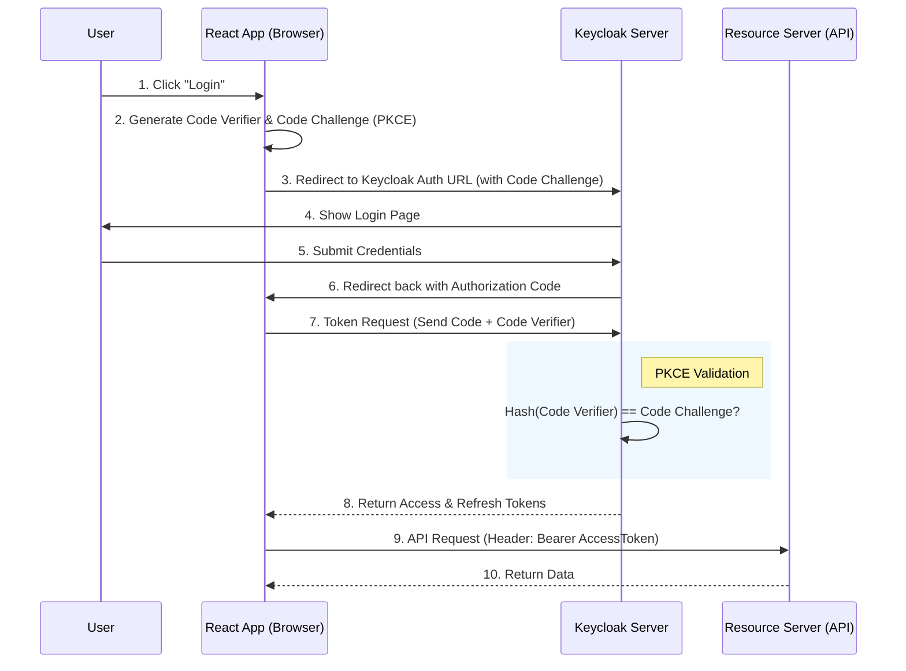

> [!NOTE]
> **Category:** Theory (Lý thuyết)
> **Goal:** Hiểu rõ kiến trúc và sự khác biệt cốt lõi khi tích hợp Keycloak với ứng dụng Single Page Application (React) so với ứng dụng Server-Side Rendering (Next.js), tập trung vào vấn đề bảo mật và quản lý trạng thái phiên.

## 1. Lý thuyết chuyên sâu (Detailed Theory)

Tích hợp Keycloak vào các framework Frontend hiện đại như React và Next.js đòi hỏi các chiến lược xử lý mã thông báo (Token) hoàn toàn khác nhau do sự khác biệt về môi trường thực thi:

**1. Môi trường React (Single Page Application - SPA):**
- Toàn bộ mã Javascript chạy trên trình duyệt (Client-side).
- Không có backend nội bộ để bảo vệ bí mật (Client Secret).
- Luồng bắt buộc: **OAuth 2.0 Authorization Code Flow with PKCE** (Proof Key for Code Exchange).
- Khó khăn lớn nhất: Lưu trữ Access Token an toàn (tránh XSS) và tự động làm mới (Silent Refresh) mà không gây gián đoạn UI.

**2. Môi trường Next.js (Server-Side Rendering / Backend-For-Frontend):**
- Next.js có hai môi trường: Chạy trên Node.js server (Server Components / API Routes) và trên trình duyệt (Client Components).
- Cho phép sử dụng cấu trúc **Confidential Client** (có Client Secret) do có khả năng bảo mật thông tin trên Server.
- Khuyến nghị sử dụng mô hình **BFF (Backend-For-Frontend)**: Server Next.js xử lý việc giao tiếp với Keycloak để lấy Token, sau đó tạo một **HTTPOnly, Secure Cookie** chứa phiên làm việc gửi về trình duyệt. Trình duyệt không bao giờ nhìn thấy cấu trúc JWT thực sự.

## 2. Luồng nội bộ & Cơ chế cấp thấp (Internal Workflow & Low-level Mechanisms)

Đối với ứng dụng SPA như React, luồng giao tiếp tiêu chuẩn để xác thực với Keycloak (sử dụng PKCE) diễn ra theo sơ đồ sau:



**Cơ chế cấp thấp (Low-level Mechanisms):**
- Trong mô hình PKCE, ứng dụng React phải tạo ra một chuỗi ngẫu nhiên dài (`code_verifier`).
- Nó băm chuỗi này bằng SHA-256 (`code_challenge`) và gửi lên Keycloak trong lúc gọi Authorization Endpoint.
- Khi đổi Code lấy Token ở Token Endpoint, React gửi `code_verifier` dạng text rõ. Keycloak sẽ tự băm nó và so sánh với `code_challenge` lúc trước để đảm bảo chính xác Client ban đầu là người đang xin Token (chống lại tấn công Authorization Code Interception).

## 3. Thực hành tốt nhất & Bảo mật (Best Practices & Security)

> [!WARNING]
> Tuyệt đối KHÔNG LƯU TRỮ Access Token hoặc Refresh Token trong `localStorage` hay `sessionStorage` của trình duyệt. Bất kỳ mã độc JavaScript nào thông qua lỗ hổng XSS (Cross-Site Scripting) cũng có thể đánh cắp các token này.

> [!IMPORTANT]
> Đối với Next.js, luôn ưu tiên sử dụng các thư viện như `NextAuth.js` (Auth.js) để triển khai mô hình phiên làm việc qua Cookie mã hóa (Encrypted HTTPOnly Cookie). Access Token chỉ được lưu trên Server và đính kèm vào các cuộc gọi tới External API từ Server-side.

**Thực hành tốt nhất:**
1. **React SPA**: Lưu Token trong bộ nhớ tạm (In-memory / React Context). Khi người dùng tải lại trang (F5), sử dụng cơ chế `check-sso` với iframe ẩn của `keycloak-js` để khôi phục session.
2. **Next.js**: Cấu hình Keycloak Client thành `Confidential`. Đảm bảo bật `Strict` SameSite cho Cookie để chống CSRF.

## 4. Cấu hình minh họa thực tế (Configuration Examples)

### Cấu hình React bằng `keycloak-js`

```javascript
import Keycloak from 'keycloak-js';

// Khởi tạo đối tượng Keycloak
const keycloak = new Keycloak({
    url: 'http://localhost:8080',
    realm: 'my-realm',
    clientId: 'react-app'
});

// Hàm khởi động
keycloak.init({
    onLoad: 'check-sso', // Kiểm tra session nếu có, không ép đăng nhập
    silentCheckSsoRedirectUri: window.location.origin + '/silent-check-sso.html',
    pkceMethod: 'S256'   // Bắt buộc dùng PKCE
}).then(authenticated => {
    if (authenticated) {
        console.log("Token in memory:", keycloak.token);
    }
}).catch(console.error);
```

### Cấu hình Next.js với `NextAuth.js` (`pages/api/auth/[...nextauth].js`)

```javascript
import NextAuth from "next-auth";
import KeycloakProvider from "next-auth/providers/keycloak";

export default NextAuth({
  providers: [
    KeycloakProvider({
      clientId: process.env.KEYCLOAK_ID,
      clientSecret: process.env.KEYCLOAK_SECRET,
      issuer: process.env.KEYCLOAK_ISSUER, // Vd: http://localhost:8080/realms/my-realm
    })
  ],
  callbacks: {
    async jwt({ token, account }) {
      // Lưu lại Access Token vào cấu trúc JWT của NextAuth khi đăng nhập thành công
      if (account) {
        token.accessToken = account.access_token;
      }
      return token;
    },
    async session({ session, token }) {
      // Truyền thông tin xuống Client (Không gửi nguyên Access Token xuống client trừ khi thực sự cần)
      session.accessToken = token.accessToken;
      return session;
    }
  }
});
```

## 5. Trường hợp ngoại lệ (Edge Cases)

1. **Third-Party Cookie Blocking (ITP) trên Safari/Brave**:
   - *Sự cố*: Cơ chế `silent-check-sso` của React SPA thường dùng iframe ẩn (hidden iframe) tạo request kèm Cookie của Keycloak (third-party cookie). Safari/Brave mặc định block cookie bên thứ ba, làm cho luồng silent refresh thất bại, bắt user phải đăng nhập lại liên tục.
   - *Khắc phục*: Thay vì dùng iframe/SPA trực tiếp, bắt buộc phải chuyển sang kiến trúc BFF (Next.js) để cùng chung domain (First-party cookie) hoặc cấu hình Custom Domain cho Keycloak sao cho nó là sub-domain cùng gốc với ứng dụng React (ví dụ: auth.mycompany.com và app.mycompany.com).

2. **Hydration Mismatch trong Next.js**:
   - *Sự cố*: Server render ra giao diện báo "Chưa đăng nhập", nhưng Client lại lấy được session từ cache và render "Đã đăng nhập", gây ra lỗi React Hydration.
   - *Khắc phục*: Trong Next.js App Router, sử dụng Component `<SessionProvider>` một cách cẩn thận và kiểm tra thuộc tính `status === 'loading'` trước khi render UI phức tạp.

## 6. Câu hỏi Phỏng vấn (Interview Questions)

1. **Junior:** Sự khác nhau giữa việc khai báo Client là Public và Confidential trong Keycloak là gì? Áp dụng chúng cho React và Next.js như thế nào?
   - *Đáp án:* Public Client không có Client Secret (dùng cho React SPA vì không thể giấu mã bí mật trên trình duyệt). Confidential Client có Client Secret (dùng cho backend, Next.js API vì server giữ bí mật an toàn).
2. **Junior:** PKCE là gì và tại sao nó lại bắt buộc đối với ứng dụng SPA?
   - *Đáp án:* PKCE là Proof Key for Code Exchange. SPA dễ bị tấn công đánh chặn Authorization Code từ các ứng dụng độc hại cùng chạy trên thiết bị (Authorization Code Interception). PKCE đảm bảo chỉ có ứng dụng yêu cầu cấp Code mới có thể đổi Code lấy Token thông qua cơ chế băm `code_verifier`.
3. **Senior:** Hãy giải thích mô hình Backend-For-Frontend (BFF) giải quyết vấn đề bảo mật Token cho trình duyệt như thế nào?
   - *Đáp án:* Trong BFF, trình duyệt không cầm JWT. Token endpoint request được thực hiện bởi Backend Server. Backend lấy Token, giữ nó trên RAM hoặc Redis, sau đó gửi một HttpOnly Cookie (chứa SessionID ngẫu nhiên) cho trình duyệt. Khi trình duyệt gọi API, nó gửi Cookie, Backend sẽ giải mã Cookie, lấy JWT tương ứng và proxy request kèm JWT qua Resource Server. Trình duyệt hoàn toàn miễn nhiễm với XSS tấn công Token.
4. **Senior:** Tại sao khi dùng NextAuth (Auth.js) tích hợp Keycloak, nếu Keycloak Server tắt, user trên Next.js vẫn có thể truy cập trang web cho đến khi session hết hạn?
   - *Đáp án:* Vì NextAuth sinh ra JWE (JSON Web Encryption) Cookie riêng của nó thay thế cho Keycloak session. Việc validate diễn ra độc lập không cần gọi tới Keycloak, cho đến khi NextAuth tự động thực hiện luồng làm mới (refresh) token thì nó mới phát hiện Keycloak server bị sập.
5. **Senior:** Bạn sẽ khắc phục lỗi "Silent Check SSO failed" trên thiết bị IOS (Safari) như thế nào trong một hệ thống thuần React SPA?
   - *Đáp án:* Do chính sách Intelligent Tracking Prevention (ITP) chặn cookie khác domain trong iframe. Giải pháp tốt nhất là đặt Keycloak chung domain cấp 1 với app (vd: auth.domain.com và app.domain.com). Nếu không thể, chuyển sang sử dụng Refresh Token Rotation được lưu trong bộ nhớ tạm hoặc Service Worker, không dựa dẫm vào trạng thái session của Identity Provider thông qua iframe.

## 7. Tài liệu tham khảo (References)

- [OAuth 2.0 for Browser-Based Apps (IETF BCP)](https://datatracker.ietf.org/doc/html/draft-ietf-oauth-browser-based-apps)
- [RFC 7636: Proof Key for Code Exchange by OAuth Public Clients](https://datatracker.ietf.org/doc/html/rfc7636)
- [Auth.js / NextAuth Keycloak Provider Documentation](https://next-auth.js.org/providers/keycloak)
- [Keycloak Securing Applications and Services Guide](https://www.keycloak.org/docs/latest/securing_apps/)
