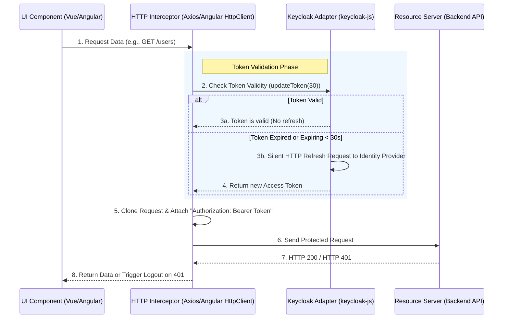

> [!NOTE]
> **Category:** Theory (Lý thuyết)
> **Goal:** Nắm bắt kỹ thuật tích hợp Keycloak vào các framework Frontend như Angular và Vue.js. Hiểu sâu cách sử dụng HttpInterceptor và Navigation Guards để quản lý luồng bảo mật.

## 1. Lý thuyết chuyên sâu (Detailed Theory)

Cũng giống như React, **Angular** và **Vue.js** khi đóng vai trò là ứng dụng Single Page Application (SPA), đều cần dựa trên tiêu chuẩn OAuth 2.0 PKCE để xác thực. Tuy nhiên, cách kiến trúc cấu trúc mã nguồn để bảo vệ Route và tiêm (inject) Token vào các cuộc gọi API lại mang tính đặc thù cao đối với từng Framework.

**1. Vue.js (Navigation Guards):**
Vue cung cấp cơ chế mạnh mẽ là `vue-router`. Trong đó, tính năng Navigation Guards (`router.beforeEach`) cho phép chúng ta can thiệp vào quá trình chuyển trang ngay trước khi Component được render. Tại đây, ứng dụng sẽ kiểm tra xem người dùng có phiên làm việc với Keycloak hay không. Nếu không, luồng chuyển trang bị chặn và kích hoạt hàm `keycloak.login()`.

**2. Angular (HttpInterceptor và Route Guards):**
Angular là một framework có tính nguyên khối cao, hỗ trợ Dependency Injection mạnh mẽ:
- **AuthGuard (`CanActivate`)**: Tương tự như Navigation Guards của Vue, chặn việc truy cập vào các đường dẫn (routes) trái phép dựa trên trạng thái của Keycloak.
- **HttpInterceptor**: Thành phần trung gian nằm giữa HttpClient của Angular và môi trường mạng. Interceptor sẽ tự động đánh chặn mọi request gửi đi, kiểm tra sự sống của token, tự động gọi hàm `updateToken()` (nếu token sắp hết hạn), và chèn (attach) `Authorization: Bearer <token>` vào Header.

## 2. Luồng nội bộ & Cơ chế cấp thấp (Internal Workflow & Low-level Mechanisms)

Luồng kiểm soát tự động chèn Access Token và tự động làm mới Token (Auto-refresh) hoạt động liên tục trong vòng đời của Angular/Vue App.



**Cơ chế cấp thấp (Low-level Mechanisms):**
- Hàm `keycloak.updateToken(minValidity)` là trái tim của quá trình này. Nếu độ phân giải của Token còn ít hơn `minValidity` (ví dụ 30 giây), Keycloak Adapter sẽ tự động lấy Refresh Token hiện tại gọi lên Token Endpoint (`grant_type=refresh_token`) để xin một Token mới tinh trong nền (background) mà không yêu cầu user nhập lại thông tin.
- Quá trình này trả về một `Promise`. HTTP Interceptor sẽ tạm dừng (pause) request đang thực hiện để chờ Promise của Keycloak resolve.

## 3. Thực hành tốt nhất & Bảo mật (Best Practices & Security)

> [!WARNING]
> Đừng chèn Token vào mọi Request. Nếu ứng dụng của bạn gọi tới các API bên thứ 3 bên ngoài hệ sinh thái của bạn (như Google Maps API, Weather API), Interceptor có thể vô tình làm rò rỉ JWT nội bộ. Hãy kiểm tra (filter) domain trước khi chèn Header.

> [!IMPORTANT]
> Phải xử lý triệt để việc Logout. Khi nhận được lỗi HTTP 401 (Unauthorized) từ API - mặc dù đã cố update token, ứng dụng bắt buộc phải kích hoạt `keycloak.logout()` để xóa trạng thái và dọn dẹp môi trường.

**Thực hành tốt nhất:**
1. **Async Initialization**: Keycloak Initialization (`keycloak.init()`) là một tác vụ bất đồng bộ. Ở Angular, hãy sử dụng `APP_INITIALIZER` để chặn không cho Angular bootstrap trước khi Keycloak tải xong trạng thái. Tương tự trong Vue, phải đặt logic `app.mount()` vào trong block `.then()` của Keycloak init.
2. **Race Conditions**: Xử lý tình trạng nhiều requests gọi cùng lúc khi token vừa hết hạn (tránh việc trigger 10 lần refresh token liên tiếp). Adapter `keycloak-js` bản mới đã xử lý tốt việc khóa tiến trình (lock), nhưng bạn cũng nên lưu ý khi thiết kế Interceptor.

## 4. Cấu hình minh họa thực tế (Configuration Examples)

### Cấu hình HttpInterceptor trong Angular

```typescript
import { Injectable } from '@angular/core';
import { HttpInterceptor, HttpRequest, HttpHandler, HttpEvent } from '@angular/common/http';
import { Observable, from, throwError } from 'rxjs';
import { mergeMap, catchError } from 'rxjs/operators';
import { KeycloakService } from 'keycloak-angular';

@Injectable()
export class KeycloakBearerInterceptor implements HttpInterceptor {
  constructor(private keycloak: KeycloakService) {}

  intercept(req: HttpRequest<any>, next: HttpHandler): Observable<HttpEvent<any>> {
    // Chỉ chèn token vào các API nội bộ
    if (!req.url.includes('/api/')) return next.handle(req);

    // Xử lý bất đồng bộ lấy token mới nhất
    return from(this.keycloak.getToken()).pipe(
      mergeMap(token => {
        if (token) {
          req = req.clone({
            setHeaders: { Authorization: `Bearer ${token}` }
          });
        }
        return next.handle(req);
      }),
      catchError(error => {
        // Token không thể làm mới (hết hạn refresh token, session closed)
        this.keycloak.login();
        return throwError(() => error);
      })
    );
  }
}
```

### Cấu hình Navigation Guard trong Vue Router

```javascript
import { createRouter, createWebHistory } from 'vue-router';
import { keycloak } from '../keycloak'; // Đã khởi tạo sẵn

const routes = [
  { path: '/', component: Home },
  { path: '/admin', component: Admin, meta: { requiresAuth: true, roles: ['admin'] } }
];

const router = createRouter({ history: createWebHistory(), routes });

router.beforeEach((to, from, next) => {
  if (to.meta.requiresAuth) {
    if (keycloak.authenticated) {
      // Check Role (RBAC)
      if (to.meta.roles && !to.meta.roles.some(r => keycloak.hasRealmRole(r))) {
        next('/unauthorized'); // Không có quyền
      } else {
        next(); // Hợp lệ
      }
    } else {
      // Yêu cầu đăng nhập, lưu lại đường dẫn gốc để quay về sau khi login
      keycloak.login({ redirectUri: window.location.origin + to.path });
    }
  } else {
    next();
  }
});
```

## 5. Trường hợp ngoại lệ (Edge Cases)

1. **Race condition khi Refresh Token và tải trang**:
   - *Sự cố*: Nếu trang SPA có 10 Component gọi 10 API cùng lúc khi tải. Nếu Token lúc đó sắp hết hạn, cả 10 request kích hoạt 10 lần `updateToken()`.
   - *Khắc phục*: Thư viện `keycloak-js` bản thân nó cung cấp một Promise cache nội bộ để gộp chung yêu cầu cấp mới. Tuy nhiên nếu bạn tự viết Axios Interceptor ở Vue, cần tạo ra một biến cờ (flag `isRefreshing`) và một Queue lưu tạm các request đang bị Pending chờ Token refresh xong.

2. **Lỗi Mạng (Network Failure) trong lúc Refresh**:
   - *Sự cố*: Mạng chập chờn khiến cho thao tác Refresh token trả về timeout. Interceptor sẽ tưởng là Session expired và văng người dùng ra trang đăng nhập một cách oan uổng.
   - *Khắc phục*: Thêm cơ chế Retry (Thử lại) 1-2 lần ở mức HTTP Error code cho Refresh Request trước khi ép buộc Logout.

## 6. Câu hỏi Phỏng vấn (Interview Questions)

1. **Junior:** Ở Angular, tại sao lại dùng HttpInterceptor thay vì copy/paste Header vào từng request HTTP?
   - *Đáp án:* HttpInterceptor hoạt động giống như một middleware. Giúp tập trung mã logic xác thực (DRY - Don't Repeat Yourself), đảm bảo không bỏ sót việc chèn token vào bất kỳ yêu cầu nào và tự động xử lý lỗi 401 ở một nơi duy nhất.
2. **Junior:** Navigation Guard trong Vue chạy trước hay sau khi Component được mount lên DOM?
   - *Đáp án:* Chạy trước khi chuyển tuyến (route transition). Điều này đảm bảo Component nhạy cảm không hề được khởi tạo hoặc gọi dữ liệu trước khi User được xác minh, tăng cường tính bảo mật.
3. **Senior:** `APP_INITIALIZER` trong Angular kết hợp với Keycloak giải quyết vấn đề cấu trúc nào trong vòng đời ứng dụng?
   - *Đáp án:* Việc init Keycloak là một quá trình tốn thời gian do có thể phải chuyển hướng trình duyệt hoặc gọi API check-sso. `APP_INITIALIZER` sẽ giữ toàn bộ tiến trình render UI của Angular ở trạng thái "treo chờ" cho đến khi trạng thái Authentication hoàn toàn rõ ràng, chống lại hiện tượng giao diện chớp tắt (flickering).
4. **Senior:** Nếu token hết hạn và Refresh token cũng hết hạn (Session Idle Timeout), ứng dụng SPA của bạn sẽ phản ứng như thế nào nếu đang treo ở màn hình Dashboard?
   - *Đáp án:* Khi ứng dụng thử gọi API hoặc thử chạy silent refresh ẩn qua `updateToken()`, Keycloak sẽ báo lỗi (Reject promise do invalid refresh token). Ứng dụng phải bắt được lỗi này (qua event `onAuthLogout` hoặc catch của updateToken) và điều hướng (redirect) người dùng về màn hình Keycloak Login lại.
5. **Senior:** Trong cấu hình Keycloak, nếu bật "Implicit Flow" thay cho "Authorization Code Flow" cho Angular SPA thì có an toàn không?
   - *Đáp án:* KHÔNG an toàn. Implicit Flow trả trực tiếp Token lên Fragment URL của trình duyệt (`#access_token=...`), khiến nó rất dễ bị lộ (qua browser history, referer headers, XSS). Chuẩn mới OAuth 2.1 loại bỏ hoàn toàn Implicit Flow và yêu cầu SPA dùng Auth Code with PKCE.

## 7. Tài liệu tham khảo (References)

- [Angular HTTP Interceptors Documentation](https://angular.io/guide/http#intercepting-requests-and-responses)
- [Vue Router Navigation Guards](https://router.vuejs.org/guide/advanced/navigation-guards.html)
- [OAuth 2.0 Security Best Current Practice (BCP)](https://datatracker.ietf.org/doc/html/draft-ietf-oauth-security-topics)
- [Keycloak Angular (Third-party library for Angular Integration)](https://www.npmjs.com/package/keycloak-angular)
