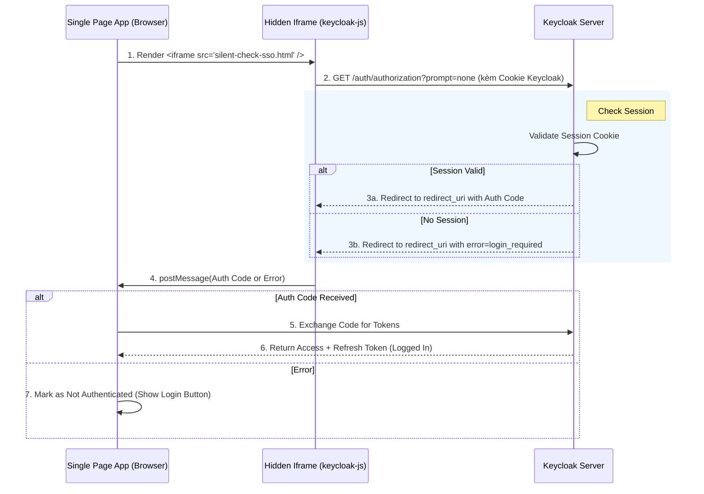

> [!NOTE]
> **Category:** Theory (Lý thuyết)
> **Goal:** Đi sâu vào thư viện cốt lõi `keycloak-js`, khám phá cơ chế tự động gia hạn mã thông báo (Silent Refresh) và kỹ thuật sử dụng Hidden Iframe để kiểm tra trạng thái Single Sign-On (SSO).

## 1. Lý thuyết chuyên sâu (Detailed Theory)

Thư viện **`keycloak-js`** là bộ công cụ Client Adapter chính thức do đội ngũ Keycloak phát triển dành cho môi trường Javascript thuần túy trên trình duyệt (Vanilla JS, React, Vue, Angular).

Nhiệm vụ cốt lõi của thư viện này không chỉ là chuyển hướng người dùng tới trang đăng nhập (Login Redirect), mà quan trọng hơn là **Quản lý Vòng đời (Lifecycle) của Token** một cách vô hình đối với người dùng cuối, thông qua hai kỹ thuật chính:
1. **Silent SSO Check (`check-sso`)**: Khi tải trang, thay vì đá người dùng sang trang của Keycloak, ứng dụng sẽ âm thầm kiểm tra xem trong trình duyệt đã có "Phiên làm việc (Session Cookie)" nào với Keycloak chưa.
2. **Silent Refresh (`updateToken`)**: Access Token thường có vòng đời rất ngắn (vd: 5 phút). Ứng dụng phải làm mới Token này liên tục mà không bắt người dùng đăng nhập lại.

Cả hai kỹ thuật này thường dựa vào **Hidden Iframe** (Khung nội tuyến ẩn) hoặc **Web Worker**. Thay vì chuyển hướng toàn bộ trang (Full Page Reload), thư viện sẽ tải một trang siêu nhẹ của Keycloak vào một Iframe có kích thước 0x0 pixel.

## 2. Luồng nội bộ & Cơ chế cấp thấp (Internal Workflow & Low-level Mechanisms)

Cơ chế `check-sso` và Silent Refresh hoạt động xoay quanh tính năng `prompt=none` của tiêu chuẩn OAuth 2.0/OIDC.



**Cơ chế cấp thấp (Low-level Mechanisms):**
- Giao thức yêu cầu truyền tham số `prompt=none`. Điều này chỉ thị cho Keycloak Server rằng: "Nếu bạn có thể cấp Token ngay thì cấp đi, còn nếu cần người dùng tương tác (như nhập pass, 2FA) thì TỪ CHỐI và báo lỗi chứ tuyệt đối không render giao diện (Form Login)".
- Giao tiếp giữa Iframe (Domain của ứng dụng) và Keycloak (Domain khác) được thực hiện thông qua API `window.postMessage`.
- Trang `silent-check-sso.html` phải được Host cùng nguồn (Same-Origin) với ứng dụng SPA để Iframe có thể nhận Message và chuyển lại cho Main Window của ứng dụng gốc.

## 3. Thực hành tốt nhất & Bảo mật (Best Practices & Security)

> [!WARNING]
> Phải cẩn trọng cấu hình `X-Frame-Options` hoặc header CSP `frame-ancestors` trên Keycloak. Mặc định nó chỉ cho phép các ứng dụng nằm trong cấu hình Web Origins của Client được quyền nhúng Keycloak qua Iframe. Sai cấu hình Web Origin sẽ làm hỏng cơ chế Silent Refresh.

> [!IMPORTANT]
> Hết sức chú ý tới bảo mật **Cookie SameSite**. Do Keycloak và SPA có thể nằm ở hai domain khác nhau, Cookie xác thực của Keycloak truyền qua Iframe được xem là **Third-Party Cookie**. Nó cần phải có cờ `SameSite=None; Secure`.

**Thực hành tốt nhất:**
1. **Sử dụng Refresh Token Rotation**: Nếu môi trường cấm ngặt Third-Party Cookie, hãy dùng cơ chế băm/chữ ký để luân chuyển Refresh Token ở phía ứng dụng SPA, và chỉ sử dụng Iframe khi thực sự mất trạng thái.
2. **Setup Timer**: `keycloak-js` cung cấp hàm `onTokenExpired`. Hãy kích hoạt `updateToken()` ngay trong sự kiện này để giữ session luôn mượt mà.

## 4. Cấu hình minh họa thực tế (Configuration Examples)

Sử dụng thư viện thuần `keycloak-js` để thiết lập cơ chế Refresh an toàn:

```javascript
import Keycloak from 'keycloak-js';

const keycloak = new Keycloak({
    url: 'https://auth.company.com',
    realm: 'my-realm',
    clientId: 'my-frontend-client'
});

// Yêu cầu bắt buộc phải có file tĩnh silent-check-sso.html nằm trong thư mục public của ứng dụng
keycloak.init({
    onLoad: 'check-sso',
    silentCheckSsoRedirectUri: window.location.origin + '/silent-check-sso.html',
    pkceMethod: 'S256',
    iframe: true, // Kích hoạt sử dụng Iframe (mặc định là true)
    checkLoginIframeInterval: 5 // Cứ 5 giây check trạng thái session một lần
}).then(authenticated => {
    if (authenticated) {
        console.log("Welcome back!");
        setupTokenRefresh();
    }
});

function setupTokenRefresh() {
    // Tự động gia hạn khi token hết hạn
    keycloak.onTokenExpired = () => {
        console.log("Token expired. Trying to refresh...");
        keycloak.updateToken(30).then(refreshed => {
            if (refreshed) {
                console.log("Token successfully refreshed");
            }
        }).catch(() => {
            console.error("Refresh failed. Redirecting to login...");
            keycloak.login();
        });
    };
}
```

Nội dung cơ bản bắt buộc của file `silent-check-sso.html`:
```html
<html>
<body>
    <script>
        // Truyền thông tin ngược lại lên Window Cha
        parent.postMessage(location.href, location.origin);
    </script>
</body>
</html>
```

## 5. Trường hợp ngoại lệ (Edge Cases)

1. **Intelligent Tracking Prevention (ITP)**:
   - *Sự cố*: Safari và Firefox Strict Mode mặc định chặn Third-Party Cookies. Iframe chạy nền không thể gửi Session Cookie của Keycloak (khi domain khác nhau), dẫn đến Keycloak luôn trả về `login_required`.
   - *Khắc phục*: 
     - Mẹo 1: Sử dụng Custom Domain cho Keycloak để đưa nó về chung Domain gốc với ứng dụng (ví dụ SPA ở `app.test.com`, Keycloak ở `sso.test.com`). Lúc này cookie được tính là First-Party.
     - Mẹo 2: Nếu bị block, ứng dụng sẽ rơi lại luồng lấy token qua Full Redirect hoặc sử dụng cơ chế Server-Side Session (BFF - Backend for Frontend).

2. **Iframe Timeout (Mạng yếu)**:
   - *Sự cố*: Trang silent-sso không tải được, promise của `check-sso` bị treo hoặc timeout.
   - *Khắc phục*: Thư viện `keycloak-js` mặc định timeout iframe sau 10 giây. Hãy bắt lỗi `init().catch(err)` để xử lý dự phòng thay vì để màn hình trắng chờ đợi.

## 6. Câu hỏi Phỏng vấn (Interview Questions)

1. **Junior:** `prompt=none` có nghĩa là gì trong giao thức OIDC?
   - *Đáp án:* Đó là tham số báo hiệu cho Server không được phép hiển thị bất cứ giao diện tương tác người dùng nào. Nếu quá trình cấp quyền có thể diễn ra ngầm (đã đăng nhập, không cần phê duyệt thêm), server trả mã code về. Nếu không, trả lỗi.
2. **Junior:** File `silent-check-sso.html` dùng để làm gì?
   - *Đáp án:* Là trang mục tiêu trả về (Redirect URI) chạy trong Iframe ẩn. Nó chứa script đơn giản để dùng `postMessage` đẩy dữ liệu xác thực (Auth Code) ra cho ứng dụng React/Angular gốc xử lý.
3. **Senior:** Tại sao ITP (như trên Safari) lại "bóp chết" luồng Silent Refresh SSO của các SPA truyền thống?
   - *Đáp án:* ITP chặn các cookie không phải của tên miền hiện tại đang hiển thị. Khi SPA gọi Iframe ẩn truy cập vào trang Keycloak, cookie SSO của Keycloak bị xem là Third-Party và bị chặn. Keycloak không nhận được cookie -> coi như user chưa login -> silent check thất bại.
4. **Senior:** Sự khác biệt giữa việc gọi `updateToken` và sự kiện `onTokenExpired` là gì?
   - *Đáp án:* `onTokenExpired` là một Callback event thụ động do thư viện kích hoạt khi Timer nội bộ phát hiện token hết hạn (đếm ngược từ trường `exp` trong JWT). Hàm `updateToken(minValidity)` là hàm Chủ động gọi lên mạng để lấy token mới. Thường thì chúng ta gọi `updateToken()` ngay bên trong event `onTokenExpired`.
5. **Senior:** Làm thế nào để giải quyết vấn đề bảo mật Clickjacking trên Keycloak nhưng vẫn cho phép ứng dụng của bạn gọi qua iframe?
   - *Đáp án:* Keycloak ngăn Clickjacking bằng `X-Frame-Options: SAMEORIGIN` và `Content-Security-Policy: frame-ancestors`. Để cho phép app gọi, trên cấu hình Client của Keycloak phải thêm chính xác URL của app vào mục `Web Origins`. Lúc này Keycloak sẽ sinh ra Header cấu hình động cho phép domain đó được nhúng Iframe.

## 7. Tài liệu tham khảo (References)

- [OIDC Core 1.0 - Successful Authentication Response with prompt=none](https://openid.net/specs/openid-connect-core-1_0.html)
- [Keycloak Javascript Adapter Documentation](https://www.keycloak.org/docs/latest/securing_apps/#_javascript_adapter)
- [Mozilla Developer Network (MDN) - Window.postMessage()](https://developer.mozilla.org/en-US/docs/Web/API/Window/postMessage)
