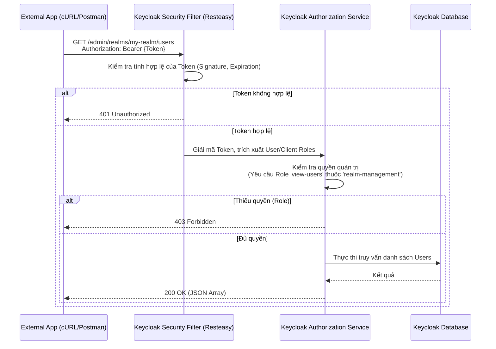

> [!NOTE]
> **Category:** Theory
> **Goal:** Nắm vững cấu trúc tổng quan, nguyên lý hoạt động và phương pháp bảo mật của Keycloak Admin REST API để thực hiện quản trị hệ thống tự động (Automated Provisioning).

## 1. Lý thuyết chuyên sâu (Detailed Theory)

**Keycloak Admin REST API** là một tập hợp các giao diện lập trình HTTP (HTTP-based APIs) cho phép các nhà phát triển và quản trị viên thực hiện MỌI THAO TÁC quản lý hệ thống mà không cần sử dụng giao diện người dùng (Admin Console). Thực tế, bản thân giao diện Keycloak Admin Console (viết bằng React) cũng chỉ là một frontend gọi trực tiếp các API này.

**Tại sao Admin REST API lại quan trọng?**
- **Tự động hóa (Automation):** Cho phép bạn tự động hóa quy trình tạo Realm, Client, Role bằng các công cụ CI/CD, Terraform, hoặc script.
- **Tích hợp Backend (Backend Integration):** Giúp ứng dụng của bạn tạo người dùng, đặt lại mật khẩu, hoặc phân quyền trực tiếp từ mã nguồn.
- **Tách biệt kiến trúc (Decoupling):** Hệ thống Identity hoàn toàn độc lập, giao tiếp với các hệ thống khác thông qua chuẩn RESTful.

**Cấu trúc URL chung:**
Tất cả các Admin API đều nằm dưới path `/admin/realms/`.
Ví dụ: `GET <server_url>/admin/realms/<realm_name>/users`

## 2. Luồng nội bộ & Cơ chế cấp thấp (Internal Workflow & Low-level Mechanisms)

Khi một HTTP Request được gửi đến Admin REST API, nó sẽ trải qua một chuỗi các bộ lọc bảo mật (Security Filters) và trình kiểm tra quyền (Authorization Checks) bên trong engine của Keycloak.



**Cơ chế cấp thấp:**
- Admin API của Keycloak được xây dựng trên JAX-RS (thông qua thư viện Resteasy của JBoss).
- Các endpoint quản trị thuộc quyền của một Client nội bộ cực kỳ đặc biệt có tên là `realm-management`. Mọi thao tác trên API đều được mapping (ánh xạ) đến các Client Roles của client này.
- **Bearer Token Authentication:** Admin API là "Stateless", nó không sử dụng Session Cookie mà chỉ đọc Header `Authorization: Bearer <Token>`.

## 3. Thực hành tốt nhất & Bảo mật (Best Practices & Security)

- **Nguyên tắc quyền tối thiểu (Least Privilege):** KHÔNG bao giờ cấp quyền `admin` (toàn quyền trên toàn Keycloak) cho một ứng dụng hoặc script tự động. Chỉ cấp các quyền cụ thể, ví dụ: nếu app chỉ cần tạo user, hãy cấp `manage-users`.
- **Phân trang (Pagination):** Khi gọi API lấy danh sách (như `/users`), LUÔN truyền các tham số `first` và `max` để tránh quá tải database và nghẽn mạng (OOM - Out of Memory) nếu số lượng bản ghi lên tới hàng triệu.
- **Rate Limiting (Giới hạn tốc độ):** Đặt Keycloak sau một API Gateway (như Kong) hoặc Reverse Proxy (Nginx) và thiết lập giới hạn tốc độ gọi Admin API để chống lại các cuộc tấn công DDoS/Brute-force nhắm vào hạ tầng quản trị.

> [!WARNING]
> Mọi thay đổi qua Admin API đều có thể gây ảnh hưởng nghiêm trọng đến hệ thống (như vô tình xóa toàn bộ Client). Hãy luôn test API trên môi trường Staging/Dev trước khi chạy trên Production.

## 4. Cấu hình minh họa thực tế (Configuration Examples)

Ví dụ tạo một người dùng mới bằng lệnh cURL thông qua Admin API.

**Bước 1: Lấy Admin Access Token** (Giả sử dùng tài khoản Admin tổng cục bộ):
```bash
TOKEN=$(curl -s -X POST "http://localhost:8080/realms/master/protocol/openid-connect/token" \
  -H "Content-Type: application/x-www-form-urlencoded" \
  -d "username=admin" \
  -d "password=admin" \
  -d "grant_type=password" \
  -d "client_id=admin-cli" | jq -r '.access_token')
```

**Bước 2: Gọi API tạo người dùng trong `my-realm`**:
```bash
curl -X POST "http://localhost:8080/admin/realms/my-realm/users" \
  -H "Authorization: Bearer $TOKEN" \
  -H "Content-Type: application/json" \
  -d '{
    "username": "new_user",
    "email": "newuser@example.com",
    "enabled": true,
    "credentials": [{
        "type": "password",
        "value": "123456",
        "temporary": false
    }]
}'
```

Nếu thành công, server sẽ phản hồi HTTP `201 Created` và không có nội dung body. ID của người dùng mới có thể tìm thấy trong Header `Location` của response.

## 5. Trường hợp ngoại lệ (Edge Cases)

- **Lỗi 409 Conflict:** Cố gắng tạo một User, Client, hoặc Role đã tồn tại (ví dụ trùng Username hoặc Email). **Khắc phục:** Trước khi thực hiện `POST`, có thể chạy một lệnh `GET` để kiểm tra sự tồn tại.
- **Token hết hạn (Token Expired) giữa chừng:** Một script gọi API hàng loạt mất 10 phút, nhưng token admin chỉ có hạn 5 phút. Khi chạy đến phút thứ 6, API trả về `401 Unauthorized`. **Khắc phục:** Script cần bắt lỗi 401, tự động xin lại Access Token mới và thực thi lại request bị lỗi.
- **Master Realm vs Custom Realm:** Đôi khi Admin gửi token lấy từ `my-realm` để gọi quản trị trên `master` realm và bị từ chối. **Khắc phục:** Token phải được lấy từ đúng realm, hoặc lấy token ở realm `master` nếu muốn quản trị chéo nhiều realm khác nhau.

## 6. Câu hỏi Phỏng vấn (Interview Questions)

1. **(Junior)** Endpoint của Admin REST API Keycloak bắt đầu bằng chuỗi URI nào? Có cần xác thực không?
   - *Đáp án:* Bắt đầu bằng `/admin/realms/...`. Luôn cần xác thực thông qua Access Token gắn trong header `Authorization`.
2. **(Junior)** Thay vì dùng giao diện admin, liệt kê 2 lợi ích khi sử dụng Admin REST API?
   - *Đáp án:* Tự động hóa qua CI/CD và tích hợp trực tiếp việc quản trị người dùng vào các ứng dụng Backend.
3. **(Senior)** Tại sao khi tạo User thành công qua REST API, Keycloak không trả về body chứa thông tin User mà lại trả về `201 Created`? Làm sao để biết User ID vừa tạo?
   - *Đáp án:* Đây là chuẩn thiết kế RESTful. URI định danh của tài nguyên vừa tạo được trả về trong HTTP Header `Location` (vd: `Location: .../users/{id}`). Parse header đó để lấy ID.
4. **(Senior)** Phân biệt vai trò của client `admin-cli` và client `realm-management` trong Keycloak.
   - *Đáp án:* `admin-cli` là client công khai (public client) dùng để nhận token từ terminal/script (như ví dụ trên). `realm-management` là client ẩn lưu trữ các quyền hạn (roles) quản trị API.
5. **(Senior)** Khi lấy danh sách hàng vạn users qua `/users`, nếu không phân trang thì hệ thống đối mặt với rủi ro gì?
   - *Đáp án:* Rủi ro Out-Of-Memory (OOM) ở Keycloak server vì phải nạp hàng vạn record vào RAM và serialize sang JSON, đồng thời làm chậm database.

## 7. Tài liệu tham khảo (References)

- Keycloak Admin REST API Reference: [Keycloak API Docs](https://www.keycloak.org/docs-api/latest/rest-api/index.html)
- JAX-RS Specification (JSR 370).
