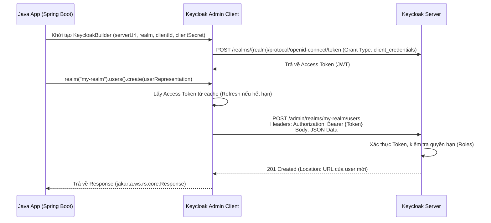

> [!NOTE]
> **Category:** Theory
> **Goal:** Hiểu sâu về kiến trúc, cách hoạt động và phương pháp tích hợp thư viện Keycloak Java Admin Client trong các dự án Java/Spring Boot để quản lý Keycloak từ xa.

## 1. Lý thuyết chuyên sâu (Detailed Theory)

**Keycloak Admin REST API** cung cấp tất cả các endpoint cần thiết để quản lý cấu hình, người dùng, client, role, v.v. (tương tự những gì bạn làm trên giao diện Admin Console). Tuy nhiên, nếu bạn viết một ứng dụng Java (như Spring Boot) để tự động hóa việc tạo người dùng, phân quyền, bạn sẽ phải thực hiện HTTP Request thủ công và xử lý chuỗi JSON rất vất vả.

Để giải quyết bài toán này, Keycloak cung cấp thư viện **Keycloak Java Admin Client** (`keycloak-admin-client`). Đây là một wrapper (lớp bọc) được viết bằng Java, sử dụng JAX-RS/Resteasy ở bên dưới. Nó ánh xạ toàn bộ Admin REST API thành các Java Interface (Objects & Methods) kiểu Strongly-typed. 

**Tại sao nên dùng Java Admin Client thay vì tự gọi REST?**
- **Type Safety:** Hạn chế lỗi runtime do sai định dạng JSON hoặc gõ sai tên trường (typo).
- **Object Mapping:** Trả về trực tiếp các object `UserRepresentation`, `ClientRepresentation` thay vì chuỗi JSON.
- **Connection Management:** Tự động quản lý Access Token, làm mới (refresh) token khi hết hạn, cấu hình connection pool ẩn bên dưới.

## 2. Luồng nội bộ & Cơ chế cấp thấp (Internal Workflow & Low-level Mechanisms)

Bản thân Keycloak Admin Client hoạt động như một REST Client tinh vi. Luồng hoạt động khởi tạo và gọi hàm như sau:



**Cơ chế cấp thấp:**
- Admin Client sử dụng thư viện **Resteasy Client** (hoặc tương thích với JAX-RS 2.x). 
- Request được Serialize thành JSON thông qua **Jackson**.
- Việc cấp phát Token (Token acquisition) được thực hiện ngầm bằng class `Keycloak` (nắm giữ `TokenManager`). Khi bạn gọi bất kỳ phương thức API nào, `TokenManager` sẽ được kiểm tra. Nếu token sắp hết hạn, nó sẽ thực hiện refresh ẩn trước khi đẩy request thực sự đi.

## 3. Thực hành tốt nhất & Bảo mật (Best Practices & Security)

- **Sử dụng Service Account thay vì User Account:** Khi khởi tạo `KeycloakBuilder`, bạn nên sử dụng cấu hình dạng Client Credentials (với `clientId` và `clientSecret`) thay vì Password (với `username` và `password`). Điều này đảm bảo bảo mật M2M (Machine-to-Machine) và tuân thủ chuẩn OAuth 2.0.
- **Connection Pooling:** Đảm bảo sử dụng Resteasy Client với connection pool để tái sử dụng các kết nối TCP, tránh cạn kiệt socket.
- **Quản lý Singleton:** Object `Keycloak` (instance trả về từ `KeycloakBuilder.build()`) là Thread-Safe. Trong Spring Boot, **hãy cấu hình nó thành một `@Bean` singleton**. Tuyệt đối KHÔNG gọi `.build()` cho mỗi request của người dùng, nếu không hệ thống sẽ tạo vô số kết nối và xin token liên tục, dẫn đến quá tải (DDoS chính Keycloak của bạn).

> [!WARNING]
> Mặc dù `KeycloakBuilder` thread-safe, nhưng các đối tượng Resteasy Proxy bên dưới (như `UsersResource`) có thể không luôn an toàn trong một số phiên bản Resteasy cũ. Hãy luôn truy xuất Resource từ đối tượng `Keycloak` gốc cho mỗi luồng xử lý.

## 4. Cấu hình minh họa thực tế (Configuration Examples)

Ví dụ cấu hình Keycloak Admin Client như một Singleton Bean trong Spring Boot:

```java
import org.keycloak.admin.client.Keycloak;
import org.keycloak.admin.client.KeycloakBuilder;
import org.springframework.context.annotation.Bean;
import org.springframework.context.annotation.Configuration;

@Configuration
public class KeycloakConfig {

    @Bean
    public Keycloak keycloakAdminClient() {
        return KeycloakBuilder.builder()
                .serverUrl("http://localhost:8080")
                .realm("my-realm") // Realm chứa Service Account
                .grantType("client_credentials")
                .clientId("my-admin-client")
                .clientSecret("YOUR_CLIENT_SECRET")
                .build();
    }
}
```

Cách tạo một người dùng mới từ Service:

```java
import org.keycloak.admin.client.Keycloak;
import org.keycloak.representations.idm.UserRepresentation;
import jakarta.ws.rs.core.Response;
import org.springframework.beans.factory.annotation.Autowired;

public class UserService {
    @Autowired
    private Keycloak keycloak;

    public void createUser() {
        UserRepresentation user = new UserRepresentation();
        user.setUsername("john_doe");
        user.setEmail("john@example.com");
        user.setEnabled(true);

        // Gọi API tạo User
        Response response = keycloak.realm("target-realm").users().create(user);
        
        if (response.getStatus() == 201) {
            System.out.println("Tạo user thành công!");
        } else {
            System.out.println("Lỗi: " + response.getStatusInfo().getReasonPhrase());
        }
    }
}
```

## 5. Trường hợp ngoại lệ (Edge Cases)

- **Lỗi 403 Forbidden:** Dù đã có Token, nhưng gọi API vẫn bị 403. **Khắc phục:** Service Account (hoặc User) lấy token chưa được gán Role (như `manage-users`, `manage-clients`) trong Keycloak. Cần vào Admin Console, tab Service Account Roles của Client và gán đúng quyền.
- **Connection Leak (Rò rỉ kết nối):** Method tạo user trả về một đối tượng `jakarta.ws.rs.core.Response`. Nếu bạn gọi `response.readEntity()` hoặc cần đọc nội dung response, bạn BẮT BUỘC phải gọi `response.close()` trong khối `finally`. Nếu quên `close()`, connection Resteasy sẽ bị kẹt, dần dần gây sập ứng dụng.
- **Phiên bản bất đồng (Version Mismatch):** Version của `keycloak-admin-client` trong `pom.xml` khác xa version của Keycloak Server (vd client v15, server v22). **Khắc phục:** Luôn giữ phiên bản của Admin Client trùng với phiên bản Keycloak Server để đảm bảo các Model Representation (như UserRepresentation) khớp chuẩn JSON với nhau.

## 6. Câu hỏi Phỏng vấn (Interview Questions)

1. **(Junior)** Keycloak Admin Client dùng để làm gì? Ưu điểm so với việc dùng `RestTemplate` hoặc `HttpClient` thuần là gì?
   - *Đáp án:* Dùng để tương tác với Keycloak Admin REST API bằng Java. Ưu điểm là cung cấp class định kiểu sẵn, tự động cấp và refresh Token.
2. **(Junior)** Khi thiết lập kết nối Keycloak Admin Client, chúng ta nên dùng Grant Type nào trong môi trường Server-to-Server?
   - *Đáp án:* `client_credentials` (thông qua Service Account).
3. **(Senior)** Trong Spring Boot, đối tượng `Keycloak` sinh ra từ `KeycloakBuilder` nên được khởi tạo ở scope nào (Request, Prototype, hay Singleton)? Tại sao?
   - *Đáp án:* Singleton. Bởi vì đối tượng này bao bọc một `TokenManager` và một Resteasy Connection Pool. Khởi tạo liên tục sẽ làm nghẽn kết nối và lặp lại thao tác xin Token một cách dư thừa.
4. **(Senior)** Khi gọi hàm `users().create(user)` trả về `Response`, tại sao chúng ta đôi khi phải gọi `response.close()`?
   - *Đáp án:* Để giải phóng Socket Connection trả về Resteasy Pool. Tránh lỗi rò rỉ kết nối (Connection Leak) làm cạn kiệt luồng HTTP.
5. **(Senior)** Nếu bạn cần gọi một REST endpoint của một Custom Provider (do bạn tự viết) thông qua Java Admin Client thì làm thế nào?
   - *Đáp án:* Admin Client chủ yếu bọc các API chuẩn. Để gọi Custom API, có thể dùng `keycloak.proxy()` để wrap interface do ta tự định nghĩa sử dụng annotation JAX-RS, hoặc trích xuất token từ `Keycloak` để tự thực hiện HTTP call bằng `HttpClient`.

## 7. Tài liệu tham khảo (References)

- Keycloak Official Documentation: [Admin REST API & Client](https://www.keycloak.org/docs/latest/server_development/#admin-rest-api)
- Resteasy Client Documentation: JAX-RS Implementation details.
