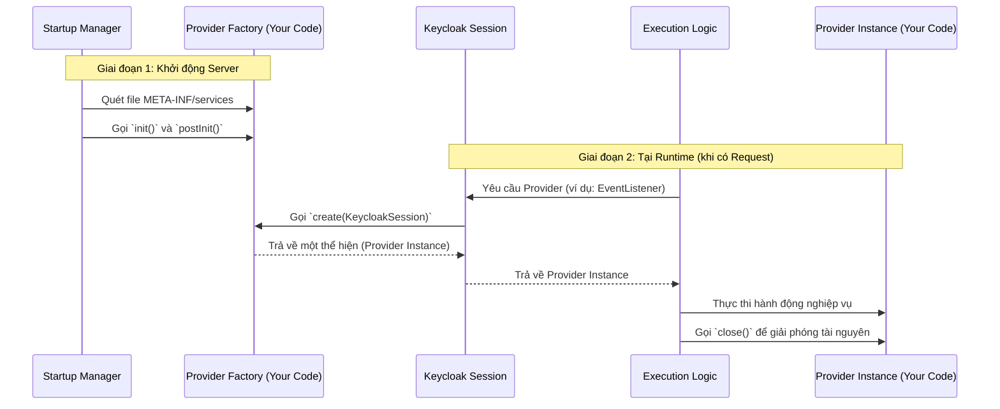

# Bài học 1: Kiến trúc Service Provider Interfaces (SPI)

> [!NOTE]
> **Category:** Theory (Lý thuyết)
> **Goal:** Hiểu kiến trúc Service Provider Interfaces (SPI), cách Keycloak mở rộng hệ thống bằng Custom Code mà không can thiệp vào Source Code lõi.

## 1. Lý thuyết chuyên sâu (Detailed Theory)
Keycloak là một hệ thống IAM nguyên khối mạnh mẽ, nhưng không một hệ thống nào có thể thỏa mãn mọi nghiệp vụ (Business Logic) phức tạp của mọi doanh nghiệp. Để giải quyết bài toán "Tính mở rộng" (Extensibility), Keycloak được thiết kế dựa trên kiến trúc **Service Provider Interface (SPI)**.

SPI là một mẫu thiết kế (Design Pattern) trong hệ sinh thái Java cho phép tải các thành phần động (Dynamic Loading) trong thời gian chạy (Runtime) mà không cần biên dịch lại phần mềm lõi.
Một cấu trúc SPI trong Keycloak thường bao gồm:
- **SPI Definition:** Định nghĩa giao diện (Interface) chung (Ví dụ: `EventListenerProvider`).
- **Provider Factory:** Lớp nhà máy đóng vai trò khởi tạo các instance của Provider (Ví dụ: `EventListenerProviderFactory`).
- **Provider Implementation:** Lớp triển khai logic cụ thể của bạn thực thi giao diện.

Bằng cách này, khi bạn muốn thay đổi cách Keycloak hash mật khẩu, hoặc cách lưu trữ user, bạn chỉ cần viết một SPI, đóng gói thành file JAR, và triển khai (Deploy) vào server.

## 2. Luồng nội bộ & Cơ chế cấp thấp (Internal Workflow & Low-level Mechanisms)
Sự tương tác giữa Keycloak Core và Custom SPI được quản lý bởi thành phần **Keycloak Session** và **ProviderManager**.


**Giải thích:**
- Khi server khởi động, nó đọc tệp đăng ký `META-INF/services/org.keycloak.provider.Spi` trong file JAR của bạn.
- Khi một HTTP Request được gửi tới, một đối tượng `KeycloakSession` duy nhất được sinh ra cho request đó.
- `KeycloakSession` sẽ gọi vào `ProviderFactory` của bạn để sinh ra đối tượng `Provider` xử lý dữ liệu. Sau khi kết thúc, hàm `close()` được gọi.

## 3. Thực hành tốt nhất & Bảo mật (Best Practices & Security)
> [!IMPORTANT]
> **Quản lý Trạng thái (State Management):** Một `Provider Instance` chỉ sống và tồn tại trong vòng đời của một Request duy nhất (Request-scoped). Trái lại, `ProviderFactory` là Application-scoped (Tồn tại vĩnh viễn suốt vòng đời Server). Không lưu trữ các biến trạng thái (State) hoặc dữ liệu người dùng tại `ProviderFactory` để tránh hiện tượng rò rỉ dữ liệu (Thread-safety issues/Data Leak) giữa các request khác nhau.

> [!WARNING]
> **Quản lý Tài nguyên (Resource Handling):** Vì hàm `create()` của bạn được gọi rất nhiều lần (mỗi request một lần), tránh thực hiện các tác vụ nặng như mở kết nối CSDL hoặc gọi REST API tốn thời gian bên trong hàm này. Thay vào đó, hãy khởi tạo kết nối/connection pool bên trong hàm `init()` của Factory.

## 4. Cấu hình minh họa thực tế (Configuration Examples)
Cấu trúc cơ bản của một lớp Factory (Java):

```java
public class MyCustomProviderFactory implements EventListenerProviderFactory {
    
    // Gọi duy nhất một lần lúc khởi động Server
    @Override
    public void init(Config.Scope config) {
        // Khởi tạo Connection Pool hoặc Kafka Producer tại đây
    }

    // Gọi liên tục cho mỗi Request
    @Override
    public EventListenerProvider create(KeycloakSession session) {
        // Trả về đối tượng xử lý, truyền vào KeycloakSession
        return new MyCustomProvider(session); 
    }

    @Override
    public String getId() {
        return "my-custom-spi-id"; // ID cấu hình trên giao diện Admin
    }

    @Override
    public void close() {
        // Đóng các kết nối khi Server tắt
    }
}
```

Để Java hiểu được lớp này là một dịch vụ, cần một file mô tả tại:
`src/main/resources/META-INF/services/org.keycloak.events.EventListenerProviderFactory` chứa nội dung là Tên gói (Package) đầy đủ của lớp Factory:
`com.example.keycloak.MyCustomProviderFactory`

## 5. Trường hợp ngoại lệ (Edge Cases)
- **Classloading Issues (Xung đột thư viện):** Khi SPI của bạn đóng gói cùng các thư viện (ví dụ Apache HttpClient) nhưng lại khác phiên bản với thư viện mà lõi Keycloak sử dụng, có thể sinh ra lỗi `NoSuchMethodError` hoặc `ClassNotFoundException`. Cách giải quyết: Sử dụng các Dependency cấp "provided" (trong Maven) để tận dụng thư viện có sẵn của Keycloak, hoặc build file JAR dạng "Fat JAR" có sử dụng kỹ thuật Relocation/Shading.
- **Vòng lặp Vô hạn (Infinite Loops):** Khi tạo Custom User Federation SPI, nếu trong code bạn lại gọi `session.users().getUserById(...)` một cách thiếu kiểm soát, nó sẽ kích hoạt lại chính Provider của bạn và gây ra lỗi tràn bộ nhớ (StackOverflow).

## 6. Câu hỏi Phỏng vấn (Interview Questions)
1. **[Junior]** Giải thích sự khác biệt giữa `ProviderFactory` và `Provider` trong Keycloak.
2. **[Junior]** Tệp `META-INF/services` đóng vai trò gì trong kiến trúc SPI?
3. **[Senior]** Làm thế nào để giải quyết vấn đề rò rỉ kết nối Database (Connection Leak) khi lập trình Custom SPI? Bạn sẽ khởi tạo và đóng kết nối ở đâu?
4. **[Senior]** Giải thích về Thread-safety trong Keycloak SPI. Tại sao không nên khai báo biến `private User currentUser` bên trong `ProviderFactory`?
5. **[Senior]** Nếu bạn cần cache dữ liệu từ một API bên ngoài để SPI sử dụng lại nhằm giảm độ trễ, bạn sẽ thiết kế cache này nằm ở `Provider` hay `ProviderFactory`? Tại sao?

## 7. Tài liệu tham khảo (References)
- [Keycloak Server Developer Guide - SPI](https://www.keycloak.org/docs/latest/server_development/)
- [Java Service Provider Interface (SPI) Documentation](https://docs.oracle.com/javase/tutorial/ext/basics/spi.html)
- [Quarkus Class Loading Architecture](https://quarkus.io/guides/class-loading-reference)
