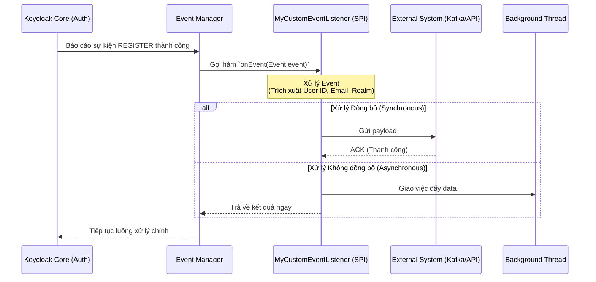

# Bài học 2: EventListener SPI và Kiến trúc Xử lý Sự kiện

> [!NOTE]
> **Category:** Theory (Lý thuyết)
> **Goal:** Nắm vững cấu trúc và cách cài đặt một EventListener SPI để lắng nghe và phản ứng với các luồng sự kiện (như Đăng nhập, Đăng ký) nhằm tích hợp Keycloak với các hệ thống bên thứ ba (Webhooks, Message Brokers).

## 1. Lý thuyết chuyên sâu (Detailed Theory)
Keycloak cung cấp sẵn các EventListener để ghi sự kiện ra Database (`jpa`) và màn hình console (`jboss-logging`). Tuy nhiên, trong môi trường Enterprise, doanh nghiệp thường yêu cầu tích hợp theo thời gian thực (Real-time Integration):
- Gửi tin nhắn SMS cảnh báo khi có đăng nhập từ IP lạ.
- Gửi thông tin người dùng mới đăng ký sang hệ thống CRM (Salesforce).
- Xuất sự kiện sang Apache Kafka để hệ thống Fraud Detection phân tích.

Để làm được điều này, chúng ta phải tự phát triển một **EventListener SPI**. Nó lắng nghe mọi sự kiện xảy ra trên toàn Keycloak và cung cấp cơ chế để thực thi mã nguồn tùy chỉnh mỗi khi sự kiện đó xuất hiện. EventListener xử lý cả `Event` (User event) và `AdminEvent`.

## 2. Luồng nội bộ & Cơ chế cấp thấp (Internal Workflow & Low-level Mechanisms)
Việc bắt giữ và đẩy sự kiện tuân theo kiến trúc Push.


**Giải thích luồng đồng bộ và bất đồng bộ:**
- Mặc định, hàm `onEvent` được gọi **Đồng bộ (Synchronous)**. Điều này nghĩa là nếu trong hàm `onEvent`, bạn gọi một API HTTP mất 5 giây, thì người dùng (User) trên màn hình đăng ký sẽ phải chờ thêm 5 giây trước khi thấy trang thành công.
- Trong kiến trúc hệ thống thực tế, các EventListener tùy chỉnh PHẢI đẩy công việc ra một luồng phụ (Thread Pool) hoặc sử dụng các Message Broker cực nhanh (Kafka/RabbitMQ) để giảm thiểu độ trễ cho luồng xác thực chính.

## 3. Thực hành tốt nhất & Bảo mật (Best Practices & Security)
> [!IMPORTANT]
> **Tránh Thắt cổ chai (Prevent Bottlenecks):** Tuyệt đối không thực hiện các HTTP Request đồng bộ kéo dài bên trong hàm `onEvent()`. Nếu External API phản hồi chậm, tất cả các luồng đăng nhập của Keycloak sẽ bị kẹt, dẫn đến quá tải bộ nhớ và treo máy chủ (Denial of Service). Hãy thiết kế Queue nội bộ hoặc dùng Java `CompletableFuture`.

> [!WARNING]
> **Lọc sự kiện (Event Filtering):** Hệ thống sinh ra hàng chục sự kiện liên quan đến mã Token (REFRESH_TOKEN, CODE_TO_TOKEN, INTROSPECT). Gửi toàn bộ những sự kiện này sang hệ thống ngoài có thể gây lãng phí băng thông và tài nguyên. Trong đoạn code SPI, luôn phải dùng lệnh `if (event.getType() == EventType.LOGIN)` để lọc trước khi xử lý.

## 4. Cấu hình minh họa thực tế (Configuration Examples)
Dưới đây là khung chuẩn của một lớp thực thi `EventListenerProvider`:

```java
import org.keycloak.events.Event;
import org.keycloak.events.EventListenerProvider;
import org.keycloak.events.admin.AdminEvent;
import org.keycloak.events.EventType;

public class WebhookEventListenerProvider implements EventListenerProvider {

    public WebhookEventListenerProvider() {
        // Constructor, có thể nhận KeycloakSession từ Factory
    }

    @Override
    public void onEvent(Event event) {
        // Chỉ quan tâm đến sự kiện REGISTER (Đăng ký mới)
        if (event.getType() == EventType.REGISTER) {
            String userId = event.getUserId();
            String email = event.getDetails().get("email");
            
            // TODO: Gửi Async qua Webhook/Kafka
            sendAsyncToWebhook(userId, email);
        }
    }

    @Override
    public void onEvent(AdminEvent adminEvent, boolean includeRepresentation) {
        // Logic xử lý khi Admin thay đổi cấu hình
    }

    @Override
    public void close() {
        // Dọn dẹp tài nguyên
    }
    
    private void sendAsyncToWebhook(String id, String email) {
        // Chạy ngầm trong ThreadPool
    }
}
```

Sau khi cấu hình Factory và cài đặt file JAR, trên UI Keycloak, truy cập **Realm Settings -> Events -> Event Listeners**, bạn sẽ thấy ID của Provider mới xuất hiện trong danh sách để kích hoạt.

## 5. Trường hợp ngoại lệ (Edge Cases)
- **Mất sự kiện khi Khởi động lại (Event Loss on Restart):** Nếu bạn lưu các Event vào một In-memory Queue trong Java (trong ProviderFactory) để chờ gửi dần qua API, nhưng đột ngột máy chủ Keycloak bị sập (Crash) hoặc Restart, toàn bộ sự kiện trong Queue sẽ bốc hơi. Giải pháp chuyên nghiệp là sử dụng thư viện Kafka Producer trực tiếp vì nó có cơ chế persistent log phía local, hoặc chấp nhận rủi ro và giám sát chặt chẽ tiến trình (Process Monitor).

## 6. Câu hỏi Phỏng vấn (Interview Questions)
1. **[Junior]** Hai phương thức chính bắt buộc phải Override khi triển khai `EventListenerProvider` là gì? (Trả lời: onEvent cho User Event và onEvent cho AdminEvent).
2. **[Junior]** Làm sao để cấu hình Keycloak gọi vào SPI EventListener của bạn sau khi deploy file JAR?
3. **[Senior]** Phân tích hậu quả nếu bạn gọi hàm `Thread.sleep(5000)` bên trong phương thức `onEvent` của một User login.
4. **[Senior]** Trình bày kiến trúc cho một EventListener có nhiệm vụ đẩy log sang HTTP API nhưng không làm tăng độ trễ (latency) của quá trình đăng nhập. Bạn sẽ quản lý ThreadPool như thế nào để an toàn trong một môi trường chịu tải cao?
5. **[Senior]** Làm thế nào để lấy thông tin chi tiết (ví dụ Custom User Attribute) của người dùng ngay bên trong EventListener SPI khi mà đối tượng `Event` chỉ chứa `userId`? (Gợi ý: Cần truyền KeycloakSession từ Factory sang Provider và dùng `session.users().getUserById(...)`).

## 7. Tài liệu tham khảo (References)
- [Keycloak Server Developer Guide - Event Listener SPI](https://www.keycloak.org/docs/latest/server_development/#_events)
- [Java Concurrency in Practice (Tham khảo xử lý Async an toàn)](#)
