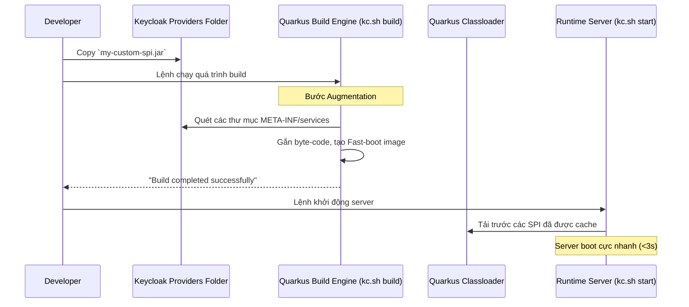

# Bài học 3: Biên dịch và Triển khai (Deployment) Custom SPI

> [!NOTE]
> **Category:** Theory (Lý thuyết)
> **Goal:** Tìm hiểu quy trình đóng gói (Build) mã nguồn Custom SPI thành file JAR, và cơ chế triển khai (Deployment) vào cấu trúc máy chủ Keycloak (kiến trúc Quarkus).

## 1. Lý thuyết chuyên sâu (Detailed Theory)
Sau khi hoàn thành việc lập trình các lớp `Provider` và `ProviderFactory` theo chuẩn Service Provider Interfaces (SPI), mã nguồn này cần được đưa vào lõi thực thi của Keycloak. Keycloak dựa trên Quarkus runtime có một cơ chế tối ưu hóa thời gian khởi động (Boot-time optimization), được gọi là quá trình **Augmentation** (hoặc Build Phase).

Quy trình triển khai SPI trên Keycloak hiện đại yêu cầu:
1. **Đóng gói (Packaging):** Biên dịch Java code, tạo file `.jar`. Bao gồm tệp `META-INF/services`.
2. **Cung cấp (Provisioning):** Đặt file `.jar` vào thư mục `/opt/keycloak/providers/`.
3. **Biên dịch máy chủ (Re-building the Server):** Chạy lệnh `kc.sh build` để Quarkus đọc, giải nén các lớp Java, tối ưu hóa dependencies, và tái cấu trúc hệ thống nạp lớp (Classloader).
4. **Khởi động (Starting):** Chạy `kc.sh start`.

## 2. Luồng nội bộ & Cơ chế cấp thấp (Internal Workflow & Low-level Mechanisms)
Quá trình Quarkus nhận diện và tích hợp Custom SPI diễn ra mạnh mẽ nhất ở giai đoạn Build (chứ không phải Runtime).


**Giải thích cơ chế:**
- Các phiên bản Keycloak cũ (Wildfly/JBoss) sử dụng "Hot Deployment", bạn chỉ việc ném file JAR vào thư mục là server tự load lại. Điều này tiện lợi nhưng làm quá trình khởi động chậm và tốn RAM.
- Hệ thống Quarkus mới bắt buộc phải chạy lệnh **build** để đóng gói toàn bộ các cấu hình, phân tích SPI và nối các Class tĩnh lại với nhau. Quá trình này giúp hệ thống tiết kiệm được hàng trăm Megabyte RAM và thời gian boot rút ngắn đáng kể.

## 3. Thực hành tốt nhất & Bảo mật (Best Practices & Security)
> [!IMPORTANT]
> **Quy trình Docker Immutability:** Trong môi trường Production, không bao giờ truy cập vào container đang chạy, copy file JAR, chạy lệnh build rồi restart (bởi vì bản chất container là Ephemeral - tạm thời). Bạn PHẢI tạo một `Dockerfile` mới lấy image gốc từ Keycloak, thực hiện lệnh copy file JAR, và gọi lệnh `RUN /opt/keycloak/bin/kc.sh build`. Sau đó tạo ra một Image Keycloak mang tính bản quyền của công ty (Custom Image).

> [!WARNING]
> **Xung đột thư viện (Jar Hell):** Tránh đóng gói (Fat JAR/Uber JAR) các thư viện đã được Keycloak tích hợp sẵn (như Jackson, Resteasy, Hibernate) vào bên trong SPI của bạn, vì nó sẽ gây xung đột Classloader trong giai đoạn Build. Chỉ bao gồm các thư viện chuyên biệt (Third-party libraries) không có mặt trên nền tảng Quarkus/Keycloak.

## 4. Cấu hình minh họa thực tế (Configuration Examples)
Để tạo ra một Custom Keycloak Image chuẩn DevOps, chúng ta dùng Dockerfile sau:

```dockerfile
# Giai đoạn Build
FROM quay.io/keycloak/keycloak:22.0.0 AS builder

# 1. Kích hoạt thông số cần thiết
ENV KC_HEALTH_ENABLED=true
ENV KC_METRICS_ENABLED=true
ENV KC_DB=postgres

# 2. Copy file SPI được biên dịch vào thư mục providers
COPY target/my-custom-event-listener.jar /opt/keycloak/providers/

# 3. Lệnh quan trọng nhất: Tối ưu hoá toàn bộ cấu trúc Server (Augmentation)
RUN /opt/keycloak/bin/kc.sh build

# Giai đoạn Runtime
FROM quay.io/keycloak/keycloak:22.0.0
COPY --from=builder /opt/keycloak/ /opt/keycloak/

# Đặt cấu hình khởi chạy
ENTRYPOINT ["/opt/keycloak/bin/kc.sh"]
CMD ["start"]
```
Cách build Image:
```bash
docker build -t my-company-keycloak:1.0 .
docker run -p 8080:8080 my-company-keycloak:1.0
```

## 5. Trường hợp ngoại lệ (Edge Cases)
- **Lỗi Provider Registration Failed:** Xảy ra khi file `META-INF/services/...` bên trong JAR chỉ định một package/class sai tên, bị lệch chính tả hoặc bạn quên thêm file này vào. Lệnh `kc.sh build` sẽ báo lỗi không tìm thấy `Factory Class`.
- **Thiếu Memory khi Build:** Quá trình `kc.sh build` tiêu tốn rất nhiều CPU và RAM. Nếu CI/CD Pipeline (như GitLab CI, GitHub Actions) có cấu hình giới hạn (dưới 1GB RAM), tiến trình Build Quarkus có thể bị Out of Memory (Killed by OS). Cấp phát tối thiểu 2GB RAM cho quá trình build.

## 6. Câu hỏi Phỏng vấn (Interview Questions)
1. **[Junior]** Bạn cần đặt file `.jar` Custom SPI vào thư mục nào trên Keycloak Server? (Thư mục `/opt/keycloak/providers/`).
2. **[Junior]** Lệnh `kc.sh build` có bắt buộc phải chạy sau khi đưa file SPI mới vào hệ thống không? Tại sao?
3. **[Senior]** Mô tả khái niệm "Quarkus Augmentation phase". Nó giúp ích gì cho hiệu năng của Keycloak so với kiến trúc JBoss cũ?
4. **[Senior]** Khi viết Dockerfile để triển khai SPI lên Production, tại sao bạn cần sử dụng cấu trúc "Multi-stage build"? Nó giải quyết bài toán gì?
5. **[Senior]** Nêu cách xử lý khi SPI của bạn cần một thư viện phụ trợ (ví dụ: Google Cloud SDK), nhưng việc gộp chung nó vào file JAR làm lệnh build của Keycloak gặp lỗi Classloader?

## 7. Tài liệu tham khảo (References)
- [Keycloak Official Docs: Configuring Providers](https://www.keycloak.org/server/configuration-provider)
- [Keycloak Container Deployment Guide](https://www.keycloak.org/server/containers)
- [Quarkus Build Steps (Augmentation Concept)](https://quarkus.io/guides/writing-extensions)
