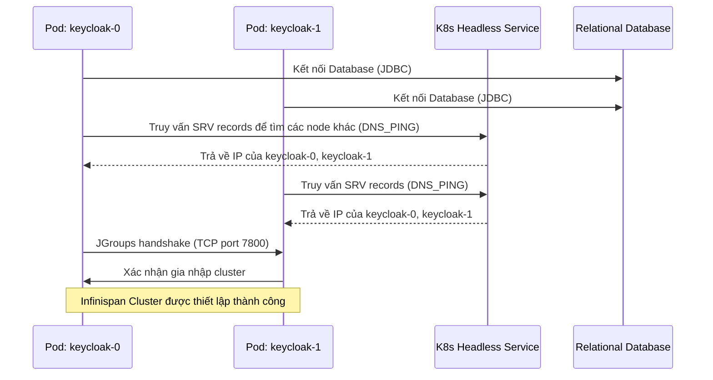

> [!NOTE]
> **Category:** Theory (Lý thuyết)
> **Goal:** Hiểu rõ sự khác biệt kiến trúc giữa StatefulSet và Deployment trong Kubernetes khi triển khai Keycloak, tại sao Keycloak lại yêu cầu clustering (Infinispan) và ảnh hưởng của nó tới quyết định chọn loại Workload.

## 1. Lý thuyết chuyên sâu (Detailed Theory)
Khi triển khai Keycloak trên Kubernetes, một trong những quyết định kiến trúc quan trọng nhất là lựa chọn giữa **Deployment** và **StatefulSet**.

**Deployment** là Workload API cơ bản nhất trong Kubernetes dành cho các ứng dụng vô trạng thái (stateless). Các Pod trong Deployment hoàn toàn có thể bị thay thế và không có danh tính cố định.
**StatefulSet** được thiết kế cho các ứng dụng có trạng thái (stateful), cung cấp các định danh mạng cố định (stable network identity) và lưu trữ bền vững (persistent storage) cho từng Pod.

Đối với Keycloak, mặc dù bản thân ứng dụng web có thể coi là stateless, nhưng Keycloak sử dụng **Infinispan** làm distributed cache nội bộ để lưu trữ các thông tin như session của người dùng, action tokens, và state của quá trình login. Để Infinispan có thể thiết lập cluster một cách ổn định thông qua các giao thức như JGroups (ví dụ DNS_PING hoặc KUBE_PING), mỗi node cần có một danh tính mạng dự đoán được. Vì lý do này, StatefulSet thường là lựa chọn tối ưu và cũng là Workload mặc định được Keycloak Operator sử dụng.

## 2. Luồng nội bộ & Cơ chế cấp thấp (Internal Workflow & Low-level Mechanisms)
Quá trình hình thành cluster của Infinispan trong Kubernetes:



Khi sử dụng **StatefulSet**, các Pod có tên gọi cố định (như `keycloak-0`, `keycloak-1`) và một Headless Service sẽ tạo ra các bản ghi DNS riêng biệt cho từng Pod. Điều này giúp cơ chế JGroups (DNS_PING) dễ dàng khám phá và kết nối các node với nhau. Nếu dùng **Deployment**, tên Pod là ngẫu nhiên và việc khám phá node dựa trên KUBE_PING (yêu cầu quyền truy cập Kubernetes API) hoặc DNS_PING có thể kém ổn định hơn khi Pod bị khởi động lại liên tục.

## 3. Thực hành tốt nhất & Bảo mật (Best Practices & Security)

> [!IMPORTANT]
> Luôn sử dụng Keycloak Operator để triển khai Keycloak trong môi trường Production thay vì tự viết các file YAML tĩnh. Operator tự động quản lý StatefulSet, cấu hình Infinispan tối ưu và hỗ trợ các tính năng như Rolling Updates không gián đoạn (Zero-Downtime).

> [!WARNING]
> Nếu bạn cố gắng sử dụng Deployment mà không cấu hình cache phân tán (để local cache) và chạy nhiều replica, người dùng sẽ gặp lỗi mất session liên tục do Load Balancer có thể điều hướng request đến các Pod khác nhau, trừ khi bạn cấu hình Sticky Session cực kỳ chặt chẽ (không được khuyến khích).

- **Headless Service:** Bắt buộc phải có một Headless Service (ClusterIP: None) đi kèm với StatefulSet để cung cấp DNS resolution cho từng Pod.
- **Graceful Shutdown:** Cấu hình thời gian `terminationGracePeriodSeconds` đủ dài (ví dụ: 60s) để Infinispan có đủ thời gian để rebalance dữ liệu cache sang các node khác trước khi một Pod thực sự bị tắt đi.

## 4. Cấu hình minh họa thực tế (Configuration Examples)

Ví dụ cấu hình một StatefulSet cơ bản cho Keycloak với JGroups DNS_PING:

```yaml
apiVersion: apps/v1
kind: StatefulSet
metadata:
  name: keycloak
spec:
  serviceName: keycloak-headless
  replicas: 2
  selector:
    matchLabels:
      app: keycloak
  template:
    metadata:
      labels:
        app: keycloak
    spec:
      containers:
        - name: keycloak
          image: quay.io/keycloak/keycloak:latest
          env:
            # Cấu hình JGroups sử dụng DNS_PING thông qua headless service
            - name: JGROUPS_DISCOVERY_PROTOCOL
              value: dns.DNS_PING
            - name: JGROUPS_DISCOVERY_PROPERTIES
              value: dns_query=keycloak-headless.default.svc.cluster.local
          ports:
            - name: http
              containerPort: 8080
            - name: jgroups
              containerPort: 7800
```

Headless Service đi kèm:
```yaml
apiVersion: v1
kind: Service
metadata:
  name: keycloak-headless
spec:
  clusterIP: None
  selector:
    app: keycloak
  ports:
    - name: jgroups
      port: 7800
      targetPort: 7800
```

## 5. Trường hợp ngoại lệ (Edge Cases)
- **Split-Brain Problem:** Trong trường hợp mất kết nối mạng giữa các node trong cluster (Network Partition), Infinispan có thể bị chia cắt thành nhiều cụm nhỏ (split-brain). Keycloak giải quyết một phần bằng cơ chế quorum, nhưng ở cấp độ K8s, cần cẩn trọng với các cấu hình Multi-AZ.
- **Pod khởi động lại liên tục (CrashLoopBackOff):** Nếu cấu hình DNS_PING sai tên headless service, quá trình startup của Keycloak sẽ bị treo do JGroups không tìm thấy peer nào, dẫn đến healthcheck thất bại và Pod bị K8s kill liên tục.

## 6. Câu hỏi Phỏng vấn (Interview Questions)
1. **[Junior]** Sự khác biệt chính giữa Deployment và StatefulSet trong Kubernetes là gì?
   - *Đáp án:* Deployment sinh ra Pod với tên ngẫu nhiên và vô trạng thái, trong khi StatefulSet cung cấp định danh mạng cố định và thứ tự khởi động tuần tự cho các Pod.
2. **[Junior]** Tại sao Keycloak không hoàn toàn là một ứng dụng "stateless"?
   - *Đáp án:* Vì Keycloak sử dụng Infinispan để lưu trữ distributed cache như session người dùng, action tokens.
3. **[Senior]** Cơ chế DNS_PING của JGroups hoạt động như thế nào trong Kubernetes StatefulSet?
   - *Đáp án:* Nó sử dụng Headless Service để truy vấn DNS SRV records, từ đó lấy được IP của các Pod đang chạy trong cụm để thiết lập TCP connection qua port 7800.
4. **[Senior]** Điều gì xảy ra nếu bạn thu nhỏ (scale down) số lượng bản sao Keycloak từ 3 xuống 1 quá nhanh?
   - *Đáp án:* Nếu không cấu hình `terminationGracePeriodSeconds` và `cache-owners` đủ hợp lý, Infinispan có thể bị mất dữ liệu session chưa kịp đồng bộ (rebalance) về node còn lại, khiến người dùng bị đăng xuất (logout) đột ngột.
5. **[Senior]** Làm thế nào Keycloak Operator quản lý việc nâng cấp phiên bản (rolling update) cho Keycloak cluster?
   - *Đáp án:* Nó thực hiện update từng Pod một theo thứ tự của StatefulSet. Nó cũng có thể giám sát trạng thái sức khỏe của Infinispan cluster trước khi tiếp tục nâng cấp Pod tiếp theo để đảm bảo tính toàn vẹn dữ liệu.

## 7. Tài liệu tham khảo (References)
- [Keycloak Official Documentation: Clustering Keycloak](https://www.keycloak.org/server/clustering)
- [Kubernetes Documentation: StatefulSets](https://kubernetes.io/docs/concepts/workloads/controllers/statefulset/)
- [JGroups Protocol: DNS_PING](http://jgroups.org/manual/index.html#_dns_ping)
