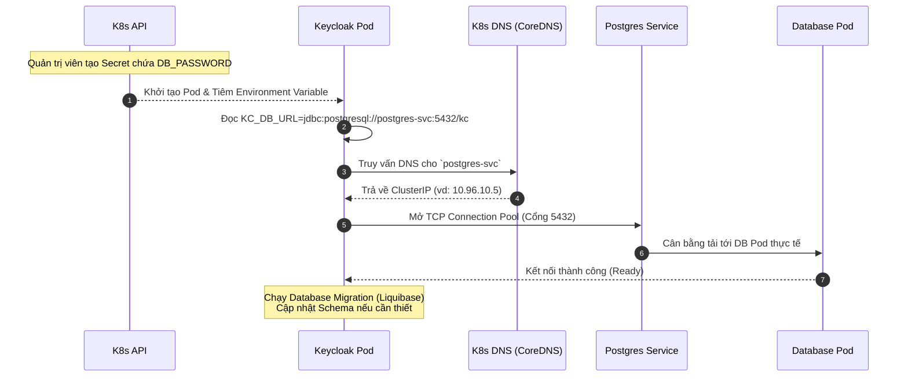

> [!NOTE]
> **Category:** Architecture/Design (Kiến trúc/Thiết kế)
> **Goal:** Thiết lập mô hình kết nối an toàn, hiệu năng cao giữa Pods Keycloak và CSDL PostgreSQL trong môi trường Kubernetes.

## 1. Lý thuyết chuyên sâu (Detailed Theory)

Mặc định, Keycloak có thể được đóng gói với cơ sở dữ liệu in-memory nhỏ gọn như H2. Tuy nhiên, H2 bay hơi khi container bị khởi động lại và không hỗ trợ kết nối đồng thời từ nhiều bản sao (Replicas) Keycloak.
Trong kiến trúc Hệ Phân Tán với Kubernetes, trạng thái ứng dụng (State) phải được lưu trữ riêng rẽ (Stateless Pods). Do đó, Keycloak phải được cấu hình kết nối ra một dịch vụ CSDL bên ngoài (Thường là **PostgreSQL**).

**Vấn đề cốt lõi:**
Khi triển khai Keycloak và CSDL trên Kubernetes, làm thế nào để Keycloak biết thông tin kết nối CSDL mà không bị lộ mật khẩu (credentials)? Và làm thế nào để đảm bảo Keycloak có thể chống chịu nếu đường truyền đến Database chập chờn?

**Giải pháp:**
- Sử dụng **Kubernetes Service Names (DNS nội bộ)** thay cho IP tĩnh để trỏ tới CSDL, vì IP của Pod Database có thể thay đổi liên tục.
- Sử dụng **Kubernetes Secrets** để lưu trữ thông tin đăng nhập (Username, Password). Keycloak Pod sẽ được tự động tiêm (inject) các biến này dưới dạng Biến môi trường (Environment Variables) khi khởi tạo.
- Cấu hình **Connection Pooling (Agroal)** bên trong ứng dụng Keycloak để tái sử dụng luồng kết nối hiệu quả.

## 2. Luồng nội bộ & Cơ chế cấp thấp (Internal Workflow & Low-level Mechanisms)



**Phân tích quá trình:**
1. Khi khởi động, Keycloak kích hoạt thư viện Agroal (Connection Pool tích hợp của Quarkus).
2. Keycloak không dùng địa chỉ IP tĩnh mà dùng chuỗi `postgres-svc`. CoreDNS (thành phần DNS tích hợp của K8s) có trách nhiệm phân giải tên này ra IP nội bộ.
3. Nếu đây là lần chạy mới, Keycloak tự động gọi Liquibase để cập nhật các bảng (Table Schema) trên CSDL lên phiên bản mới nhất theo bộ mã nguồn (Auto-migration).

## 3. Thực hành tốt nhất & Bảo mật (Best Practices & Security)

> [!WARNING]
> Tuyệt đối không bao giờ ghi trực tiếp mật khẩu CSDL dưới dạng văn bản thuần (plain text) trong thẻ `env` của tệp YAML Deployment. Hãy dùng tham chiếu `valueFrom: secretKeyRef`.

> [!IMPORTANT]
> - **Sử dụng Dịch vụ CSDL được quản lý (Managed DB Service):** Trong sản xuất, thay vì chạy Postgres ngay trên K8s thông qua StatefulSet, hãy sử dụng các dịch vụ DB có sẵn trên Cloud (như AWS RDS, Google Cloud SQL). Điều này giải phóng bạn khỏi gánh nặng Backup, Replications và High Availability của DB.
> - **Tối ưu Connection Pool:** Đảm bảo tham số cấu hình pool size phù hợp với tài nguyên. Cấu hình biến `KC_DB_POOL_INITIAL_SIZE` và `KC_DB_POOL_MAX_SIZE`.
> - **Wait-for-it pattern:** Pod Postgres có thể khởi động chậm hơn Keycloak. Nếu Keycloak bật lên và không thấy DB, nó sẽ sập (CrashLoopBackOff). K8s sẽ tự khởi động lại Keycloak cho đến khi DB sẵn sàng, do đó đây là hành vi tự chữa lành hợp lệ (Self-healing).

## 4. Cấu hình minh họa thực tế (Configuration Examples)

**Bước 1: Tạo đối tượng Secret lưu trữ mật khẩu CSDL:**
```yaml
apiVersion: v1
kind: Secret
metadata:
  name: keycloak-db-secret
type: Opaque
data:
  # Cần được mã hóa Base64 trước khi đặt vào đây: 
  # echo -n "mypassword" | base64
  username: a2V5Y2xvYWs=
  password: bXlwYXNzd29yZA==
```

**Bước 2: Cấu hình Deployment Keycloak tham chiếu tới Secret:**
```yaml
apiVersion: apps/v1
kind: Deployment
metadata:
  name: keycloak
spec:
  replicas: 2
  template:
    spec:
      containers:
        - name: keycloak
          image: quay.io/keycloak/keycloak:latest
          env:
            - name: KC_DB
              value: postgres
            - name: KC_DB_URL
              value: jdbc:postgresql://postgres-svc.db-namespace.svc.cluster.local:5432/keycloakdb
            - name: KC_DB_USERNAME
              valueFrom:
                secretKeyRef:
                  name: keycloak-db-secret
                  key: username
            - name: KC_DB_PASSWORD
              valueFrom:
                secretKeyRef:
                  name: keycloak-db-secret
                  key: password
          command: ["/opt/keycloak/bin/kc.sh", "start"]
```

## 5. Trường hợp ngoại lệ (Edge Cases)

- **CrashLoop do phân giải DNS chậm:** Nếu môi trường K8s có mạng chậm, Keycloak Pod không thể liên lạc với CoreDNS kịp thời sẽ quăng ra `UnknownHostException` tại chuỗi `postgres-svc`. K8s sẽ phải restart Pod theo chính sách.
- **Vấn đề Lock Database (Liquibase Lock):** Nếu bạn có 3 Pods Keycloak khởi động cùng 1 lúc (Scaling), cả 3 sẽ đồng loạt cố cập nhật Schema Database. Cơ chế của Liquibase sẽ cho một Pod duy nhất nắm giữ khóa (Locking table). Nếu Pod giữ khóa bị sập giữa chừng, bảng `DATABASECHANGELOGLOCK` trong Database bị kẹt trạng thái `locked=true`, khiến mọi Pod tiếp theo đều bị treo đứng im.
  *Cách xử lý:* Can thiệp vào Database, truy vấn bảng `DATABASECHANGELOGLOCK` và dùng lệnh UPDATE trả cột `locked` về `false` thủ công.

## 6. Câu hỏi Phỏng vấn (Interview Questions)

1. **(Junior)** Tại sao Keycloak Deployment trên Kubernetes không nên sử dụng cơ sở dữ liệu mặc định H2?
   - *Đáp án:* Vì H2 lưu dữ liệu trên Ram hoặc Disk cục bộ của Container. Trong K8s, container có thể chết bất cứ lúc nào, khiến dữ liệu (Tài khoản người dùng, cấu hình) biến mất vĩnh viễn. Ngoài ra, nó không hỗ trợ việc nhân bản (replicas) nhiều Pod Keycloak để cân bằng tải.
2. **(Junior)** Thay vì cấu hình IP tĩnh của Database vào `KC_DB_URL`, chúng ta nên dùng chuỗi nào?
   - *Đáp án:* Dùng K8s Service Name (ví dụ `postgres-svc`). K8s tự động phân giải Service Name thành IP động thông qua CoreDNS.
3. **(Senior)** Làm thế nào để cấu hình mật khẩu DB an toàn nhất trong file YAML của K8s?
   - *Đáp án:* Sử dụng tài nguyên `Secret` của Kubernetes. Và trong Deployment dùng khối `valueFrom.secretKeyRef` để mapping các giá trị bí mật đó vào biến môi trường động cho Pod khi nó khởi tạo.
4. **(Senior)** Trong K8s, hiện tượng Liquibase Lock khi khởi chạy nhiều Pods Keycloak là gì?
   - *Đáp án:* Khi triển khai, Keycloak sẽ cố migration DB Schema. Nếu cả n Pods chạy cùng lúc, sẽ xảy ra tranh chấp dữ liệu. Công cụ Liquibase tạo khóa (Lock). Nếu quá trình lỗi gây kẹt khóa này, mọi Replicas Keycloak sẽ kẹt khởi động vì chờ nhả Lock. Khắc phục bằng việc clear cờ lock thủ công trong Database.
5. **(Senior)** Đâu là ưu và nhược điểm khi sử dụng Postgres cài trực tiếp trong Kubernetes Cluster thay vì dùng Amazon RDS ngoài cụm K8s?
   - *Đáp án:* Ưu điểm: Phản hồi mạng cực nhanh, quản lý mạng nội bộ dễ, giảm chi phí ban đầu. Nhược điểm: Phải tự quản lý độ sẵn sàng cao, sao lưu dữ liệu, bảo trì nâng cấp DB tốn sức, rủi ro mất mát nếu cấu hình Persistent Volume lỏng lẻo. RDS có tính tự động hóa cao hơn và an toàn cao.

## 7. Tài liệu tham khảo (References)

- [Keycloak Guide: Configuring the database](https://www.keycloak.org/server/db)
- [Kubernetes Secrets Documentation](https://kubernetes.io/docs/concepts/configuration/secret/)
