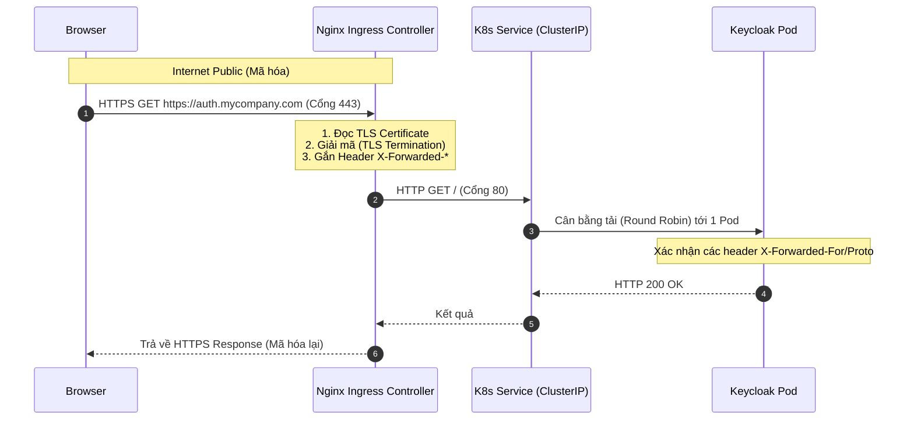

> [!NOTE]
> **Category:** Architecture/Design (Kiến trúc/Thiết kế)
> **Goal:** Phân tích kiến trúc điều hướng lưu lượng (Traffic Routing) và kết thúc bảo mật (TLS Termination) thông qua đối tượng Ingress khi triển khai Keycloak trong cụm Kubernetes.

## 1. Lý thuyết chuyên sâu (Detailed Theory)

Khi triển khai Keycloak trên Kubernetes (K8s), container Keycloak (Pod) cung cấp dịch vụ phân giải danh tính. Tuy nhiên, bản thân Pod K8s có IP biến động (ephemeral) và không thể tiếp cận trực tiếp từ ngoài Internet. 
Đối tượng **Ingress** trong Kubernetes hoạt động như một cửa ngõ (API Gateway/Reverse Proxy thông minh) chặn trước toàn bộ lưu lượng truy cập từ ngoài cụm K8s vào bên trong. Kèm theo đó, quá trình xử lý chứng chỉ bảo mật SSL/TLS (HTTPS) cũng thường được giao phó cho Ingress chứ không nằm trực tiếp trên bản thân Keycloak. Quá trình này gọi là **TLS Termination** (Kết thúc/Giải mã TLS ở tầng Proxy).

**Vấn đề cốt lõi:**
Nếu cấu hình chứng chỉ số (SSL/TLS) ngay trong server Keycloak (sử dụng Keystore Java), quy trình quản lý sẽ cực kỳ phức tạp (không tự động gia hạn, rủi ro cấu hình sai) và ăn mòn tài nguyên CPU quý giá của Keycloak để giải mã mã hóa (decrypt cipher text).

**Giải pháp với Ingress:**
- Tích hợp **Nginx Ingress Controller** làm thiết bị định tuyến trung tâm.
- Sử dụng công cụ **cert-manager** để tự động cấp phát và gia hạn chứng chỉ SSL miễn phí (Let's Encrypt).
- Nginx Ingress Controller nhận HTTPS Request (cổng 443), tiến hành giải mã bằng Private Key của nó. Sau khi trở thành văn bản thuần HTTP (cổng 80), nó sẽ đẩy tiếp cho cụm Keycloak nội bộ. Lúc này, Keycloak không cần quan tâm đến chứng chỉ SSL nữa (Offloading).

## 2. Luồng nội bộ & Cơ chế cấp thấp (Internal Workflow & Low-level Mechanisms)



**Phân tích sự quan trọng của HTTP Headers:**
Khi Ingress giải mã HTTPS thành HTTP và gửi cho Keycloak, Keycloak sẽ đinh ninh rằng người dùng đang truy cập hệ thống bằng HTTP không an toàn. Điều này cực kỳ nguy hiểm, Keycloak sẽ sinh ra các Redirect URL bằng `http://` làm lỗi toàn bộ hệ thống OIDC (vì OAuth 2.0 yêu cầu nghiêm ngặt HTTPS).
Để giải quyết bài toán "Proxy", Ingress **BẮT BUỘC** phải gắn thêm các headers sau:
- `X-Forwarded-For`: IP thật của người dùng.
- `X-Forwarded-Proto`: "https" - báo hiệu rằng gốc gác của request này là HTTPS.
Keycloak phải cấu hình cơ chế `PROXY_ADDRESS_FORWARDING` để tin tưởng và đọc các Headers này.

## 3. Thực hành tốt nhất & Bảo mật (Best Practices & Security)

> [!WARNING]
> Mặc định Keycloak có chế độ "strict HTTPS" (Buộc HTTPS). Nếu Ingress thực hiện TLS Termination mà bạn không cấu hình Keycloak đúng cách để nhận biết Proxy, Keycloak sẽ liên tục văng lỗi "HTTPS required" và từ chối mọi yêu cầu đăng nhập.

> [!IMPORTANT]
> - **Cấu hình biến môi trường Keycloak:** Bắt buộc phải đặt `KC_PROXY_HEADERS=xforwarded` (phiên bản Keycloak >= 20) hoặc `PROXY_ADDRESS_FORWARDING=true` (phiên bản Keycloak <= 19) khi chạy qua Ingress.
> - **Chứng chỉ tự động:** Luôn triển khai hệ sinh thái `cert-manager` kết hợp với `Let's Encrypt` (ACME Protocol) để Kubernetes tự quản lý vòng đời TLS Secret.
> - **Chặn Admin Console ra Public:** Bạn nên cấu hình Ingress giới hạn route `/admin` hoặc `/auth/admin` không cho public internet truy cập mà chỉ giới hạn dải IP VPN của công ty (Whitelisting).

## 4. Cấu hình minh họa thực tế (Configuration Examples)

**Ví dụ cấu hình Ingress Manifest (`keycloak-ingress.yaml`):**

```yaml
apiVersion: networking.k8s.io/v1
kind: Ingress
metadata:
  name: keycloak-ingress
  namespace: iam
  annotations:
    kubernetes.io/ingress.class: nginx
    # Kích hoạt Let's Encrypt
    cert-manager.io/cluster-issuer: "letsencrypt-prod"
    # Buộc Ingress Controller gắn đúng Header để Keycloak hoạt động Proxy
    nginx.ingress.kubernetes.io/proxy-buffer-size: "128k"
spec:
  tls:
    - hosts:
        - auth.mycompany.com
      secretName: keycloak-tls-secret # Tên bí mật (Secret) được cấp phát
  rules:
    - host: auth.mycompany.com
      http:
        paths:
          - path: /
            pathType: Prefix
            backend:
              service:
                name: keycloak-service
                port:
                  number: 8080
```

*Trong cấu hình K8s Deployment của Keycloak, phải có biến môi trường:*
```yaml
env:
  - name: KC_PROXY
    value: "edge" # Chế độ Edge báo cho Keycloak biết rằng TLS Termination được xử lý ở thiết bị phía trước
  - name: KC_HOSTNAME
    value: "auth.mycompany.com"
```

## 5. Trường hợp ngoại lệ (Edge Cases)

- **Lỗi Token Header quá lớn (HTTP 413 / 431):** Keycloak trả về và nhận rất nhiều cookie bảo mật và Token JSON khổng lồ qua Headers. Nginx Ingress mặc định giới hạn buffer size khá nhỏ (4K). Khi người dùng thuộc quá nhiều Group/Roles trên Keycloak, Token phình to, dẫn đến lỗi 400 Bad Request Headers Too Large trên Ingress. Phải cấu hình annotation `nginx.ingress.kubernetes.io/proxy-buffer-size: "128k"` như ví dụ ở trên để sửa lỗi.
- **Mix Content Warning (Cảnh báo kết hợp nội dung):** Nếu Keycloak không nhận diện được `X-Forwarded-Proto=https`, nó sẽ sinh ra các thẻ link CSS/JS bắt đầu bằng `http://`. Trình duyệt web hiện đại sẽ Block tất cả (cảnh báo Mixed Content) làm màn hình đăng nhập trở thành màn hình trắng trơn.

## 6. Câu hỏi Phỏng vấn (Interview Questions)

1. **(Junior)** TLS Termination tại Ingress có ý nghĩa gì?
   - *Đáp án:* Là việc giải mã giao thức bảo mật SSL/HTTPS ngay tại lớp Nginx Ingress Controller. Request sau khi đi qua Ingress sẽ trở thành HTTP thông thường và chuyển tiếp đến cụm Keycloak.
2. **(Junior)** Làm thế nào Keycloak biết request gốc từ người dùng là HTTP hay HTTPS nếu Ingress chỉ gửi HTTP vào?
   - *Đáp án:* Keycloak sẽ đọc HTTP Header `X-Forwarded-Proto` do Ingress chèn vào.
3. **(Senior)** Nếu biến môi trường `KC_PROXY=edge` bị thiếu, hành vi lỗi của Keycloak sẽ diễn ra như thế nào?
   - *Đáp án:* Keycloak sẽ tạo ra các URL redirect, URL trong thư mục OIDC Discovery (`.well-known`) với Scheme `http` thay vì `https`. Điều này khiến mọi Client (React, Spring Boot) từ chối giao tiếp vì vi phạm chuẩn bảo mật OAuth2.
4. **(Senior)** Lệnh cấu hình `nginx.ingress.kubernetes.io/proxy-buffer-size` giải quyết sự cố gì cụ thể với Keycloak?
   - *Đáp án:* Giúp Ingress có thể xử lý các Request Headers mang kích thước khổng lồ. Token OIDC chứa JWT với nhiều Claims/Roles có thể dễ dàng vượt quá dung lượng buffer mặc định của Nginx, gây lỗi.
5. **(Senior)** Tại sao lại cần cert-manager trong khi bạn hoàn toàn có thể nhúng certificate thủ công vào Kubernetes Secret?
   - *Đáp án:* Chứng chỉ Let's Encrypt chỉ sống được 90 ngày. Việc thay thủ công (rotation) sẽ tạo ra rủi ro vận hành (con người quên gia hạn gây sập trang web). Cert-manager tự động giải bài toán ACME Challenge và tái gia hạn ở ngày thứ 60 tự động hóa 100%.

## 7. Tài liệu tham khảo (References)

- [Keycloak Guide: Configuring a reverse proxy](https://www.keycloak.org/server/reverseproxy)
- [Kubernetes Ingress Documentation](https://kubernetes.io/docs/concepts/services-networking/ingress/)
