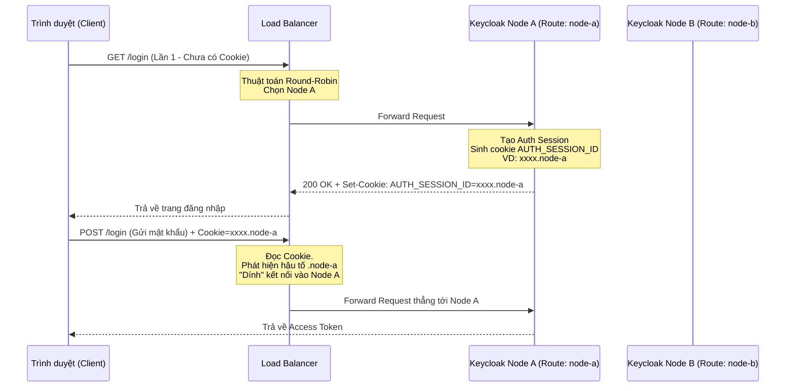

> [!NOTE]
> **Category:** Theory / Architecture
> **Goal:** Giải thích chuyên sâu về cơ chế Phiên dính (Sticky Sessions) của Load Balancer, tầm quan trọng sống còn của nó đối với hiệu năng và độ ổn định khi triển khai Keycloak trong kiến trúc Cụm (Cluster).

## 1. Lý thuyết chuyên sâu (Detailed Theory)

Khi triển khai hệ thống Keycloak với nhiều Node (Clustering), trước các Node này luôn phải có một Bộ cân bằng tải (Load Balancer - LB) như Nginx, HAProxy, hoặc AWS ALB. Theo mặc định, các LB sử dụng thuật toán như Round-Robin (chia đều lần lượt) hoặc Least-Connections.

Vấn đề nảy sinh ở Luồng xác thực (Authentication Flow) của Keycloak, vì luồng này bao gồm nhiều bước (ví dụ: Load trang đăng nhập -> Điền form -> Nhập mã OTP). Nếu thuật toán chia đều đẩy các Request của cùng 1 luồng này qua lại liên tục giữa các Node khác nhau, Infinispan (Lưới dữ liệu bộ nhớ) sẽ phải liên tục kéo/đồng bộ trạng thái phiên xác thực (Authentication Session) qua mạng ngang hàng. Việc này gọi là **Remote Cache Fetching** — nó gây ra độ trễ (Latency) cực lớn và làm giảm hiệu năng toàn hệ thống.

**Sticky Sessions (Phiên dính)** là một giải pháp cấu hình tại tầng Load Balancer để đảm bảo rằng: Khi một Client bắt đầu một phiên xác thực tại Node A, thì tất cả các Request tiếp theo của Client đó (thuộc cùng một phiên) sẽ LUÔN được Load Balancer ưu tiên đẩy về chính Node A, trừ khi Node A gặp sự cố (bị sập).

## 2. Luồng nội bộ & Cơ chế cấp thấp (Internal Workflow & Low-level Mechanisms)

Keycloak cung cấp một cơ chế định tuyến (Routing) tích hợp vào bên trong luồng cookie.



**Cơ chế cấp thấp:**
- Keycloak gắn thêm hậu tố định tuyến (Routing Suffix) vào cookie `AUTH_SESSION_ID`. Ví dụ `12345abcd.node-1`.
- Cấu hình này giúp LB (nếu có khả năng phân tích Cookie) không cần phải tự tạo một session riêng để nhớ, mà chỉ cần đọc giá trị `AUTH_SESSION_ID`, dùng biểu thức chính quy (Regex) lấy chuỗi phía sau dấu chấm (`.`), và so sánh nó với danh sách tên các Node trong Upstream.
- Ngay cả khi luồng đăng nhập đã xong, phiên đăng nhập SSO (User Session) vẫn được giữ tại Local RAM của Node A, và việc LB đưa người dùng về đúng Node A sẽ giúp đọc dữ liệu từ RAM với tốc độ tia chớp.

## 3. Thực hành tốt nhất & Bảo mật (Best Practices & Security)

- **Bắt buộc cho Keycloak Cluster:** Tính năng Sticky Sessions KHÔNG phải là một "tùy chọn" khi cấu hình HA cho Keycloak, nó là **bắt buộc** để luồng đăng nhập (Auth Flow) hoạt động trơn tru. Không cấu hình sẽ dẫn tới các lỗi như "Invalid username or password" hoặc trang web bị tải lại liên tục.
- **Không nhầm lẫn với Cookie Tracking của LB:** LB có thể sử dụng IP Hash hoặc tự sinh Cookie riêng (LB-generated). Tuy nhiên, cách tốt nhất là sử dụng tính năng **Application-based Cookie** (LB dựa trên chính Cookie `AUTH_SESSION_ID` của Keycloak) để đồng bộ nhất quán trạng thái.
- **Định danh Node tĩnh (Static Node Identification):** Bắt buộc phải khai báo tên cố định cho từng Node khi khởi động (thường truyền qua tham số môi trường) để Keycloak có thể gắn đúng Hậu tố (Suffix) đó vào Cookie.

## 4. Cấu hình minh họa thực tế (Configuration Examples)

**Cấu hình cho Node Keycloak:**
Sử dụng tham số để cấu hình Route (ví dụ trong Docker Compose):
```bash
KC_SPI_STICKY_SESSION_ENCODER_INFINISPAN_ROUTE=node1
```

**Cấu hình Nginx OSS (Sử dụng IP Hash):**
Nếu dùng bản Nginx miễn phí không hỗ trợ đọc cookie ứng dụng, giải pháp tiệm cận nhất là dùng `ip_hash` (dính phiên dựa trên IP).
```nginx
upstream keycloak_cluster {
    ip_hash;
    server 10.0.0.1:8080;
    server 10.0.0.2:8080;
}
```

**Cấu hình HAProxy (Dùng đúng chuẩn Application Cookie):**
HAProxy là lựa chọn mã nguồn mở xuất sắc khi kết hợp với Keycloak.
```haproxy
backend keycloak_backend
    balance roundrobin
    cookie AUTH_SESSION_ID prefix nocache
    server node1 10.0.0.1:8080 cookie node1 check
    server node2 10.0.0.2:8080 cookie node2 check
```
*(HAProxy sẽ đọc cookie `AUTH_SESSION_ID`. Nếu cookie chứa `~node1`, nó sẽ đẩy về máy chủ có định danh `cookie node1`).*

## 5. Trường hợp ngoại lệ (Edge Cases)

- **Sập máy chủ (Node Failure):** Sticky Session làm mất tính chịu lỗi? Không. Nếu Node A bị sập (Crash), Load Balancer (qua Health Check) sẽ loại Node A khỏi danh sách và đẩy Request mang cookie `.node-a` sang Node B. Vì Infinispan đã dùng cấu hình Distributed Cache (`owners=2`), Node B sẽ âm thầm nhận nhiệm vụ tải dữ liệu bộ đệm từ node dự phòng lên, và người dùng vẫn tiếp tục sử dụng mà không hề hay biết Node A đã sập.
- **Mất Cân bằng Tải (Imbalanced Load):** Vì session bị dính chặt, nếu một bộ phận người dùng đăng nhập quá tập trung vào một thời điểm trên một Node, hoặc dải IP sử dụng chung một NAT lớn (với IP Hash), có thể dẫn đến hiện tượng một Node phải xử lý 80% tải trong khi các Node khác rảnh rỗi.
  - **Cách xử lý:** Sử dụng thuật toán cân bằng tải bằng Cookie thay vì IP Hash sẽ giảm bớt được tình trạng tập trung quá mức do NAT.

## 6. Câu hỏi Phỏng vấn (Interview Questions)

1. **(Junior)** Sticky Sessions (Phiên dính) có tác dụng gì trong cấu trúc Cụm (Cluster) của Load Balancer?
   - *Đáp án:* Nó giúp cho tất cả các request của một người dùng cố định được chuyển tới cùng một máy chủ (Node) đang xử lý luồng (flow) của người đó, tránh phải tải lại trạng thái dữ liệu liên tục qua lại giữa các máy chủ.

2. **(Junior)** Nếu không sử dụng Sticky Sessions cho Keycloak, điều gì sẽ xảy ra ở trang đăng nhập?
   - *Đáp án:* Người dùng có thể gặp lỗi xác thực liên tục (VD: Đang ở màn hình nhập OTP thì bị đẩy về một Node khác không có phiên tạm lưu của OTP đó), hoặc hệ thống trở nên cực kỳ chậm chạp do các Node phải liên tục đồng bộ dữ liệu.

3. **(Senior)** Giải thích cơ chế Application-based Cookie Routing mà Keycloak hỗ trợ để cấu hình cho Load Balancer.
   - *Đáp án:* Keycloak nối thêm tên định danh của Node (Routing Suffix) vào cuối cookie `AUTH_SESSION_ID`. Các LB như HAProxy hay AWS ALB có thể phân tích biểu thức chính quy (Regex) của cookie này để định tuyến request thẳng tới tên Node (Backend) tương ứng thay vì tự sinh ra một Cookie dính riêng.

4. **(Senior)** Sticky Session có làm phá vỡ tính High Availability khi một Node trong Keycloak bị sập không?
   - *Đáp án:* Không. Khi Node cũ bị sập, LB sẽ dùng thuật toán round-robin phân bổ session đó sang Node mới. Node mới sẽ dùng Infinispan Cache nội bộ để truy vấn lấy lại phiên session từ một bản sao dự phòng (Backup owner) và khôi phục hoạt động bình thường, đảm bảo High Availability.

5. **(Senior)** Nếu dùng Nginx mã nguồn mở, bạn sẽ dùng thuật toán cân bằng tải nào để mô phỏng Sticky Session? Nhược điểm của nó là gì?
   - *Đáp án:* Dùng `ip_hash`. Nhược điểm là nếu hàng trăm nhân viên trong cùng một công ty đi chung một luồng mạng nội bộ (có cùng 1 IP Public), toàn bộ yêu cầu của họ sẽ bị dính chặt vào đúng 1 Node của Keycloak, gây hiện tượng nghẽn cổ chai.

## 7. Tài liệu tham khảo (References)

- [Keycloak Guide: Configuring a Load Balancer](https://www.keycloak.org/server/reverseproxy)
- [HAProxy Cookie based routing](https://cbonte.github.io/haproxy-dconv/2.4/configuration.html#cookie)
- [AWS Elastic Load Balancing - Sticky Sessions](https://docs.aws.amazon.com/elasticloadbalancing/latest/application/sticky-sessions.html)
