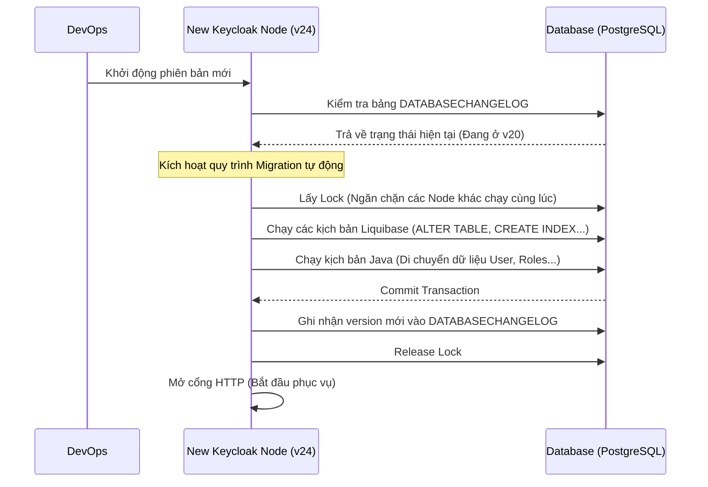

> [!NOTE]
> **Category:** Theory (Lý thuyết)
> **Goal:** Hiểu rõ quy trình, rủi ro, và cơ chế bên dưới khi tiến hành nâng cấp phiên bản Keycloak (Version Upgrade) nhằm đảm bảo không làm gián đoạn dịch vụ định danh.

## 1. Lý thuyết chuyên sâu (Detailed Theory)

Phần mềm Identity Access Management như Keycloak yêu cầu phải được cập nhật thường xuyên để vá các lỗ hổng bảo mật (CVEs) hoặc thêm các chuẩn OAuth2/OIDC mới.
Quá trình **Version Upgrade** không đơn thuần chỉ là việc thay thế file nhị phân (Binary) hoặc Docker Image. Nó bao gồm một quy trình phức tạp gọi là **Database Schema Migration** (Nâng cấp lược đồ cơ sở dữ liệu), nơi các bảng, cột và chỉ mục trong DB bị biến đổi.

**Tại sao tính năng này phức tạp?**
Khác với các ứng dụng Stateless (Phi trạng thái), Keycloak là một ứng dụng Stateful liên kết chặt chẽ với Database. Khi nâng cấp từ phiên bản cũ (VD: v20) lên bản mới (VD: v24):
- Định dạng token có thể thay đổi.
- Cách lưu trữ thuật toán băm (hash) có thể thay đổi.
- Dữ liệu cấu hình JSON cũ phải được dịch sang cấu trúc dữ liệu mới trong Java.
Việc nâng cấp nếu thất bại có thể gây mất toàn bộ quyền truy cập của hàng vạn người dùng.

## 2. Luồng nội bộ & Cơ chế cấp thấp (Internal Workflow & Low-level Mechanisms)

Keycloak quản lý việc thay đổi DB thông qua một công cụ tích hợp sẵn là **Liquibase**. 



**Cơ chế cấp thấp:**
- **Liquibase:** Khi Keycloak boot, nó so sánh file `META-INF/jpa-changelog-master.xml` (chứa định nghĩa cấu trúc của bản v24) với bảng `DATABASECHANGELOG` trong DB. Nếu có khoảng trống, nó sẽ chạy các file changeset tuần tự từ v20 -> v21 -> v22 -> v23 -> v24.
- **Java Logic Migration:** Đôi khi SQL không đủ để di chuyển dữ liệu phức tạp. Keycloak chứa các lớp Java (như `MigrateTo21_0_0.java`) sẽ được gọi để tính toán và update DB bằng JPA/Hibernate.

## 3. Thực hành tốt nhất & Bảo mật (Best Practices & Security)

> [!WARNING]
> **Không có đường lùi (No Rollback in Database):** Một khi Keycloak phiên bản mới chạy thành công các kịch bản Liquibase, DB sẽ bị thay đổi vĩnh viễn. Bạn KHÔNG THỂ khởi động lại phiên bản Keycloak cũ và kết nối với DB mới này (Nó sẽ báo lỗi Incompatible Version).

Do đó, các **Best Practices** là bắt buộc:
1. **Luôn Backup DB:** Bắt buộc phải dump toàn bộ CSDL (PostgreSQL, MySQL) thành file sql/tar trước khi khởi động phiên bản mới.
2. **Kiểm tra trên môi trường Staging:** Phải phục hồi bản Backup DB của Prod vào môi trường Staging và chạy thử quá trình Upgrade. Đo lường xem mất bao lâu (với hàng triệu User, việc `ALTER TABLE` có thể mất hàng giờ, gây Downtime lớn).
3. **Đọc kỹ Migration Notes:** Luôn phải đọc file *Upgrading Guide* của Keycloak. Mỗi phiên bản có thể yêu cầu thay đổi cách viết Script Mapper, hoặc ngừng hỗ trợ một tính năng cũ.

## 4. Cấu hình minh họa thực tế (Configuration Examples)

**Cấu hình tự động Migration:**
Mặc định trong môi trường Quarkus, Database Migration được chạy tự động khi khởi động.
```bash
bin/kc.sh start --db postgres --db-url jdbc:postgresql://localhost/keycloak --db-username user --db-password pass
```

**Xuất kịch bản SQL (Manual Migration):**
Trong môi trường doanh nghiệp cấp cao, DBA (Database Admin) không cho phép Keycloak tự động sửa cấu trúc bảng. Họ yêu cầu Keycloak phải sinh ra file SQL để họ tự chạy:
```bash
# Lệnh yêu cầu Keycloak tạo ra file nâng cấp sql thay vì cập nhật thẳng vào DB
bin/kc.sh build --db postgres --transaction-xa=false
bin/kc.sh start --spi-connections-jpa-default-migration-strategy=manual --spi-connections-jpa-default-migration-export=<đường_dẫn_file.sql>
```

## 5. Trường hợp ngoại lệ (Edge Cases)

- **Database Lock Bị Kẹt:** Nếu máy chủ Keycloak chết đột ngột lúc đang chạy Migration, bảng `DATABASECHANGELOGLOCK` trong DB sẽ giữ giá trị `LOCKED = TRUE`. Khi bật máy chủ lại, nó sẽ bị kẹt vĩnh viễn chờ Lock. **Khắc phục:** Quản trị viên phải vào DB, chạy thủ công lệnh `UPDATE DATABASECHANGELOGLOCK SET LOCKED=FALSE, LOCKGRANTED=NULL, LOCKEDBY=NULL WHERE ID=1;`.
- **Zero-Downtime Upgrade thất bại:** Keycloak hỗ trợ Zero Downtime Upgrade bằng chế độ Rolling Deployment (nâng cấp dần từng Node trong Cluster). Nhưng nếu khoảng cách phiên bản quá xa (VD: v18 lên v24), định dạng Session trong cache Infinispan sẽ không tương thích, gây văng người dùng ra ngoài. **Khắc phục:** Nên upgrade từng phiên bản nhỏ (VD: 18->19, 19->20), hoặc chấp nhận yêu cầu người dùng đăng nhập lại (Clear Cache).

## 6. Câu hỏi Phỏng vấn (Interview Questions)

**Junior Level:**
1. Liquibase là gì và Keycloak sử dụng nó với mục đích gì?
2. Nếu bạn nâng cấp Keycloak từ v22 lên v24 và gặp lỗi không mong muốn ở giao diện, bạn có thể chỉ đơn giản là chạy lại Docker Image bản v22 với Database hiện tại được không? Tại sao?

**Senior Level:**
3. **Tình huống:** Quá trình khởi động Keycloak phiên bản mới trên Kubernetes bị thất bại liên tục (CrashLoopBackOff). Log cho thấy lỗi Timeout khi cố gắng lấy Lock từ bảng `DATABASECHANGELOGLOCK`. Tại sao điều này xảy ra và cách xử lý triệt để trong môi trường Containerized là gì?
   *Đáp án gợi ý:* Xảy ra do nhiều Pod khởi động cùng lúc và tranh giành khóa, hoặc một Pod trước đó bị killed giữa chừng OOM (Out Of Memory). Cách xử lý: Tách biệt Job Migration ra khỏi tiến trình Deployment chính. Chạy một Kubernetes Init Container hoặc K8s Job để chạy migration trước, sau khi thành công mới cho các Pod HTTP khởi động lên.
4. Trình bày chiến lược nâng cấp Keycloak mà không làm rớt các phiên đăng nhập (Active Sessions) của hàng ngàn người dùng đang hoạt động trong một Cluster High-Availability?

## 7. Tài liệu tham khảo (References)
- [Keycloak Upgrading Guide](https://www.keycloak.org/docs/latest/upgrading/index.html)
- [Liquibase Documentation](https://docs.liquibase.com/)
