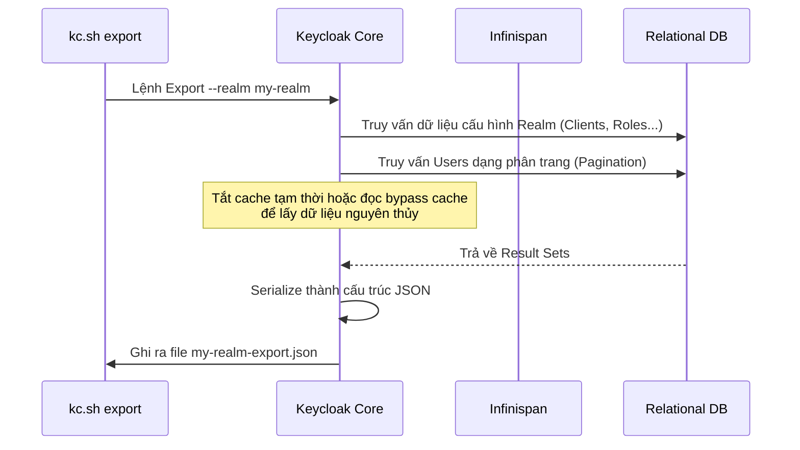

> [!NOTE]
> **Category:** Theory (Lý thuyết)
> **Goal:** Hiểu rõ cơ chế xuất (Export) và nhập (Import) dữ liệu Realm trong Keycloak để di chuyển dữ liệu giữa các môi trường (Dev -> Staging -> Prod) mà không làm gián đoạn hệ thống.

## 1. Lý thuyết chuyên sâu (Detailed Theory)

**Realm Migration** trong Keycloak là quá trình trích xuất toàn bộ cấu hình hệ thống (Bao gồm Clients, Roles, Groups, Identity Providers) và dữ liệu người dùng (Users, Passwords băm, Credentials) thành một định dạng trung gian (JSON) để đưa vào một máy chủ Keycloak khác.

**Tại sao tính năng này tồn tại?**
Trong vòng đời phát triển phần mềm (SDLC), cấu hình IAM không bao giờ được cấu hình thẳng trên môi trường Production. Quy trình chuẩn là:
1. Đội Dev cấu hình Keycloak ở môi trường Local/Dev.
2. Cấu hình được xuất ra (Export).
3. Cấu hình được đẩy lên Git và triển khai bằng đường ống CI/CD (Import) vào môi trường Staging/Production.

Tính năng này giúp đảm bảo tính nhất quán (Consistency) giữa các môi trường, giảm thiểu lỗi do thao tác thủ công của con người (Human Error).

## 2. Luồng nội bộ & Cơ chế cấp thấp (Internal Workflow & Low-level Mechanisms)

Quá trình Import/Export không đơn giản chỉ là việc sao chép từ bảng CSDL này sang bảng khác, mà là một quá trình tuần tự hóa dữ liệu phức tạp.



**Cơ chế cấp thấp:**
- **Full Export:** Phải được thực hiện qua công cụ CLI (`kc.sh export`) trước khi khởi động tiến trình HTTP server. Lý do là để đảm bảo không có giao dịch Database nào đang diễn ra gây bất đồng bộ (Race condition).
- **Partial Export/Import:** Có thể thực hiện qua giao diện Web Admin Console, nhưng nó sẽ *không bao gồm danh sách Users* do rủi ro tràn RAM nếu Realm có hàng triệu người dùng. 
- **Mã hóa Password:** Khi Export User, trường Password được xuất ra dưới dạng băm (Hash - VD: PBKDF2). Keycloak cũng xuất luôn cả `salt` và `hashIterations`. Khi Import, mật khẩu này vẫn hợp lệ và người dùng không cần đổi lại.

## 3. Thực hành tốt nhất & Bảo mật (Best Practices & Security)

> [!CAUTION]
> **Rò rỉ dữ liệu nhạy cảm:** Tệp tin JSON export ra chứa Client Secrets (dạng plain-text hoặc mask tùy bản) và Password Hashes của toàn bộ người dùng. **KHÔNG BAO GIỜ** được commit tệp này lên các kho chứa mã nguồn công khai (Public Git). Nó cần được mã hóa hoặc lưu ở nơi bảo mật cao cấp (HashiCorp Vault, AWS S3 có mã hóa).

- **Chiến lược ghi đè (Overwrite Strategy):** Khi Import vào một hệ thống đã có sẵn dữ liệu, Keycloak có các chiến lược xử lý xung đột (IF_EXISTS):
  - `IGNORE`: Bỏ qua nếu dữ liệu đã tồn tại (An toàn nhất).
  - `OVERWRITE`: Ghi đè dữ liệu cũ bằng dữ liệu mới.
  - `FAIL`: Hủy bỏ toàn bộ quá trình nếu phát hiện trùng lặp.
- **Tách biệt User và Configuration:** Trong môi trường Production, KHÔNG bao giờ export/import Users. Chúng ta chỉ import Cấu hình (Clients, Roles). Users luôn được tạo tự nhiên từ hệ thống sống hoặc qua API.

## 4. Cấu hình minh họa thực tế (Configuration Examples)

**Lệnh Export thông qua CLI (trên Keycloak Quarkus):**
```bash
# Dừng Keycloak trước (Nếu chạy chế độ standalone)
# Xuất cấu hình của my_realm ra thư mục /tmp/export, bao gồm cả users
bin/kc.sh export --dir /tmp/export --realm my_realm --users realm_file
```
Tham số `--users realm_file` sẽ xuất Users thành các tệp `my_realm-users-0.json`, `my_realm-users-1.json` để chia nhỏ dung lượng (Pagination).

**Lệnh Import khi khởi động:**
```bash
# Nhập dữ liệu tự động ngay khi boot server
bin/kc.sh import --dir /tmp/export --override true
```

## 5. Trường hợp ngoại lệ (Edge Cases)

- **Tràn bộ nhớ khi Import (OutOfMemoryError):** Nếu file JSON lên đến hàng Gigabytes, việc parse JSON sẽ làm tràn Heap Memory của JVM. **Khắc phục:** Sử dụng công cụ CLI, không dùng Admin Console, và luôn để tùy chọn `--users realm_file` hoặc `--users skip` nếu không cần người dùng.
- **Xung đột khóa ngoại (Foreign Key Constraints):** Khi Import ghi đè (`OVERWRITE`), Keycloak có thể xóa Role cũ trước rồi mới Insert lại. Nếu Role đó đang gắn cho một Group khác không có trong file Import, hệ thống CSDL sẽ báo lỗi constraint. **Khắc phục:** Nên xóa sạch Realm trước khi Full Import, hoặc dùng công cụ đồng bộ như Terraform thay vì dựa vào cơ chế Export/Import thô.

## 6. Câu hỏi Phỏng vấn (Interview Questions)

**Junior Level:**
1. Sự khác biệt giữa Partial Export trên giao diện Web và Full Export bằng dòng lệnh CLI là gì?
2. Tại sao người dùng không cần phải thiết lập lại mật khẩu sau khi hệ thống chuyển sang một server Keycloak mới bằng chức năng Import?
3. Nếu chọn chiến lược Import `IGNORE`, điều gì xảy ra nếu Client `myapp` đã tồn tại trong Keycloak nhưng có cấu hình URL khác với file JSON?

**Senior Level:**
4. **Tình huống:** Công ty muốn triển khai CI/CD hoàn toàn tự động. Mỗi lần dev push code chứa file `realm.json` mới, hệ thống phải cập nhật Keycloak. Tuy nhiên, việc khởi động lại Keycloak bằng lệnh `kc.sh import` gây Downtime vài giây. Có cách nào cập nhật Configuration (Clients, Roles) động mà không cần restart server và không dùng giao diện?
   *Đáp án gợi ý:* Sử dụng Keycloak Admin REST API để gửi cấu hình JSON lên, hoặc áp dụng Keycloak Operator trên Kubernetes để tự động sync cấu hình (Custom Resource Definitions - CRD), hoặc dùng Terraform Provider cho Keycloak.
5. Giải thích tại sao việc Export cả Users và Passwords thường được coi là một Anti-pattern trong môi trường Production hiện đại, và kiến trúc nào nên thay thế nó? (Gợi ý: Dùng User Federation hoặc Event Listener).

## 7. Tài liệu tham khảo (References)
- [Keycloak Server Administration Guide - Export and Import](https://www.keycloak.org/server/importExport)
- [Keycloak Configuration CLI (Công cụ bên thứ 3 phổ biến)](https://github.com/adorsys/keycloak-config-cli)
