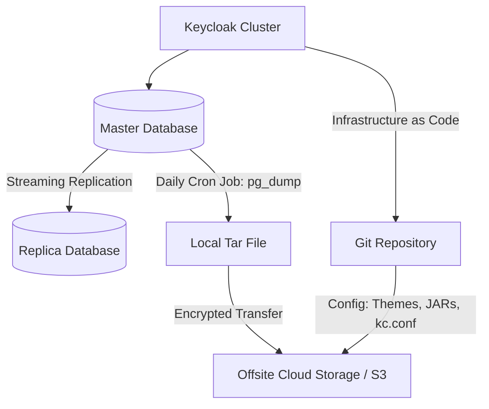

> [!NOTE]
> **Category:** Theory (Lý thuyết)
> **Goal:** Thiết lập các chiến lược sao lưu dữ liệu (Backup Strategy) toàn diện cho hệ thống Keycloak để đảm bảo khả năng phục hồi sau thảm họa (Disaster Recovery).

## 1. Lý thuyết chuyên sâu (Detailed Theory)

Keycloak là một hệ thống mang tính chất trung tâm (Centralized). Nếu Keycloak mất dữ liệu, toàn bộ các ứng dụng phụ thuộc vào nó sẽ không thể cho phép người dùng đăng nhập, dẫn đến tê liệt toàn bộ doanh nghiệp. Do đó, **Backup Strategy (Chiến lược sao lưu)** không chỉ là việc lưu lại file, mà là một quy trình đảm bảo **RPO** (Recovery Point Objective - lượng dữ liệu tối đa chấp nhận mất) và **RTO** (Recovery Time Objective - thời gian tối đa để khôi phục hệ thống).

**Tại sao tính năng này tồn tại?**
Các thảm họa có thể xảy ra:
- Lỗi phần cứng, hỏng ổ cứng (Hardware Failure).
- Quản trị viên vô tình chạy lệnh xóa nhầm Database (Human Error).
- Tấn công Ransomware mã hóa dữ liệu.
Việc sao lưu đa tầng (Multi-tier Backup) giúp tổ chức có thể khôi phục lại trạng thái của Identity Provider ở một thời điểm an toàn trong quá khứ.

## 2. Luồng nội bộ & Cơ chế cấp thấp (Internal Workflow & Low-level Mechanisms)

Hệ thống Keycloak bao gồm hai thành phần dữ liệu cốt lõi cần phải được backup đồng bộ:
1. **Relational Database (CSDL Quan hệ):** Lưu trữ Users, Realms, Clients, Offline Sessions.
2. **Configuration Files (Tệp cấu hình):** Lưu trữ cấu hình khởi động JVM, SSL Certificates, Custom Providers (JAR files), Custom Themes.



**Cơ chế sao lưu cấp thấp:**
- **Hot Backup (Sao lưu nóng):** CSDL (như PostgreSQL) cung cấp các công cụ như `pg_dump` hoặc WAL (Write-Ahead Logging) archiving. Nó cho phép sao lưu dữ liệu ngay cả khi hệ thống Keycloak đang liên tục ghi dữ liệu mới mà không bị khóa bảng.
- **Cache (Infinispan):** Không cần và không nên backup bộ nhớ Cache chứa các Active Sessions (Phiên người dùng trực tuyến ngắn hạn). Vì dữ liệu này sinh ra liên tục, nếu hệ thống sập, người dùng chỉ cần đăng nhập lại. 

## 3. Thực hành tốt nhất & Bảo mật (Best Practices & Security)

> [!WARNING]
> **Mã hóa bản Backup:** Dữ liệu backup của Keycloak chứa hàm băm mật khẩu người dùng và các khóa bí mật của Client (Client Secrets). Kẻ tấn công có thể tải bản backup này về máy local và chạy Brute-force để bẻ khóa mật khẩu. Bắt buộc phải mã hóa file Backup (bằng GPG hoặc AES) trước khi đẩy lên Cloud.

> [!IMPORTANT]
> **Quy tắc 3-2-1:** 
> - **3** bản sao của dữ liệu (1 chính, 2 backup).
> - Lưu trên **2** phương tiện khác nhau (Disk, Cloud).
> - **1** bản sao đặt ở một vị trí địa lý khác (Offsite) để phòng hỏa hoạn/động đất.

- **Automation:** Đừng bao giờ dựa vào việc quản trị viên tự tay chạy lệnh backup mỗi cuối tuần. Hãy dùng Cronjob hoặc các công cụ tự động của Cloud Provider (như AWS RDS Automated Backups).
- **Test the Restore (Diễn tập khôi phục):** Một bản sao lưu vô dụng nếu nó không thể khôi phục. Mỗi 3-6 tháng, phải thực hiện một bài diễn tập khôi phục DB lên một máy chủ tạm thời để chắc chắn rằng quy trình vẫn hoạt động.

## 4. Cấu hình minh họa thực tế (Configuration Examples)

**Ví dụ Script Backup an toàn cho PostgreSQL (Chạy qua Cronjob):**
```bash
#!/bin/bash
DATE=$(date +%Y%m%d_%H%M%S)
BACKUP_FILE="/backups/keycloak_db_$DATE.sql.gz"
ENCRYPTED_FILE="/backups/keycloak_db_$DATE.sql.gz.gpg"

# 1. Chạy lệnh dump và nén
pg_dump -h localhost -U keycloak_admin keycloak_db | gzip > $BACKUP_FILE

# 2. Mã hóa bằng GPG
gpg --recipient admin@techcorp.com --encrypt $BACKUP_FILE

# 3. Xóa bản không mã hóa
rm $BACKUP_FILE

# 4. Đẩy lên AWS S3
aws s3 cp $ENCRYPTED_FILE s3://techcorp-secure-backups/keycloak/
```

**Backup thư mục Customizations của Keycloak:**
Sao lưu thư mục `providers` (chứa file JAR) và `themes` (chứa CSS/HTML).
```bash
tar -czvf /backups/kc_assets.tar.gz /opt/keycloak/providers /opt/keycloak/themes /opt/keycloak/conf
```

## 5. Trường hợp ngoại lệ (Edge Cases)

- **Lệch pha dữ liệu (Data Inconsistency):** Bạn thực hiện Export Realm bằng giao diện Web vào lúc 12:00, nhưng DB backup lúc 12:05. Những người dùng tạo tài khoản trong 5 phút đó sẽ có trong DB nhưng không có trong bản Export. **Khắc phục:** Database Backup (SQL Dump) là "Chân lý" (Single source of truth). Realm Export chỉ nên dùng cho cấu hình, không dùng để sao lưu (backup) hệ thống chạy thực tế.
- **Rác dữ liệu lớn (Bloated DB):** Bảng `OFFLINE_USER_SESSION` có thể phình to hàng trăm GB nếu hệ thống không xóa các session hết hạn, khiến quá trình Backup quá lâu. **Khắc phục:** Cấu hình thời gian sống (TTL) hợp lý cho Offline Session trong Keycloak, và chạy quá trình dọn dẹp định kỳ trước khi chạy Backup.

## 6. Câu hỏi Phỏng vấn (Interview Questions)

**Junior Level:**
1. Tại sao nói việc sử dụng tính năng "Export Realm" trong Keycloak không được coi là một phương pháp Backup chuẩn cho môi trường Production?
2. Kể tên 2 thành phần chính cần được sao lưu khi vận hành máy chủ Keycloak.
3. Quy tắc 3-2-1 trong chiến lược Backup là gì?

**Senior Level:**
4. **Tình huống:** Trong một cuộc tấn công Ransomware, máy chủ DB và máy chủ Keycloak đều bị mã hóa. Bạn chỉ còn bản backup DB mã hóa trên AWS S3. Hãy trình bày quy trình các bước khôi phục lại hệ thống Identity Provider để doanh nghiệp hoạt động trở lại với thời gian downtime tối thiểu.
   *Đáp án gợi ý:* Cài đặt môi trường Keycloak mới từ Git/IaC. Kéo bản backup DB từ S3, giải mã bằng GPG key an toàn. Phục hồi DB (pg_restore). Khởi động Keycloak kết nối tới DB. Chuyển hướng DNS nội bộ (hoặc Load Balancer) từ máy chủ cũ sang cụm máy chủ mới.
5. Giải thích cách thiết lập Point-In-Time Recovery (PITR) cho cơ sở dữ liệu của Keycloak (Sử dụng WAL/Archive log) để đáp ứng chuẩn RPO = 5 phút cho một công ty tài chính.

## 7. Tài liệu tham khảo (References)
- [PostgreSQL Documentation - Backup and Restore](https://www.postgresql.org/docs/current/backup.html)
- [NIST Special Publication 800-34 Rev. 1 - Contingency Planning Guide for Federal Information Systems](https://csrc.nist.gov/publications/detail/sp/800-34/rev-1/final)
