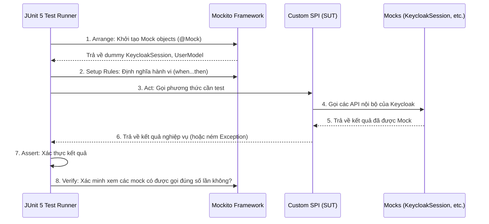

> [!NOTE]
> **Category:** Theory (Lý thuyết)
> **Goal:** Cung cấp kiến thức chuyên sâu về Unit Test trong quá trình phát triển Custom Extensions cho Keycloak (SPIs). Giải thích cách sử dụng JUnit 5, Mockito để giả lập các thành phần lõi của Keycloak như `KeycloakSession`, `RealmModel`, `UserModel`.

## 1. Lý thuyết chuyên sâu (Detailed Theory)

Trong phát triển phần mềm, **Unit Test** (Kiểm thử mức Đơn vị) là quá trình kiểm thử các thành phần nhỏ nhất của phần mềm (như function, method, class) một cách cô lập. Đối với Keycloak, việc viết Unit Test thường tập trung vào các **Custom SPIs** (Service Provider Interfaces) do lập trình viên tự phát triển, ví dụ như Custom Authenticator, Event Listener, hoặc User Federation Provider.

### Bản chất của việc Unit Test trong Keycloak
Keycloak được xây dựng với kiến trúc monolithic module-based khá đồ sộ. Mọi request xử lý trong Keycloak đều xoay quanh một context đối tượng cốt lõi là `KeycloakSession`. Object này chứa toàn bộ các Provider quản lý:
- `users()` (User Provider)
- `realms()` (Realm Provider)
- `sessions()` (Session Provider)
- `getContext()` (Context của HTTP request hiện tại)

**Vấn đề cốt lõi:** Khi phát triển một SPI, đoạn code logic của bạn thường bị gắn chặt (tightly-coupled) với các interface của Keycloak. Nếu không có Unit Test cô lập, bạn sẽ bắt buộc phải triển khai (deploy) file `.jar` vào một instance Keycloak đang chạy mới có thể kiểm thử được logic. Điều này làm tăng thời gian phản hồi (feedback loop) và rất khó để tái tạo (reproduce) các lỗi ngầm.

Giải pháp là sử dụng các thư viện **Mocking** (chủ yếu là **Mockito**) để giả lập các hành vi của `KeycloakSession` và các Model (như `UserModel`, `RealmModel`), giúp kiểm thử phần logic cốt lõi mà không cần phải khởi chạy toàn bộ Keycloak server.

---

## 2. Luồng nội bộ & Cơ chế cấp thấp (Internal Workflow & Low-level Mechanisms)

Khi viết Unit Test cho một Keycloak Extension, vòng đời của một Test Case tuân theo mô hình **Arrange - Act - Assert** kết hợp với **Mocking**.



**Giải thích luồng cơ chế:**
1. **Arrange:** Test runner sử dụng Mockito để tạo ra các bản sao "giả" (dummy) của các interface Keycloak phức tạp.
2. **Setup Rules:** Thông qua `when(mock.method()).thenReturn(value)`, chúng ta tiêm (inject) các điều kiện môi trường giả lập (ví dụ giả lập việc tìm thấy User trong Database).
3. **Act & Assert:** Thực thi System Under Test (SUT) và kiểm tra kết quả trả về xem có khớp với logic hay không. Quá trình này không hề chạm vào I/O mạng hoặc Database thật.

---

## 3. Thực hành tốt nhất & Bảo mật (Best Practices & Security)

> [!TIP]
> **Tách biệt Logic và Framework (Clean Architecture)**
> Thay vì nhồi nhét mọi xử lý vào bên trong phương thức `authenticate(AuthenticationFlowContext context)` của Keycloak, hãy tách logic tính toán, kiểm tra mật khẩu hay regex thành các class Service độc lập (Poco/POJO classes) không phụ thuộc vào `KeycloakSession`. Điều này giúp việc Unit Test trở nên dễ dàng và không cần phải mock quá nhiều interface của Keycloak.

> [!WARNING]
> **Anti-pattern: Over-mocking**
> Nếu bạn thấy mình phải viết đến 50 dòng code `when(...).thenReturn(...)` chỉ để test một hàm 10 dòng, đây là dấu hiệu của Over-mocking. Kiến trúc của bạn đang gắn kết quá chặt với các thành phần nội bộ của Keycloak. Hãy cân nhắc việc tái cấu trúc (refactor) hoặc đẩy phần test này sang dạng **Integration Test** với Testcontainers.

---

## 4. Cấu hình minh họa thực tế (Configuration Examples)

Dưới đây là một ví dụ minh họa về cách Unit Test cho một `EventListenerProvider` đơn giản, kiểm tra việc bắt sự kiện `LOGIN` và ghi log hoặc thực hiện logic nội bộ.

```java
import org.junit.jupiter.api.BeforeEach;
import org.junit.jupiter.api.Test;
import org.junit.jupiter.api.extension.ExtendWith;
import org.keycloak.events.Event;
import org.keycloak.events.EventType;
import org.keycloak.models.KeycloakSession;
import org.keycloak.models.RealmModel;
import org.keycloak.models.RealmProvider;
import org.mockito.Mock;
import org.mockito.junit.jupiter.MockitoExtension;

import static org.junit.jupiter.api.Assertions.*;
import static org.mockito.Mockito.*;

@ExtendWith(MockitoExtension.class)
public class CustomEventListenerTest {

    @Mock
    private KeycloakSession session;
    @Mock
    private RealmProvider realmProvider;
    @Mock
    private RealmModel realm;

    private CustomEventListener listener;

    @BeforeEach
    public void setup() {
        // Setup mock hierarchy
        when(session.realms()).thenReturn(realmProvider);
        when(realmProvider.getRealm("test-realm")).thenReturn(realm);
        
        listener = new CustomEventListener(session);
    }

    @Test
    public void testOnEvent_LoginSuccess_ShouldProcessLogic() {
        // Arrange
        Event event = new Event();
        event.setType(EventType.LOGIN);
        event.setRealmId("test-realm");
        event.setUserId("user-123");

        // Act
        listener.onEvent(event);

        // Assert & Verify
        verify(session, times(1)).realms();
        verify(realmProvider, times(1)).getRealm("test-realm");
        // Kiểm tra xem logic cụ thể có được gọi đúng không
    }
}
```

---

## 5. Trường hợp ngoại lệ (Edge Cases)

### NullPointerException với Chaining Methods
Trong Keycloak, mã nguồn thường viết nối tiếp (method chaining), ví dụ: `session.getContext().getRealm().getName()`.
- **Sự cố:** Nếu trong Unit Test, bạn chỉ mock `session`, khi code thực thi gọi đến `getContext()`, nó sẽ trả về `null`. Sau đó việc gọi `getRealm()` trên đối tượng `null` sẽ sinh ra `NullPointerException`.
- **Khắc phục:** Mockito có cấu hình `RETURNS_DEEP_STUBS` để tự động mock chuỗi nối tiếp. Tuy nhiên, cách tốt nhất và an toàn nhất là tuân thủ việc mock từng layer một cách rõ ràng ở khối setup (như trong ví dụ trên).

---

## 6. Câu hỏi Phỏng vấn (Interview Questions)

1. **Khái niệm Unit Test là gì? Khác biệt giữa Unit Test và Integration Test trong Keycloak là gì?**
   - *Junior:* Unit Test kiểm tra một module cô lập. Integration Test kiểm tra nhiều module liên kết với nhau (cần database, chạy container Keycloak).
   - *Senior:* Phân tích sâu về ranh giới I/O. Unit test phải nhanh, deterministic, chạy trên bộ nhớ RAM hoàn toàn, sử dụng Mock cho các external dependencies (như `KeycloakSession`). Integration Test trong Keycloak thường cần `Testcontainers` để bọc toàn bộ instance server.

2. **Khi phát triển Custom Authenticator, tại sao việc mock `AuthenticationFlowContext` lại phức tạp?**
   - *Junior:* Vì nó chứa quá nhiều thuộc tính và đối tượng khác.
   - *Senior:* Vì `AuthenticationFlowContext` là một giao diện ôm trọn (façade interface) cho HTTP Request, Response, Session, Realm, Client, User, và execution flow. Nó vi phạm Interface Segregation Principle (ISP). Mock một đối tượng như vậy đòi hỏi phải set up hàng chục dependencies con.

3. **Làm thế nào để tránh Over-mocking trong Keycloak Extension testing?**
   - *Senior:* Áp dụng mẫu thiết kế (Design Pattern) phù hợp, ví dụ Strategy hoặc Hexagonal Architecture. Phần lõi nghiệp vụ (ví dụ: tính toán risk score, gọi API bên ngoài) nhận input là các POJO cơ bản (String, Object đơn giản) thay vì nhận trực tiếp `UserModel` hay `KeycloakSession`.

4. **`@ExtendWith(MockitoExtension.class)` trong JUnit 5 đóng vai trò gì?**
   - *Junior:* Dùng để bật tính năng mock của Mockito.
   - *Senior:* Nó quản lý lifecycle của các đối tượng được dán nhãn `@Mock` và `@InjectMocks`. Nó tự động khởi tạo các biến đó trước khi mỗi test chạy và thực hiện việc dọn dẹp, đồng thời thực thi strict stubbing để bắt lỗi các mock không được sử dụng (Unused stubs).

5. **Làm sao để test một method `private` bên trong Custom SPI?**
   - *Senior:* Về nguyên tắc, bạn không nên viết unit test trực tiếp cho private method. Bạn nên test thông qua public methods gọi tới private method đó. Nếu bắt buộc phải test, nó là dấu hiệu (code smell) cho thấy class đang làm quá nhiều việc (vi phạm Single Responsibility Principle). Hãy tách private method đó ra thành một class Helper hoặc Service riêng và để nó là public.

---

## 7. Tài liệu tham khảo (References)

- [JUnit 5 User Guide](https://junit.org/junit5/docs/current/user-guide/)
- [Mockito Framework Documentation](https://javadoc.io/doc/org.mockito/mockito-core/latest/org/mockito/Mockito.html)
- [Keycloak Server Developer Guide - SPIs](https://www.keycloak.org/docs/latest/server_development/)
