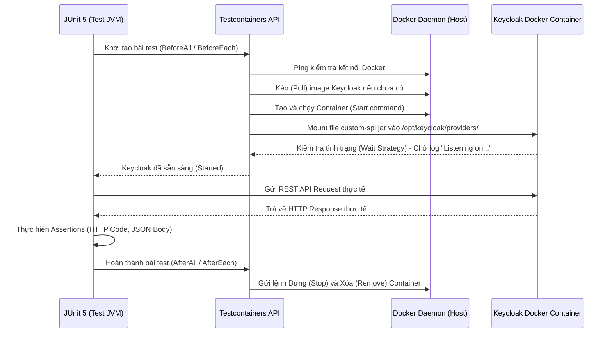

> [!NOTE]
> **Category:** Theory (Lý thuyết)
> **Goal:** Hiểu sâu về kiến trúc và cách thức hoạt động của Testcontainers khi áp dụng vào Integration Test cho Keycloak. Nắm bắt cách thiết lập môi trường Docker hoàn toàn tự động, triển khai các Custom SPIs để kiểm thử trong điều kiện thực tế (production-like) từ chính các Unit Test runner.

## 1. Lý thuyết chuyên sâu (Detailed Theory)

**Testcontainers** là một thư viện mã nguồn mở dành cho Java hỗ trợ môi trường kiểm thử bằng cách cung cấp các thực thể dùng một lần (throwaway instances) của các dịch vụ cơ sở hạ tầng (databases, message brokers, web browsers) được đóng gói dưới dạng Docker containers. Gần đây, hệ sinh thái Testcontainers đã hỗ trợ module chính thức cho Keycloak (`dasniko/testcontainers-keycloak` hoặc sử dụng module chính thức của Keycloak Testcontainers).

### Tại sao Unit Test với Mockito là chưa đủ?
Trong phát triển Keycloak SPIs, Unit Test đóng vai trò quan trọng nhưng thường bộc lộ những điểm yếu chết người:
1. **Flow Redirect Phức tạp:** Trong các Custom Authenticators, luồng thực thi (execution flow) đôi khi phải dừng lại và trả về các form HTML (Freemarker templates) cho người dùng, sau đó đợi POST request tiếp theo. Mockito không thể kiểm chứng toàn vẹn luồng HTTP này.
2. **Database Transactions:** Keycloak cung cấp giao dịch cơ sở dữ liệu nội bộ cực kỳ phức tạp thông qua Hibernate/JPA. Các lỗi vi phạm khóa ngoại (foreign key constraints) hay lỗi `LazyInitializationException` sẽ không bao giờ xuất hiện nếu bạn chỉ dùng Mock objects.
3. **Môi trường thực thi sai lệch:** Mock objects chỉ hành xử theo cách lập trình viên định nghĩa trước. Nếu hệ thống Keycloak thực tế có thay đổi về hành vi bên trong (ví dụ khi nâng cấp version từ 21 lên 24), các test dùng Mockito vẫn passed (báo xanh) nhưng trên thực tế code đã hỏng.

**Giải pháp với Testcontainers:**
Thư viện cho phép khởi tạo một server Keycloak hoàn chỉnh thông qua Docker API ngay trước khi chạy chuỗi test. Hơn nữa, nó cho phép **mount file .jar** (chứa mã nguồn SPI của bạn) trực tiếp vào thư mục `/opt/keycloak/providers/` bên trong container. Do đó, bạn sẽ gọi HTTP request trực tiếp tới server và assert kết quả thực sự thay vì các đối tượng ảo.

---

## 2. Luồng nội bộ & Cơ chế cấp thấp (Internal Workflow & Low-level Mechanisms)

Quá trình vòng đời (Lifecycle) của một bài kiểm thử sử dụng Testcontainers diễn ra như sau:



**Cơ chế Wait Strategy:**
Testcontainers giao tiếp liên tục với Docker Daemon để đọc stream logs của Keycloak container. Thay vì chờ một số giây cứng nhắc (Thread.sleep), nó quét logs để tìm một cụm từ cụ thể (ví dụ: `Listening on: http://0.0.0.0:8080`) hoặc ping liên tục vào endpoint `/health/ready` của Keycloak. Điều này đảm bảo test chỉ bắt đầu khi Keycloak server thực sự sẵn sàng nhận request.

---

## 3. Thực hành tốt nhất & Bảo mật (Best Practices & Security)

> [!TIP]
> **Sử dụng tính năng Reusable Containers**
> Quá trình khởi động Keycloak đôi khi mất từ 5 đến 15 giây. Nếu bạn có 5 class Integration Test, thời gian chạy có thể lên đến hàng phút. Bằng cách kích hoạt tính năng **Reuse** của Testcontainers (`.withReuse(true)`), các containers sẽ không bị kill sau mỗi test class, giúp các class chạy sau tận dụng luôn container đã dựng sẵn, giảm cực mạnh thời gian thực thi.

> [!WARNING]
> **Vấn đề cấu hình Resource Management trong CI/CD**
> Khi tích hợp vào các pipeline CI/CD (như GitLab CI, GitHub Actions), hãy cẩn trọng với bộ nhớ RAM. Mặc định Keycloak yêu cầu khá nhiều RAM. Bạn phải giới hạn cấu hình JVM của Keycloak bên trong container (thông qua biến môi trường `JAVA_OPTS` hoặc `KC_DB`) để tránh việc trình điều phối (OOM Killer) giết chết pipeline do hết bộ nhớ.

---

## 4. Cấu hình minh họa thực tế (Configuration Examples)

Ví dụ dưới đây thiết lập JUnit 5 với Testcontainers để mount một theme tùy chỉnh và một SPI, đồng thời import tệp `realm-export.json` có sẵn.

```java
import dasniko.testcontainers.keycloak.KeycloakContainer;
import org.junit.jupiter.api.Test;
import org.testcontainers.junit.jupiter.Container;
import org.testcontainers.junit.jupiter.Testcontainers;

import static io.restassured.RestAssured.given;
import static org.hamcrest.Matchers.equalTo;

@Testcontainers
public class KeycloakIntegrationTest {

    // Khởi tạo Keycloak Container phiên bản 24.0.1
    @Container
    private static final KeycloakContainer keycloak = new KeycloakContainer("quay.io/keycloak/keycloak:24.0.1")
            .withRealmImportFile("test-realm.json")
            // Giả sử Maven/Gradle đã build ra file jar vào thư mục target
            .withProviderClassesFrom("target/classes")
            // Hoặc chèn file jar tĩnh: .withProvider("target/my-custom-spi.jar")
            .withEnv("KC_LOG_LEVEL", "DEBUG");

    @Test
    public void testCustomEndpoint_ReturnsCorrectData() {
        // Lấy URL thực tế do Docker mapping ngẫu nhiên (chống đụng port)
        String authServerUrl = keycloak.getAuthServerUrl();

        // Sử dụng RestAssured để gọi request thật
        given()
            .baseUri(authServerUrl)
            .when()
            .get("/realms/test-realm/my-custom-endpoint")
            .then()
            .statusCode(200)
            .body("status", equalTo("success"));
    }
}
```

---

## 5. Trường hợp ngoại lệ (Edge Cases)

### Lỗi Timeout do Container quá tải (Container Startup Timeout)
- **Sự cố:** Đôi khi máy tính cá nhân hoặc CI Runner bị nghẽn CPU/Disk I/O, khiến cho Keycloak khởi động chậm hơn mức timeout mặc định của Testcontainers (thường là 60 giây), dẫn đến lỗi `ContainerLaunchException`.
- **Khắc phục:** Ghi đè (Override) chiến lược chờ (Wait Strategy) để kéo dài thời gian timeout.
```java
keycloak.waitingFor(Wait.forHttp("/health/ready")
        .forPort(8080)
        .withStartupTimeout(Duration.ofMinutes(3))); // Kéo dài lên 3 phút
```

### Xung đột Port mapping tĩnh
Nếu bạn ép buộc container chạy trên cổng 8080 cố định trên máy host, test sẽ sập (fail) nếu một service khác đang chiếm dụng cổng này. Hãy luôn sử dụng cổng mapping ngẫu nhiên (dynamic port) do Testcontainers tự sinh và truy xuất nó qua `keycloak.getAuthServerUrl()`.

---

## 6. Câu hỏi Phỏng vấn (Interview Questions)

1. **Sự khác biệt chính giữa việc sử dụng Mockito và Testcontainers khi kiểm thử Keycloak là gì?**
   - *Junior:* Mockito dùng cho Unit Test để làm "giả" các lớp đối tượng, chạy rất nhanh. Testcontainers chạy Docker tạo ra Keycloak thật, dùng cho Integration Test, kết quả chính xác hơn nhưng tốn thời gian chạy.
   - *Senior:* Mockito kiểm thử White-box (bạn biết cấu trúc code nội bộ). Testcontainers thiên về Black-box Testing, trong đó Keycloak như một hệ thống kín, test gửi input dạng HTTP/Database state và kiểm chứng output. Testcontainers giúp tìm ra lỗi tương thích với JVM, lỗi phiên bản Keycloak hoặc lỗi database dialect mà Mockito không làm được.

2. **Làm thế nào để truyền một Custom SPI (như Event Listener) vào bên trong Keycloak container lúc nó chạy?**
   - *Junior:* Dùng hàm `.withProvider("đường dẫn file .jar")` của KeycloakContainer.
   - *Senior:* Bản chất là Testcontainers sẽ tạo một cấu hình Docker Bind Mount (Gắn kết thư mục) từ file `.jar` của máy chủ host vào đường dẫn nội bộ `/opt/keycloak/providers/` của container, sau đó Keycloak Quarkus sẽ tự động phát hiện (hot deploy hoặc re-build) trong quá trình khởi động (startup phase).

3. **Làm sao để giải quyết vấn đề test chạy quá chậm trên CI/CD với Testcontainers?**
   - *Senior:* Áp dụng chiến lược Test Slice (phân nhóm Test). Khởi tạo `KeycloakContainer` ở mức `@BeforeAll` (Class level) hoặc tốt hơn là sử dụng Singleton Pattern hoặc Testcontainers JUnit 5 Extension để dùng chung một Keycloak instance cho toàn bộ Suite Test (khởi động 1 lần duy nhất). Và xóa/khôi phục dữ liệu Realm (Clean state) thông qua Admin REST API giữa các test methods.

4. **Làm thế nào để debug (gỡ lỗi) mã nguồn SPI đang chạy BÊN TRONG Testcontainers?**
   - *Senior:* Thêm tham số JVM Debug vào biến môi trường của container: `.withEnv("JAVA_OPTS", "-agentlib:jdwp=transport=dt_socket,server=y,suspend=n,address=*:5005")`, sau đó publish cổng 5005 ra bên ngoài và dùng tính năng Remote Debug của IDE (IntelliJ/Eclipse) đính kèm (attach) vào để đặt breakpoint.

5. **Wait Strategy trong Testcontainers là gì và tại sao Keycloak lại cần nó?**
   - *Junior:* Để đợi container khởi động xong.
   - *Senior:* Việc Docker báo "Started" chỉ có nghĩa là tiến trình JVM chạy lên. Web server bên trong nó (Quarkus) và Database (H2/Postgres) có thể tốn 10 giây để migration và sẵn sàng tiếp nhận HTTP requests. Wait Strategy quét logs hoặc gọi liên tục endpoint healthcheck để chặn (block) thread chạy Test lại, đảm bảo Test không bắn request đi khi Web server nội bộ chưa mở port.

---

## 7. Tài liệu tham khảo (References)

- [Testcontainers Official Documentation](https://java.testcontainers.org/)
- [dasniko / testcontainers-keycloak GitHub Repository](https://github.com/dasniko/testcontainers-keycloak)
- [Testing Keycloak Providers using Testcontainers](https://www.keycloak.org/docs/latest/server_development/)
