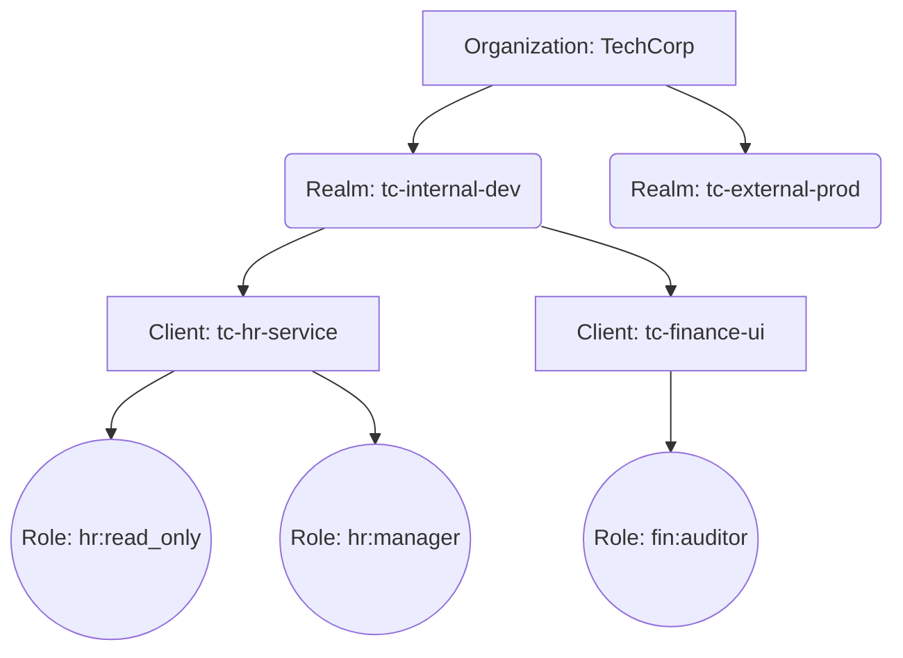

> [!NOTE]
> **Category:** Theory (Lý thuyết)
> **Goal:** Định hình các quy tắc đặt tên (Naming Convention) chuẩn mực cho Realm, Client, Role, và Group trong Keycloak nhằm dễ dàng quản trị, theo dõi và tích hợp CI/CD ở quy mô doanh nghiệp.

## 1. Lý thuyết chuyên sâu (Detailed Theory)

Khi triển khai Keycloak trong các tổ chức lớn, số lượng cấu hình có thể lên đến hàng chục Realm, hàng trăm Client và hàng ngàn Role. Nếu không có một **Naming Convention (Quy tắc đặt tên)** thống nhất ngay từ đầu, hệ thống sẽ nhanh chóng trở nên hỗn loạn (Spaghetti Configurations). Việc phân biệt giữa Client dùng cho ứng dụng nội bộ (Internal) và khách hàng (External), hoặc giữa Role của hệ thống và Role của nghiệp vụ sẽ trở nên bất khả thi.

**Tại sao tính năng này tồn tại?**
Quy tắc đặt tên không phải là một tính năng cấu hình cứng trong phần mềm Keycloak, mà là một **Best Practice** do con người đặt ra. Việc tuân thủ quy tắc này mang lại các giá trị:
- **Ngăn chặn xung đột (Collision Prevention):** Tránh việc hai ứng dụng khác nhau vô tình tạo ra hai Role cùng tên (ví dụ: `admin`) gây lỗi phân quyền.
- **Tự động hóa (Automation):** Giúp các công cụ Infrastructure as Code (như Terraform) và CI/CD script dễ dàng dự đoán tên tài nguyên để thao tác (như tự động gán role theo prefix).
- **Phân loại hiển thị (Visibility):** Quản trị viên dễ dàng lọc và tìm kiếm cấu hình trên giao diện Console.

## 2. Luồng nội bộ & Cơ chế cấp thấp (Internal Workflow & Low-level Mechanisms)

Trong cơ sở dữ liệu của Keycloak (bảng `REALM`, `CLIENT`, `KEYCLOAK_ROLE`), các tên định danh (Name/ID) được lưu trữ dưới dạng chuỗi (String). Keycloak thường không áp dụng chuẩn hóa chữ hoa/chữ thường nghiêm ngặt (case-insensitive tùy DB) cho ID, nhưng lại phân biệt trong Token Claims.



**Cơ chế ảnh hưởng tới Token:** 
Tên của Client và Role sẽ được trực tiếp đưa vào `Access Token` ở các block như `resource_access` và `realm_access`. Nếu tên quá dài hoặc chứa ký tự đặc biệt, nó có thể phá vỡ chuẩn JSON hoặc làm phình to kích thước JWT Header, dẫn tới lỗi xử lý từ các API Gateway.

## 3. Thực hành tốt nhất & Bảo mật (Best Practices & Security)

> [!IMPORTANT]
> **Không sử dụng khoảng trắng và ký tự đặc biệt:** Tránh sử dụng dấu cách, dấu ngoặc, hoặc ký tự Unicode tiếng Việt có dấu trong định danh (ID) hoặc tên (Name) của Realm và Client.

Các tiêu chuẩn được khuyến nghị:
- **Realm:** Dùng chữ thường, phân cách bằng dấu gạch ngang (kebab-case). Thường chứa tiền tố môi trường. VD: `acme-prod`, `acme-staging`.
- **Client ID:** Dùng kebab-case, mô tả rõ vai trò và loại ứng dụng. VD: `portal-web-spa`, `payment-api-service`.
- **Role Name:** Sử dụng định dạng có namespace bằng dấu hai chấm (`:`) hoặc dấu chấm (`.`) để tránh trùng lặp. VD: `urn:acme:billing:admin`, `hr_system.user`. Hạn chế dùng chữ hoa toàn bộ trừ khi hệ thống cũ yêu cầu (VD: `ROLE_ADMIN`).
- **Group Path:** Sắp xếp theo cấu trúc sơ đồ tổ chức thực tế. VD: `/vietnam/hanoi/engineering/devops`.

> [!WARNING]
> **Hạn chế thay đổi tên Realm:** Tên Realm đóng vai trò là tiền tố (Issuer URL) của mọi Token. Nếu đổi tên Realm sau khi hệ thống đã đi vào hoạt động, toàn bộ Token cũ sẽ bị vô hiệu hóa vì không khớp Issuer.

## 4. Cấu hình minh họa thực tế (Configuration Examples)

Ví dụ tổ chức cấu trúc cho một hệ thống Bệnh viện (MediCare):

**Realms:**
- `medicare-staff-prod` (Dành cho bác sĩ, y tá - kết nối Active Directory)
- `medicare-patient-prod` (Dành cho bệnh nhân - cho phép đăng ký tự do)

**Clients (trong realm staff):**
- Client ID: `emr-frontend-spa` (Hệ thống hồ sơ bệnh án - Web)
- Client ID: `billing-backend-api` (Hệ thống thanh toán - API)

**Roles (Client Roles của `emr-frontend-spa`):**
- `emr:doctor:read_write`
- `emr:nurse:read_only`

**Groups:**
- `/departments/cardiology` (Khoa tim mạch)
- `/departments/neurology` (Khoa thần kinh)

Bằng cách đặt tên này, khi nhìn vào JWT Payload:
```json
"resource_access": {
  "emr-frontend-spa": {
    "roles": ["emr:doctor:read_write"]
  }
}
```
Backend hoàn toàn có thể parse chuỗi "emr:doctor:read_write" bằng regex để biết được namespace `emr`, entity `doctor`, và action `read_write`.

## 5. Trường hợp ngoại lệ (Edge Cases)

- **Tên Role từ Identity Provider bên ngoài:** Khi kết nối Keycloak với Azure AD hoặc OKTA, tên Role đồng bộ về có thể mang định dạng UUID (như `b1d7-4c...`) hoặc chuỗi phức tạp. **Khắc phục:** Sử dụng Protocol Mapper loại "Role Name Mapper" để đổi tên các Role này thành định dạng chuẩn của tổ chức trước khi cấp phát Token.
- **Legacy System Integration:** Hệ thống Spring Boot cũ yêu cầu Role phải bắt đầu bằng `ROLE_`. **Khắc phục:** Thay vì làm hỏng naming convention trong Keycloak, hãy dùng Mapper cấu hình thêm Prefix `ROLE_` riêng cho Client Spring Boot đó.

## 6. Câu hỏi Phỏng vấn (Interview Questions)

**Junior Level:**
1. Tại sao không nên đặt tên Realm có chứa khoảng trắng hoặc ký tự đặc biệt (ví dụ: `Hệ Thống Nội Bộ`)?
2. Sự khác biệt giữa việc sử dụng `kebab-case` và `camelCase` đối với Client ID trong Keycloak?
3. Nếu bạn phải chia môi trường (Dev, Staging, Prod), bạn sẽ đặt tên Realm như thế nào?

**Senior Level:**
4. **Tình huống:** Một công ty sử dụng tên Role chung chung như `admin` và `user` cho tất cả các Client (hơn 50 ứng dụng). Gần đây, ứng dụng A và ứng dụng B đang gặp sự cố "tréo ngoe" khi user có quyền admin của A lại vô tình đăng nhập được vào B với tư cách admin. Dưới góc độ Naming Convention và Role Management, bạn khắc phục điều này như thế nào?
   *Đáp án gợi ý:* Nguyên nhân là do họ dùng Realm Roles với tên quá chung chung (`admin`). Cần thiết kế lại bằng cách chuyển sang sử dụng Client Roles hoặc định nghĩa lại Realm Roles với Namespace rõ ràng (VD: `app_a:admin`, `app_b:admin`).
5. Giải thích cách thức Naming Convention của Groups (ví dụ: `/region/country/department`) có thể kết hợp với Group Attributes để hỗ trợ Attribute-Based Access Control (ABAC).

## 7. Tài liệu tham khảo (References)
- [Keycloak Official Documentation - Realm Configuration](https://www.keycloak.org/docs/latest/server_admin/#_create-realm)
- [OAuth 2.0 Security Best Current Practice - RFC 6819](https://datatracker.ietf.org/doc/html/rfc6819)
