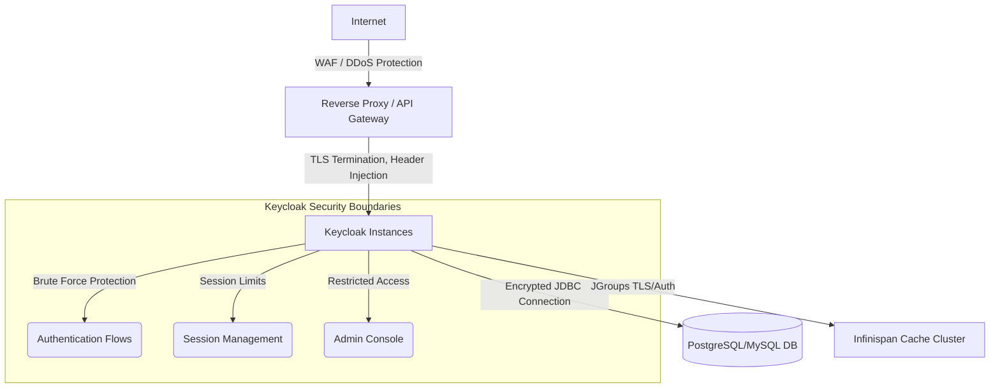

> [!NOTE]
> **Category:** Theory (Lý thuyết)
> **Goal:** Cung cấp bộ tiêu chuẩn kiểm tra an toàn (Security Checklist) bắt buộc trước khi đưa Keycloak vào môi trường Production, nhằm ngăn chặn các lỗ hổng bảo mật và các cuộc tấn công phổ biến.

## 1. Lý thuyết chuyên sâu (Detailed Theory)

Keycloak là "người gác cổng" (Gatekeeper) của toàn bộ hệ thống doanh nghiệp. Nếu Keycloak bị xâm nhập, kẻ tấn công có thể giả mạo token và lấy toàn quyền kiểm soát các hệ thống lõi. Do đó, **Security Checklist** là một danh sách các công việc cấu hình mạng, cơ sở dữ liệu và chính sách xác thực mà quản trị viên phải hoàn thành nghiêm ngặt trước khi triển khai thực tế (Go-Live).

**Tại sao tính năng này tồn tại?**
Mặc định, Keycloak được cấu hình để dễ dàng phát triển (Developer-friendly), ví dụ như cho phép HTTP HTTPs, mở cổng Admin Console ra Internet, và không có chính sách mật khẩu phức tạp. Môi trường Production đòi hỏi một mô hình "Mặc định an toàn" (Secure by Default). Checklist này lấp đầy khoảng trống giữa môi trường Dev và Prod.

## 2. Luồng nội bộ & Cơ chế cấp thấp (Internal Workflow & Low-level Mechanisms)

Quá trình bảo mật một cụm Keycloak diễn ra ở nhiều tầng (Layered Security): từ Hạ tầng mạng (Network/Edge), Môi trường chạy (OS/JVM), Cấu hình Keycloak, và Cơ sở dữ liệu.



**Cơ chế cấp thấp:**
- Ở mức giao tiếp mạng, Keycloak sử dụng Undertow/Quarkus HTTP Server. Việc cấu hình TLS/SSL giúp mã hóa payload, ngăn chặn Packet Sniffing.
- Ở mức quản lý phiên làm việc, Infinispan lưu trữ session. Nếu JGroups (giao thức đồng bộ cache) không được bảo mật, hacker có thể nghe lén nội dung token trên mạng nội bộ.

## 3. Thực hành tốt nhất & Bảo mật (Best Practices & Security)

> [!IMPORTANT]
> **Bắt buộc sử dụng HTTPS (TLS/SSL):** Giao thức OAuth2 và OIDC truyền tải Bearer Token trong Header. Nếu dùng HTTP HTTP thường, token sẽ bị đánh cắp bằng kỹ thuật Man-In-The-Middle (MITM). Cấu hình Keycloak yêu cầu `Require SSL` ở mức `all requests`.

**Danh sách Security Checklist (Top 5 ưu tiên):**
1. **Chặn truy cập Admin Console từ Internet:** Cổng `/auth/admin` hoặc đường dẫn admin phải bị block ở mức Reverse Proxy (Nginx, HAProxy) hoặc WAF. Chỉ cho phép truy cập từ dải IP nội bộ (VPN).
2. **Kích hoạt Brute Force Protection:** Trong mục Realm Settings, tính năng bảo vệ Brute Force phải được bật để khóa tài khoản sau N lần đăng nhập sai.
3. **Đổi thông tin đăng nhập DB:** Không sử dụng mật khẩu mặc định, cấu hình Database JDBC sử dụng SSL (`ssl=true`).
4. **Áp dụng Password Policy:** Cấu hình chính sách mật khẩu (độ dài tối thiểu 8, bắt buộc chữ hoa, số, ký tự đặc biệt) và kiểm tra mật khẩu bị rò rỉ qua tính năng "Not recently used".
5. **Cấu hình Security Headers (CSP):** Bật Content Security Policy, X-Frame-Options (`SAMEORIGIN`) để chống Clickjacking và XSS ở mục Realm Settings -> Security Defenses.

> [!CAUTION]
> **Tắt tính năng Default Client:** Xóa tài khoản `admin` mặc định sau khi tạo tài khoản khác, và xóa các Client không sử dụng. Đặc biệt, KHÔNG gán quyền `realm-management` cho các Public Client.

## 4. Cấu hình minh họa thực tế (Configuration Examples)

**Cấu hình Nginx để ẩn Admin Console (Reverse Proxy):**
```nginx
server {
    listen 443 ssl;
    server_name sso.techcorp.com;

    # Chặn hoàn toàn đường dẫn admin từ Internet
    location /admin {
        # Chỉ cho phép IP của Office VPN
        allow 192.168.100.0/24;
        deny all;
        proxy_pass http://keycloak-backend;
    }

    # Cho phép các đường dẫn khác (auth, realms)
    location / {
        proxy_pass http://keycloak-backend;
        proxy_set_header Host $host;
        proxy_set_header X-Real-IP $remote_addr;
        proxy_set_header X-Forwarded-For $proxy_addrs;
        proxy_set_header X-Forwarded-Proto https;
    }
}
```

**Cấu hình Password Policy trong Keycloak Admin:**
- Length: 12
- Digits: 1
- Upper Case: 1
- Special Chars: 1
- Hashing Iterations: 27500 (Pbkdf2-sha256)

## 5. Trường hợp ngoại lệ (Edge Cases)

- **Brute Force khóa nhầm người dùng hợp lệ (Denial of Service - DoS):** Nếu hệ thống bị tấn công Brute Force ồ ạt bằng cách đoán đúng Username liên tục (Password Spraying), tài khoản của người dùng hợp lệ sẽ bị khóa cứng. **Khắc phục:** Sử dụng tính năng "Wait Increment" (Tăng thời gian chờ) thay vì khóa vĩnh viễn, hoặc triển khai reCAPTCHA vào luồng đăng nhập.
- **SSL Termination mất IP thực:** Nếu proxy không cấu hình đúng các header `X-Forwarded-For`, tính năng Brute Force của Keycloak sẽ nhận nhầm mọi request đều đến từ 1 IP của Proxy và sẽ khóa IP của Proxy, gây chết toàn bộ hệ thống. **Khắc phục:** Cấu hình thuộc tính `proxy=reencrypt` hoặc `proxy=edge` khi khởi động Keycloak để nó đọc đúng Header.

## 6. Câu hỏi Phỏng vấn (Interview Questions)

**Junior Level:**
1. Tại sao việc chỉ có mật khẩu (Password) là không đủ an toàn cho Keycloak Admin? (Gợi ý: Cần 2FA/MFA)
2. Hãy kể tên 3 header HTTP mà Keycloak sử dụng để bảo vệ chống lại các lỗ hổng web (như XSS, Clickjacking).
3. Tại sao cấu hình `Require SSL` lại có các mức (all requests, external requests, none)?

**Senior Level:**
4. **Tình huống:** Sau khi cấu hình Nginx đứng trước Keycloak, bạn nhận thấy Keycloak liên tục chặn IP của Nginx do tính năng Brute Force Protection, khiến toàn bộ người dùng không đăng nhập được. Nguyên nhân do đâu và bạn xử lý như thế nào ở cả tầng Nginx và Keycloak Quarkus?
   *Đáp án gợi ý:* Nguyên nhân do thiếu `X-Forwarded-For` header hoặc Keycloak chưa bật chế độ nhận biết Proxy. Sửa cấu hình Keycloak bằng biến môi trường `KC_PROXY=edge` và Nginx phải có `proxy_set_header X-Forwarded-For $proxy_addrs`.
5. Đánh giá rủi ro khi lưu trữ Session Datastore (Infinispan) dưới dạng phân tán mà không mã hóa giao tiếp nội bộ giữa các Node Keycloak. Có cách nào khai thác nó không?

## 7. Tài liệu tham khảo (References)
- [Keycloak Server Administration Guide - Threat Mitigation](https://www.keycloak.org/docs/latest/server_admin/#threat-mitigation)
- [OWASP Authentication Cheat Sheet](https://cheatsheetseries.owasp.org/cheatsheets/Authentication_Cheat_Sheet.html)
