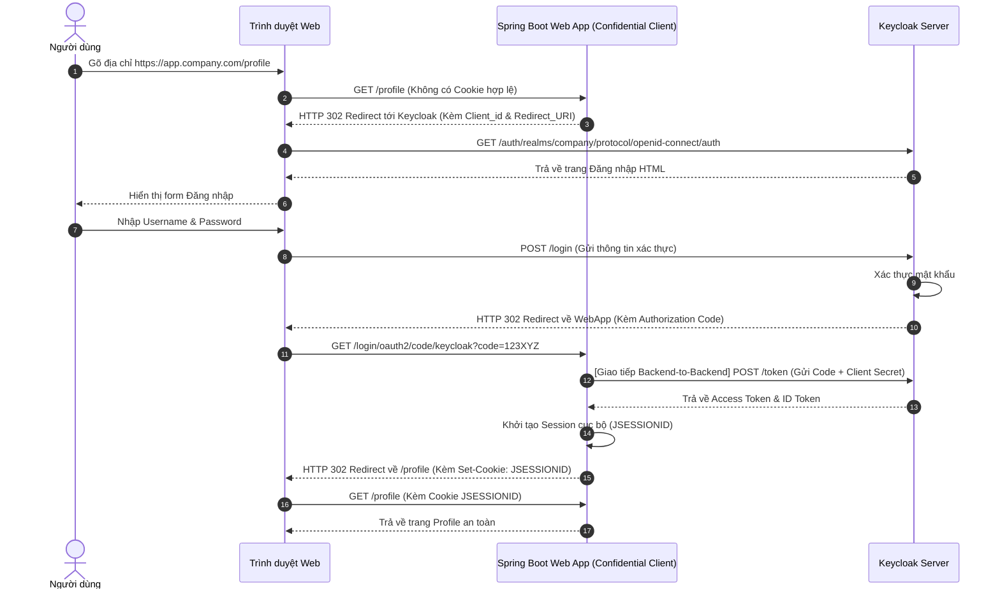

# Lesson 1: Project 01 - Tích Hợp Đăng Nhập Cơ Bản (Basic Login)

> [!NOTE]
> **Category:** Architecture/Design (Kiến trúc/Thiết kế)
> **Goal:** Thiết kế và triển khai một giải pháp tích hợp Keycloak cho một ứng dụng Web truyền thống (Server-side rendering) không chia cắt Frontend/Backend.

## 1. Lý thuyết chuyên sâu (Detailed Theory)

### 1.1. Bối cảnh dự án (Project Context)
Trong thực tế, không phải lúc nào công ty cũng sử dụng các công nghệ tân tiến như React, Angular hay Microservices. Vẫn còn tồn tại hàng nghìn hệ thống Legacy (Di sản) được viết bằng Spring MVC, ASP.NET MVC, JSP hoặc PHP. Trong các hệ thống này, Frontend (Giao diện HTML) và Backend (Xử lý Logic) nằm chung trong cùng một mã nguồn và chạy trên cùng một máy chủ (Server-side Rendering). 

Bài toán đặt ra là: Làm sao để thay thế hệ thống Đăng nhập tự chế (Lưu mật khẩu thô trong Database) của hệ thống cũ kỹ này bằng một hệ thống Identity Access Management (IAM) chuyên nghiệp như Keycloak mà ít làm gián đoạn mã nguồn nhất?

### 1.2. Giải pháp kiến trúc (Architectural Solution)
Đối với các ứng dụng Server-side, phương thức bảo mật tối ưu nhất và an toàn nhất là sử dụng giao thức **OAuth 2.0 Authorization Code Flow**.
Trong mô hình này:
- Ứng dụng Web đóng vai trò là một **Confidential Client** (Client có khả năng giữ bí mật). Nó có thể lưu trữ an toàn `client_secret` trên máy chủ mà không sợ bị lộ cho người dùng (vì mã nguồn không chạy trên trình duyệt).
- Người dùng không bao giờ nhập mật khẩu trên giao diện của Ứng dụng Web. Thay vào đó, họ bị điều hướng (Redirect) sang Keycloak để đăng nhập.
- Sau khi đăng nhập thành công, Keycloak trả về một mã thẻ (Authorization Code). Ứng dụng Web ở phía Backend sẽ âm thầm cầm mã thẻ này đổi lấy Access Token và ID Token từ Keycloak.
- Phiên đăng nhập (Session) sau đó sẽ được Ứng dụng Web duy trì bằng Cookie cục bộ truyền thống (Session Cookie), trình duyệt hoàn toàn không biết sự tồn tại của Token.

## 2. Luồng nội bộ & Cơ chế cấp thấp (Internal Workflow & Low-level Mechanisms)

Dưới đây là sơ đồ chi tiết về luồng thực thi (Authorization Code Flow) khi người dùng truy cập một trang được bảo vệ:



**Phân tích kỹ thuật (Step-by-step):**
1. **Bước 1-3:** Ứng dụng web chặn Request chưa đăng nhập và điều hướng sang Keycloak. Mấu chốt ở đây là tham số `redirect_uri` (địa chỉ Keycloak sẽ gọi lại).
2. **Bước 4-9:** Quá trình xác thực hoàn toàn nằm trong tay Keycloak. Ứng dụng Web không hề biết mật khẩu của User.
3. **Bước 10-13:** Bước quan trọng nhất. WebApp nhận được `Code`. Vì WebApp là Confidential Client nên nó cầm `Code` cùng với `Client_Secret` gửi request ẩn đằng sau Backend (Channel an toàn) lên Keycloak để lấy Token. Trình duyệt không bao giờ nhìn thấy Token.
4. **Bước 14-17:** WebApp giữ Token trong RAM hoặc Redis của nó, và trả về cho trình duyệt 1 Session Cookie truyền thống.

## 3. Thực hành tốt nhất & Bảo mật (Best Practices & Security)

> [!IMPORTANT]
> **Tuyệt đối không sử dụng Implicit Flow**
> Implicit Flow từng được thiết kế cho các ứng dụng cũ, nơi Token bị lộ thẳng lên URL. Trong bối cảnh hiện đại, OAuth 2.0 Security Best Current Practice (BCP) cấm sử dụng Implicit Flow. Luôn sử dụng Authorization Code Flow.

> [!WARNING]
> **Bảo vệ Client Secret**
> Không bao giờ được hardcode `client_secret` trực tiếp trong mã nguồn. Hãy sử dụng Biến môi trường (Environment Variables) hoặc hệ thống quản lý Secret như HashiCorp Vault.

> [!TIP]
> **Sử dụng PKCE (Proof Key for Code Exchange)**
> Dù ứng dụng của bạn là Confidential Client, việc bật PKCE (Sinh ra Code Challenge và Code Verifier) vẫn được khuyến khích để ngăn chặn hoàn toàn tấn công chặn bắt mã (Authorization Code Interception Attack).

## 4. Cấu hình minh họa thực tế (Configuration Examples)

### 4.1. Cấu hình trên Keycloak Admin Console
- **Client ID:** `my-legacy-webapp`
- **Client Authenticator:** Client Id and Secret
- **Access Type:** `confidential` (Nếu dùng bản cũ) hoặc Bật cờ `Client authentication` (Trên giao diện Keycloak mới).
- **Valid Redirect URIs:** `https://app.company.com/login/oauth2/code/keycloak`
- **Standard Flow Enabled:** `ON` (Để cho phép Authorization Code Flow).
- **Direct Access Grants Enabled:** `OFF` (Ngăn chặn việc đăng nhập bằng API gọi trực tiếp).

### 4.2. Cấu hình Spring Boot Application (application.yml)
Nếu hệ thống cũ được viết bằng Java Spring Boot, cấu hình tích hợp OAuth2 Login vô cùng ngắn gọn:

```yaml
spring:
  security:
    oauth2:
      client:
        registration:
          keycloak:
            client-id: my-legacy-webapp
            client-secret: ${KEYCLOAK_CLIENT_SECRET} # Đọc từ biến môi trường
            scope: openid, profile, email
            authorization-grant-type: authorization_code
            redirect-uri: "{baseUrl}/login/oauth2/code/{registrationId}"
        provider:
          keycloak:
            issuer-uri: https://sso.company.com/realms/company-realm
```

Chỉ với đoạn cấu hình trên, Spring Security sẽ tự động đảm nhiệm toàn bộ luồng Authorization Code Flow (Từ bước 3 đến bước 15 trong sơ đồ) mà bạn không cần code thêm bất cứ dòng Java nào.

## 5. Trường hợp ngoại lệ (Edge Cases)

- **Lỗi `Invalid Redirect URI`:** Xảy ra ở bước 3 khi địa chỉ ứng dụng (ví dụ `http://localhost:8080/callback`) không khớp chính xác tới từng ký tự với những gì đã cấu hình trong ô `Valid Redirect URIs` trên Keycloak. 
  - *Cách khắc phục:* Đảm bảo URI khớp tuyệt đối (Có phân biệt http và https, có/không có dấu gạch chéo `/` ở cuối).
- **Lỗi `Client Secret Mismatch`:** Xảy ra ở bước 12. WebApp gửi sai Secret. Keycloak sẽ trả về HTTP 401 Unauthorized. 
  - *Cách khắc phục:* Kiểm tra lại biến môi trường hoặc copy lại Secret từ Keycloak Console.
- **Vòng lặp vô hạn (Infinite Redirect Loop):** Xảy ra khi WebApp chạy sau một Reverse Proxy (Nginx) chặn SSL. Keycloak tưởng URL trả về là `http` thay vì `https`. 
  - *Cách khắc phục:* Chỉnh Nginx gửi header `X-Forwarded-Proto: https` và cấu hình Spring Boot `server.forward-headers-strategy=framework`.

## 6. Câu hỏi Phỏng vấn (Interview Questions)

1. **(Junior)** Trong mô hình ứng dụng Web truyền thống, tại sao lại khuyên dùng Authorization Code Flow thay vì ném thẳng Username/Password từ Form Login sang API của Keycloak?
   - *Đáp án:* Để Keycloak hoàn toàn chịu trách nhiệm xác thực. Ứng dụng Web không bao giờ nhìn thấy hoặc lưu trữ Mật khẩu của người dùng, giúp giảm rủi ro lộ lọt và dễ dàng kích hoạt MFA (Xác thực đa yếu tố) từ phía Keycloak.
2. **(Junior)** Sự khác biệt giữa Public Client và Confidential Client là gì? Ứng dụng Web tĩnh (HTML/JS) thuộc loại nào?
   - *Đáp án:* Confidential Client có thể giữ bí mật Client Secret (thường chạy ở Backend/Server). Public Client không thể giữ bí mật (như Ứng dụng di động, SPA React). Web tĩnh HTML/JS chạy trên trình duyệt nên nó là Public Client.
3. **(Senior)** Nếu Hacker ăn cắp được `Authorization Code` (ở bước 10 trong sơ đồ), hệ thống có bị tổn hại không?
   - *Đáp án:* Không. Để đổi Code lấy Token, Hacker phải có thêm `Client_Secret` (Nằm ẩn dưới Backend) hoặc phải biết `Code_Verifier` (Nếu bật PKCE). Do đó, chỉ có mã Code không thì vô dụng.
4. **(Senior)** Trong kiến trúc này, khi Token của Keycloak hết hạn (Expired), làm sao để ứng dụng Web duy trì phiên đăng nhập?
   - *Đáp án:* Ứng dụng Web đang duy trì phiên bằng Session Cookie cục bộ (ví dụ JSESSIONID). Khi Access Token hết hạn, Backend có thể dùng Refresh Token (nếu có) để gọi Keycloak lấy Access Token mới âm thầm. Nếu Session Cookie chưa hết hạn, người dùng vẫn duyệt web bình thường.
5. **(Senior)** Reverse Proxy Nginx đóng vai trò gì trong việc gây ra lỗi Redirect URI `http` thành `https`? Cách xử lý tận gốc?
   - *Đáp án:* Nginx bóc lớp TLS (SSL Termination) và forward request HTTP thô vào Backend. Backend lầm tưởng giao thức là HTTP nên sinh ra Redirect URI bắt đầu bằng `http://`. Cách xử lý là Nginx phải đẩy Header `X-Forwarded-Proto` và Backend phải đọc Header này để tự động sinh đúng URI `https`.

## 7. Tài liệu tham khảo (References)
- **RFC 6749 (The OAuth 2.0 Authorization Framework):** Mục 4.1 (Authorization Code Grant).
- **Spring Security Reference:** OAuth 2.0 Login.
- **Keycloak Documentation:** Securing Applications and Services Guide.
