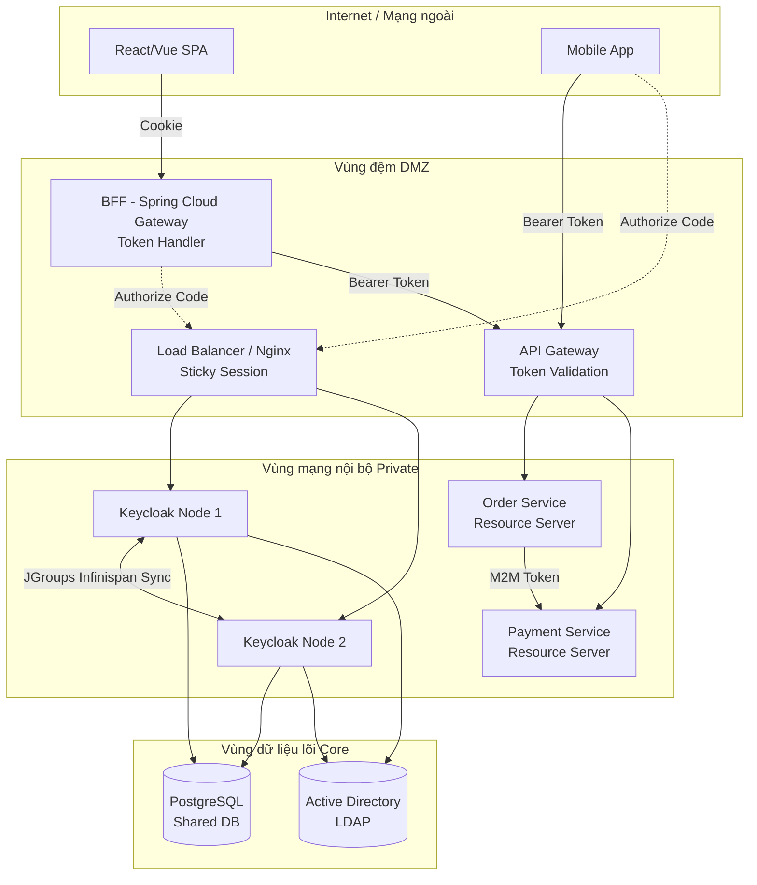

# Lesson 10: Project 10 - Enterprise IAM Platform

> [!NOTE]
> **Category:** Architecture/Enterprise
> **Goal:** Lắp ghép toàn bộ mảnh ghép từ các bài học trước (RBAC, BFF, API Gateway, Microservices, LDAP, HA Cluster) để phác thảo nên một bức tranh toàn cảnh: **Nền tảng Quản lý Định danh và Truy cập Doanh nghiệp (Enterprise IAM Platform)** hoàn chỉnh.

## 1. Lý thuyết chuyên sâu (Detailed Theory)

Một nền tảng **Enterprise IAM (Identity and Access Management)** thực sự trong các tập đoàn lớn (Ngân hàng, Viễn thông, Thương mại điện tử) không bao giờ chỉ đơn thuần là việc "tải file zip Keycloak về chạy". Nó là một hệ sinh thái phức tạp kết nối hàng loạt các phân hệ mạng và bảo mật lại với nhau.

Cấu trúc chuẩn của một Enterprise IAM Platform bao gồm 5 tầng (Layers) cốt lõi:
1. **Nguồn định danh lõi (Identity Source):** Nơi chứa thông tin nhân viên gốc rễ (Thường là Microsoft Active Directory hoặc OpenLDAP).
2. **Động cơ Xác thực (Authentication Engine):** Cụm Keycloak Sẵn sàng cao (HA Cluster) đảm nhận việc sinh Token, quản lý Session, OTP, Brute-force.
3. **Mặt tiền Bảo mật Frontend (Frontend Edge):** Kiến trúc BFF (Backend-For-Frontend) giúp các ứng dụng Web SPA tránh khỏi rủi ro XSS bằng việc đổi Token lấy HttpOnly Cookie.
4. **Mặt tiền Bảo mật Backend (Backend Edge):** API Gateway đứng chặn toàn bộ luồng dữ liệu vào Microservices, kiểm tra tính hợp lệ của JWT (Signature, Expiration).
5. **Dịch vụ Tài nguyên (Resource Servers):** Các Microservices ẩn sâu bên trong mạng nội bộ, nhận Token Relay từ Gateway, và thực hiện Phân quyền chi tiết (Authorization - RBAC/ABAC).

## 2. Luồng nội bộ & Cơ chế cấp thấp (Internal Workflow & Low-level Mechanisms)

Bức tranh dưới đây minh họa Cấu trúc mạng (Network Topology) của toàn bộ hệ thống, phân chia rõ ràng các phân vùng mạng (DMZ, Private, Core).



## 3. Thực hành tốt nhất & Bảo mật (Best Practices & Security)

> [!IMPORTANT]
> **Quy hoạch Realm độc lập (Realm Segregation)**
> Không bao giờ trộn lẫn Khách hàng (Customer) và Nhân viên (Employee) vào chung một Realm. 
> - **Employee_Realm:** Liên kết với Active Directory, dùng Mật khẩu AD + OTP, chính sách mật khẩu khắt khe (đổi mỗi 90 ngày).
> - **Customer_Realm:** Cho phép tự đăng ký (Self-Registration), kết nối Social Login (Google, Facebook), không liên kết AD. 
> Việc tách Realm đảm bảo nếu Customer Realm bị lộ lọt dữ liệu thì tài khoản quản trị nội bộ của công ty vẫn an toàn.

> [!TIP]
> **Infrastructure as Code (IaC) cho Keycloak**
> Việc dùng trỏ chuột click tạo Realm, tạo Client trên giao diện UI của Keycloak ở môi trường Production là một **Bad Practice** tồi tệ. Nó không thể tái tạo lại được nếu Keycloak bị sập. Bạn phải quản lý cấu hình bằng Code (IaC) thông qua các công cụ như `Keycloak Config CLI` (Dùng file YAML) hoặc `Terraform Keycloak Provider`. Mọi thay đổi cấu hình phải được review qua Git (GitOps).

> [!WARNING]
> **Giám sát cụm chặt chẽ (Cluster Monitoring)**
> Khi vận hành nền tảng IAM, mù thông tin là tự sát. Bạn bắt buộc phải cấu hình Prometheus để kéo thông số (Metrics) từ cụm Keycloak và hiển thị lên Grafana. Các thông số sống còn phải theo dõi: Memory Heap (tránh OOM), CPU usage (đặc biệt trong giờ cao điểm login), số lượng User Sessions hiện tại, và trạng thái kết nối JGroups (để phát hiện Split-brain).

## 4. Cấu hình minh họa thực tế (Configuration Examples)

Ví dụ quy trình tự động hóa CI/CD để triển khai cấu hình Realm lên Production bằng `keycloak-config-cli`:

1. File định nghĩa cấu hình `realm-config.yaml` được lưu trên Git:
```yaml
realm: my-enterprise-realm
enabled: true
accessTokenLifespan: 300 # 5 phút
ssoSessionIdleTimeout: 1800 # 30 phút
clients:
  - clientId: bff-gateway
    enabled: true
    clientAuthenticatorType: client-secret
    secret: vault-secret-123
    standardFlowEnabled: true
    publicClient: false
```

2. Lệnh chạy trong CI/CD Pipeline (GitLab CI / GitHub Actions) để áp dụng cấu hình:
```bash
docker run --rm \
  -e KEYCLOAK_URL=https://sso.mycompany.com \
  -e KEYCLOAK_USER=admin \
  -e KEYCLOAK_PASSWORD=${ADMIN_PASS} \
  -v ./realm-config.yaml:/config/realm-config.yaml \
  quay.io/phasetwo/keycloak-config-cli:latest
```

## 5. Trường hợp ngoại lệ (Edge Cases)

### 5.1. Bão Đăng nhập Buổi sáng (Morning Login Storm)
- **Vấn đề:** Đúng 8h00 sáng, 10,000 nhân viên văn phòng đồng loạt mở máy tính và đăng nhập vào mạng công ty. Quá trình Hash mật khẩu (Sử dụng thuật toán PBKDF2 với hàng trăm nghìn vòng lặp) tiêu tốn lượng CPU khổng lồ. Cụm Keycloak bị thắt cổ chai CPU, dẫn tới Timeout.
- **Giải pháp:** 
  1. **Pre-Scale:** Cấu hình hệ thống Cloud (K8s HPA) tự động nhân bản (Scale up) từ 3 Nodes lên 10 Nodes vào lúc 7h45 sáng, và scale down lại lúc 9h00.
  2. **Tối ưu Hashing:** Cân bằng số vòng lặp (Iterations) của thuật toán mã hóa mật khẩu. Nếu để quá cao (hàng triệu vòng) sẽ an toàn tuyệt đối nhưng làm sập CPU. Cần tìm điểm cân bằng hiệu năng (Benchmark).

### 5.2. Thảm họa toàn diện (Disaster Recovery)
- **Vấn đề:** Data Center chính (DC1) bị cúp điện toàn phần hoặc đứt cáp quang. Giao thông phải điều hướng sang Data Center dự phòng (DC2). Nhưng toàn bộ RAM chứa Session của người dùng đang nằm ở cụm Infinispan của DC1. Nếu chuyển sang DC2, toàn bộ hàng triệu người dùng phải đăng nhập lại, gây ra bão Login mới ở DC2 làm sập tiếp DC2.
- **Giải pháp:** Thiết lập kiến trúc **Cross-Datacenter Replication** (Đồng bộ liên trung tâm dữ liệu) bằng công cụ JBoss Data Grid (JDG). Session sẽ được đồng bộ ngầm định kỳ từ DC1 sang cụm Cache của DC2. Tuy nhiên kiến trúc này cực kỳ phức tạp và tốn kém băng thông đường truyền quốc tế.

## 6. Câu hỏi Phỏng vấn (Interview Questions)

**1. (Junior) Phân tích ưu nhược điểm của việc tự vận hành Keycloak (On-premise Enterprise IAM) so với việc đi thuê dịch vụ đám mây có sẵn như Auth0, Okta, hay AWS Cognito?**
- *Đáp án:* 
  - **Thuê Cloud (Auth0/Okta):** Ưu điểm là setup cực nhanh, không phải lo quản lý máy chủ, không lo sập server, update bảo mật tự động. Nhược điểm là chi phí cực kỳ đắt đỏ khi số lượng User lớn (Billing theo Active Users), và dữ liệu người dùng bị lưu trữ trên Cloud của đối tác (vi phạm quy định dữ liệu ở một số quốc gia/ngành ngân hàng).
  - **Tự Host Keycloak:** Ưu điểm là miễn phí (Mã nguồn mở), kiểm soát 100% dữ liệu, có thể viết Custom SPI can thiệp sâu vào luồng xử lý. Nhược điểm là chi phí nhân sự vận hành DevOps/SRE rất đắt, cần người có chuyên môn cực sâu về Java, Infinispan, và Security.

**2. (Senior) Trong mô hình kết hợp cả BFF và API Gateway (Như sơ đồ trên). Nếu BFF đã giữ JWT trong bộ nhớ và API Gateway cũng kiểm tra JWT, liệu chúng ta có đang xác thực JWT 2 lần gây lãng phí CPU không?**
- *Đáp án:* Có, nhưng đây là sự lãng phí cần thiết theo nguyên tắc "Phòng thủ chiều sâu" (Defense in Depth). 
  - BFF giữ JWT để thay thế nó cho Cookie (Bảo vệ SPA).
  - API Gateway kiểm tra lại JWT vì API Gateway không chỉ nhận Request từ BFF, nó còn nhận Request từ Mobile App (không qua BFF), hoặc từ đối tác thứ 3. Việc API Gateway kiểm tra mọi Token trước khi thả vào mạng nội bộ là "Chốt chặn biên" (Edge Security) không thể bỏ qua. (Hơn nữa, việc xác thực chữ ký (Local Validation) rất nhẹ, không gây trễ đáng kể).

## 7. Tài liệu tham khảo (References)
- **Keycloak Documentation:** High Availability and Cross-Datacenter Replication.
- **Cloud Native Patterns:** Designing Change-Tolerant Software.
- **Microservices.io:** Enterprise Architecture Patterns.
