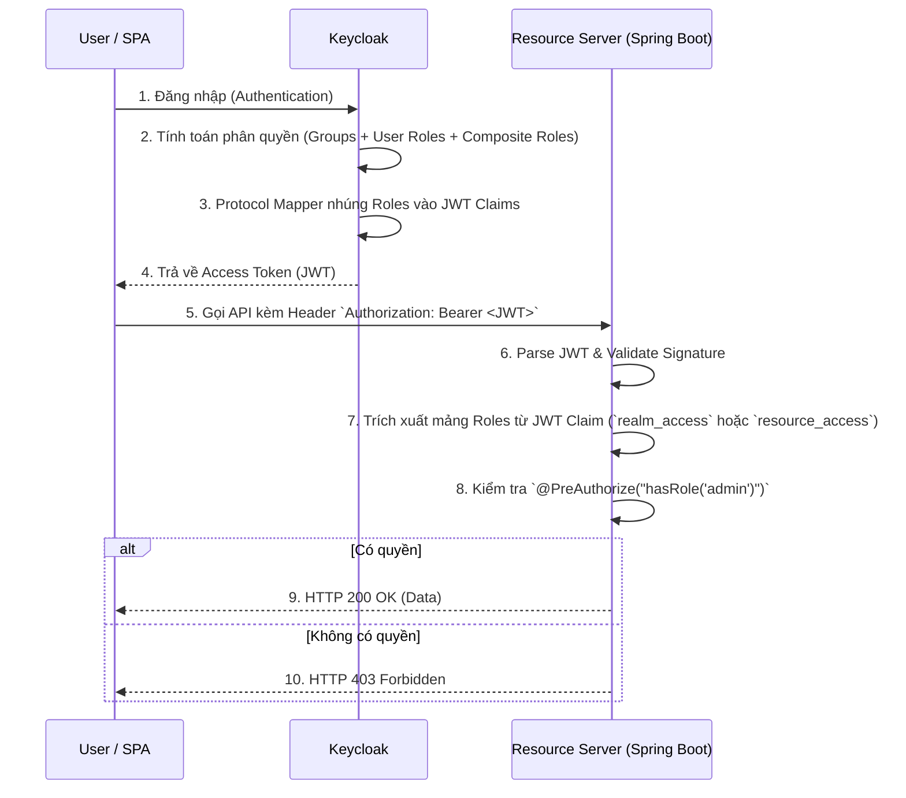

# Lesson 2: Project 02 - Role-Based Access Control (RBAC) Architecture

> [!NOTE]
> **Category:** Architecture/Design
> **Goal:** Thiết kế và triển khai mô hình phân quyền RBAC (Role-Based Access Control) chuẩn doanh nghiệp sử dụng Keycloak, tích hợp với Backend (Resource Server) qua JWT Claims, và xử lý các vấn đề mở rộng khi số lượng người dùng và quyền hạn tăng đột biến.

## 1. Lý thuyết chuyên sâu (Detailed Theory)

Trong các ứng dụng Enterprise, Authentication (Xác thực - Bạn là ai?) chỉ là bước đầu. Bài toán phức tạp hơn nằm ở **Authorization** (Phân quyền - Bạn được phép làm gì?). 

**RBAC (Role-Based Access Control)** là mô hình phân quyền kinh điển nhất, trong đó quyền truy cập không được gán trực tiếp cho User, mà được gán cho một **Role** (Vai trò). User sau đó sẽ được cấp các Role tương ứng.

Trong kiến trúc của Keycloak, RBAC được triển khai qua các khái niệm cốt lõi:
- **Realm Roles (Vai trò cấp miền):** Là các Role có phạm vi toàn cục trong một Realm. Bất kỳ Client (ứng dụng) nào trong Realm cũng có thể nhìn thấy và sử dụng Realm Roles. Chỉ nên dùng cho các quyền quản trị chéo ứng dụng (ví dụ: `global-admin`).
- **Client Roles (Vai trò cấp ứng dụng):** Là các Role chỉ có ý nghĩa nội bộ trong một Client cụ thể. Ví dụ: Client `accounting-service` có Role `view-reports`, Client `hr-service` có Role `approve-leave`. Đây là cách chuẩn để thiết kế Microservices.
- **Composite Roles (Vai trò phức hợp):** Một Role có thể "chứa" nhiều Role khác. Ví dụ: Role `manager` là một Composite Role bao gồm `employee`, `view-reports`, và `approve-leave`.
- **Groups (Nhóm):** Đại diện cho một tập hợp User trong tổ chức (ví dụ: `Accounting Department`). Bạn không nên gán Role lẻ tẻ cho từng User, mà hãy gán User vào Group, sau đó gán Role cho Group đó.

## 2. Luồng nội bộ & Cơ chế cấp thấp (Internal Workflow & Low-level Mechanisms)

Khi áp dụng RBAC với OAuth2/OIDC, Keycloak truyền tải thông tin phân quyền thông qua **JWT Access Token**. Luồng xử lý diễn ra như sau:



Cấu trúc Payload của một JWT chứa thông tin RBAC do Keycloak sinh ra thường có dạng:
```json
{
  "sub": "user-uuid-1234",
  "realm_access": {
    "roles": ["offline_access", "uma_authorization"]
  },
  "resource_access": {
    "accounting-service": {
      "roles": ["view-reports", "manager"]
    }
  }
}
```

## 3. Thực hành tốt nhất & Bảo mật (Best Practices & Security)

> [!IMPORTANT]
> **Hạn chế tối đa sử dụng Realm Roles**
> Trong kiến trúc Microservices, việc dùng Realm Roles dẫn đến sự chồng chéo (Coupling) giữa các service. Quyền `admin` của Service A không được phép lẫn lộn với `admin` của Service B. Hãy luôn ưu tiên tạo **Client Roles** cho từng ứng dụng cụ thể.

> [!WARNING]
> **Nguyên tắc Privilege Creep (Leo thang quyền hạn do tích tụ)**
> Khi nhân viên luân chuyển phòng ban, quyền cũ thường không bị thu hồi. Để chống lại điều này, KHÔNG gán Role trực tiếp cho User. Hãy sử dụng **Groups**. Khi nhân viên chuyển từ bộ phận IT sang HR, chỉ cần đổi Group của họ từ `IT-Group` sang `HR-Group`, tự động toàn bộ Role của IT sẽ bị thu hồi và Role của HR sẽ được cấp phát.

> [!TIP]
> **Map Roles cẩn thận để tránh Token Bloat**
> Mặc định Keycloak có thể nhét hàng chục Role rác vào Token. Hãy sử dụng **Client Scopes** để chỉ định: "Chỉ khi Client A gọi, thì mới nhúng Client Roles của Client A vào Token". Điều này giúp JWT nhỏ gọn và tiết kiệm băng thông.

## 4. Cấu hình minh họa thực tế (Configuration Examples)

### 4.1. Khai báo Client Roles trên Keycloak
1. Vào Admin Console -> **Clients** -> Chọn Client `accounting-service`.
2. Tab **Roles** -> Click **Create Role**.
3. Tên Role: `view-reports`.

### 4.2. Ánh xạ (Mapping) Client Roles vào JWT
Mặc định Spring Security hy vọng Role nằm ở một Claim phẳng, thay vì lồng sâu trong `resource_access.accounting-service.roles`. Ta có hai cách xử lý:
**Cách 1: Code ở Backend Spring Boot (Custom JwtAuthenticationConverter)**
```java
@Configuration
@EnableWebSecurity
public class SecurityConfig {

    @Bean
    public SecurityFilterChain filterChain(HttpSecurity http) throws Exception {
        http.authorizeHttpRequests(authorize -> authorize
                .requestMatchers("/api/reports/**").hasRole("view-reports")
                .anyRequest().authenticated()
        ).oauth2ResourceServer(oauth2 -> oauth2
                .jwt(jwt -> jwt.jwtAuthenticationConverter(jwtAuthenticationConverter()))
        );
        return http.build();
    }

    private JwtAuthenticationConverter jwtAuthenticationConverter() {
        JwtAuthenticationConverter converter = new JwtAuthenticationConverter();
        converter.setJwtGrantedAuthoritiesConverter(jwt -> {
            Map<String, Object> resourceAccess = jwt.getClaim("resource_access");
            if (resourceAccess == null) return Collections.emptyList();
            
            Map<String, Object> accounting = (Map<String, Object>) resourceAccess.get("accounting-service");
            if (accounting == null) return Collections.emptyList();
            
            Collection<String> roles = (Collection<String>) accounting.get("roles");
            return roles.stream()
                .map(role -> new SimpleGrantedAuthority("ROLE_" + role)) // Thêm tiền tố ROLE_ cho Spring
                .collect(Collectors.toList());
        });
        return converter;
    }
}
```

## 5. Trường hợp ngoại lệ (Edge Cases)

### 5.1. Token Bloat (Phình to kích thước Token)
- **Vấn đề:** Khi một User thuộc tổ chức lớn, họ có thể sở hữu đến 500 Roles. Khi Keycloak nhúng toàn bộ 500 Roles này vào JWT, dung lượng Token có thể vượt quá 8KB. Kết quả là Nginx hoặc Tomcat sẽ ném ra lỗi `431 Request Header Fields Too Large` và chặn luôn Request.
- **Giải pháp:** Sử dụng **Audience Restriction**. Cấu hình Protocol Mappers để chỉ đưa vào Token những Role thuộc về ứng dụng đích (Resource Server) mà Access Token đang hướng tới, thay vì đưa toàn bộ Role của hệ thống.

### 5.2. Thu hồi Quyền hạn (Role Revocation & Stale Data)
- **Vấn đề:** Quản trị viên vừa xóa Role `admin` của User A trên Keycloak. Tuy nhiên, Access Token cũ của User A vẫn còn hạn (Ví dụ hạn 5 phút). Trong 5 phút này, JWT mang sang Backend vẫn chứa Role `admin` và User A vẫn có thể phá hoại hệ thống. (Đây là nhược điểm chí mạng của JWT Stateless).
- **Giải pháp:** Đối với các API cực kỳ nhạy cảm (như chuyển tiền, xóa database), Backend KHÔNG NÊN chỉ tin vào JWT. Backend cần thực hiện một lệnh gọi Token Introspection (`/protocol/openid-connect/token/introspect`) ngược về Keycloak theo thời gian thực để xác nhận lại quyền, hoặc lưu một `Blacklist` dưới Redis.

## 6. Câu hỏi Phỏng vấn (Interview Questions)

**1. (Junior) Sự khác biệt giữa Realm Roles và Client Roles trong Keycloak là gì? Khi nào dùng cái nào?**
- *Đáp án:* Realm Roles là vai trò toàn cục áp dụng cho toàn bộ Realm. Client Roles là vai trò cục bộ chỉ có ý nghĩa với một ứng dụng cụ thể. Nên hạn chế tối đa Realm Roles để tránh Coupling. Luôn ưu tiên dùng Client Roles để cô lập quyền hạn theo đúng tinh thần Microservices.

**2. (Senior) Spring Security mặc định ánh xạ Roles từ trường `scope` hoặc `scp`. Trong khi đó Keycloak nhét Roles vào `realm_access` hoặc `resource_access`. Bạn giải quyết sự bất đồng ngôn ngữ này như thế nào?**
- *Đáp án:* Ta viết một lớp kế thừa/cấu hình `JwtAuthenticationConverter` trong cấu hình `SecurityFilterChain` của Spring Boot. Lớp này sẽ đọc cây JSON của JWT, trích xuất chính xác mảng `roles` từ `resource_access.<client-id>.roles`, sau đó map thành danh sách các đối tượng `SimpleGrantedAuthority` có tiền tố `ROLE_` để Spring Security có thể hiểu được lệnh `@PreAuthorize("hasRole('...')")`.

**3. (Senior) Hệ thống có 10,000 nhân viên, có 50 chi nhánh. Mỗi chi nhánh có Trưởng phòng, Kế toán, Nhân viên. Bạn sẽ thiết kế cấu trúc RBAC trên Keycloak như thế nào để không bị rối loạn quản lý?**
- *Đáp án:* 
  1. Tuyệt đối không gán Role lẻ cho từng người.
  2. Tạo hệ thống phân cấp Group: `Chi_Nhanh_A / Ke_Toan`.
  3. Tạo các Client Roles: `accounting-service:view`, `accounting-service:edit`.
  4. Tạo Composite Role: `role_ketoan_truong` chứa các Client Roles tương ứng.
  5. Cuối cùng, Gán (Map) cái `role_ketoan_truong` vào cái Group `Chi_Nhanh_A / Ke_Toan`. Khi có nhân sự mới, quản trị viên chỉ cần kéo thả nhân sự đó vào Group là xong.

## 7. Tài liệu tham khảo (References)
- **Keycloak Documentation:** Server Administration Guide - Roles and Groups.
- **Spring Security Reference:** OAuth2 Resource Server JWT Architecture.
- **NIST RBAC Model:** ANSI/INCITS 359-2004 (Role-Based Access Control).
