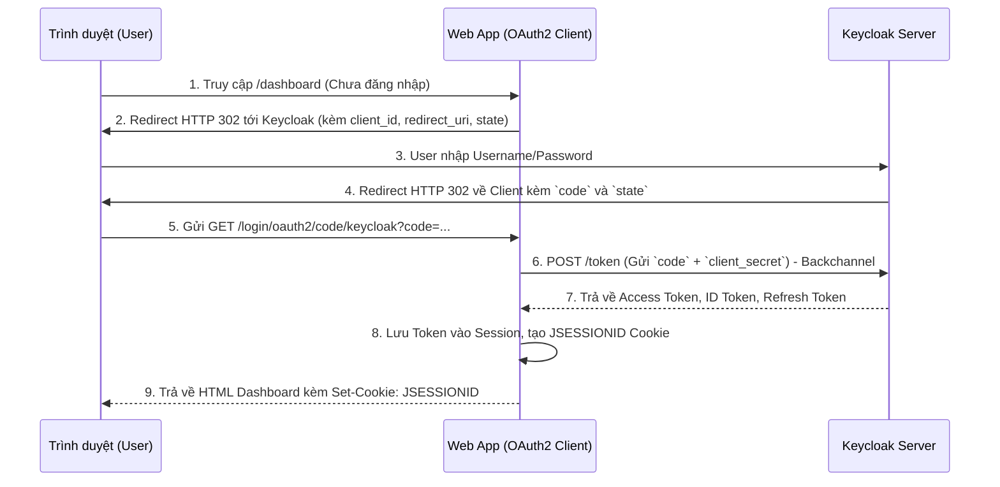

# Lesson 3: Project 03 - OAuth2 Client Integration

> [!NOTE]
> **Category:** Architecture/Design
> **Goal:** Tích hợp ứng dụng web truyền thống (Server-rendered app) với Keycloak sử dụng Authorization Code Flow, quản lý phiên làm việc (Session), và xử lý an toàn các token (Access Token, Refresh Token) ở phía Backend.

## 1. Lý thuyết chuyên sâu (Detailed Theory)

Trong hệ sinh thái OAuth2/OIDC, **OAuth2 Client** (hay Web App / Confidential Client) là ứng dụng có khả năng lưu trữ mã bí mật (`client_secret`) một cách an toàn trên Server. 

Không giống như các ứng dụng Single Page Application (React/Angular) chạy trên trình duyệt (Public Client), OAuth2 Client chạy trên Server (như Spring MVC, Django, Node.js Express). Do đó, luồng xác thực an toàn nhất và duy nhất nên dùng là **Authorization Code Flow** (có hoặc không có PKCE).

Quy trình bảo mật của OAuth2 Client bao gồm:
1. **Bảo mật Secret:** Client Secret tuyệt đối không bao giờ được gửi xuống trình duyệt.
2. **Quản lý Session:** Thay vì trả JWT về cho trình duyệt (như SPA thường làm), Server sẽ giữ Access/Refresh Token trong bộ nhớ hoặc Redis, và chỉ trả về cho trình duyệt một **Cookie Session ID** (ví dụ: `JSESSIONID`).
3. **Chống giả mạo:** Sử dụng `state` và `nonce` để chống lại các cuộc tấn công CSRF (Cross-Site Request Forgery) và Replay Attacks.

## 2. Luồng nội bộ & Cơ chế cấp thấp (Internal Workflow & Low-level Mechanisms)

Đây là luồng Authorization Code Flow kinh điển tích hợp giữa trình duyệt, OAuth2 Client (Spring MVC) và Keycloak:



> Điểm mấu chốt: **Trình duyệt hoàn toàn không biết đến sự tồn tại của JWT**. Trình duyệt chỉ giữ Cookie truyền thống. Mọi giao dịch về Token đều diễn ra ở kênh "Backchannel" giữa Web App và Keycloak.

## 3. Thực hành tốt nhất & Bảo mật (Best Practices & Security)

> [!IMPORTANT]
> **Không bao giờ chọn "Public Client" cho Server-side App**
> Khi tạo Client trên Keycloak cho ứng dụng Spring MVC/Node.js, bạn bắt buộc phải bật `Client authentication = ON` (tức là Confidential Client). Nếu tắt, ứng dụng của bạn sẽ bị hạ cấp xuống Public Client và mất đi lớp bảo mật bằng Client Secret.

> [!WARNING]
> **Tuyệt đối không lưu Token trong Cookie trần trụi**
> Một số kiến trúc sai lầm cố gắng nhét toàn bộ JWT vào Cookie để làm Stateless Web App. Điều này cực kỳ nguy hiểm vì JWT thường có kích thước lớn (gây lỗi 400 Bad Request Header) và nếu Cookie bị lộ, Hacker sẽ có cả JWT. Hãy dùng Session lưu trên Server (Memory/Redis) và chỉ lưu Session ID trong Cookie.

> [!TIP]
> **Tự động làm mới Token (Silent Refresh)**
> Access Token thường chỉ sống 5 phút. Khi Web App gọi API hộ User, nó cần tự động dùng Refresh Token để xin Access Token mới mà không bắt User đăng nhập lại. Spring Security hỗ trợ tính năng này hoàn toàn tự động qua `OAuth2AuthorizedClientManager`.

## 4. Cấu hình minh họa thực tế (Configuration Examples)

### 4.1. Cấu hình Keycloak
1. Tạo Client `my-web-app`.
2. **Client authentication**: `ON` (Xác thực Confidential).
3. **Valid redirect URIs**: `http://localhost:8080/login/oauth2/code/keycloak` (Đây là endpoint mặc định của Spring Security).
4. Qua tab **Credentials**, copy phần `Secret`.

### 4.2. Cấu hình Spring Boot (`application.yml`)
Trong Spring Boot, chúng ta cấu hình ứng dụng đóng vai trò là một OAuth2 Client:

```yaml
spring:
  security:
    oauth2:
      client:
        registration:
          keycloak:
            client-id: my-web-app
            client-secret: xxxx-yyyy-zzzz # Secret lấy từ Keycloak
            scope: openid, profile, email
            authorization-grant-type: authorization_code
            redirect-uri: "{baseUrl}/login/oauth2/code/{registrationId}"
        provider:
          keycloak:
            issuer-uri: http://localhost:8080/realms/myrealm
```

### 4.3. Code Controller trích xuất thông tin User
```java
@Controller
public class DashboardController {

    @GetMapping("/dashboard")
    public String dashboard(@AuthenticationPrincipal OidcUser oidcUser, Model model) {
        // oidcUser chứa toàn bộ thông tin từ ID Token
        model.addAttribute("name", oidcUser.getFullName());
        model.addAttribute("email", oidcUser.getEmail());
        return "dashboard"; // Trả về file HTML (Thymeleaf/Freemarker)
    }
}
```

## 5. Trường hợp ngoại lệ (Edge Cases)

### 5.1. Lỗi "State mismatch" hoặc "CSRF Attack Detected"
- **Vấn đề:** Khi Keycloak redirect về ứng dụng với `code` và `state`, ứng dụng (ví dụ Spring Security) báo lỗi không khớp `state`.
- **Giải pháp:** Lỗi này xảy ra 99% do Session bị mất trong quá trình Redirect. Nguyên nhân thường do trình duyệt block Cookie (như SameSite=Strict khi redirect khác domain), hoặc do Load Balancer không bật Sticky Session (ứng dụng nhận request login ở node A, nhưng lúc Keycloak trả về lại rơi vào node B). Cần dùng Redis để chia sẻ Session giữa các Node (Spring Session Redis).

### 5.2. Hết hạn Session nhưng Keycloak vẫn còn Session
- **Vấn đề:** User đã hết hạn JSESSIONID trên ứng dụng (sau 30 phút không dùng), ứng dụng đá User văng ra màn hình đăng nhập. Nhưng khi User bấm "Login", họ lập tức vào lại được luôn mà không cần gõ mật khẩu.
- **Giải pháp:** Vì Session trên Keycloak (SSO Session) có thời lượng dài hơn (thường 10 tiếng). Khi ứng dụng văng ra, Keycloak thấy SSO Cookie vẫn còn nên cấp luôn mã `code` mới. Để giải quyết, hãy đồng bộ thời gian timeout giữa ứng dụng và Keycloak, hoặc triển khai **Back-channel Logout**.

## 6. Câu hỏi Phỏng vấn (Interview Questions)

**1. (Junior) Tại sao các ứng dụng Web (Server-side) lại an toàn hơn ứng dụng SPA (Single Page Application) trong việc xử lý Token?**
- *Đáp án:* Ứng dụng Server-side (OAuth2 Client) được gọi là Confidential Client vì nó có thể giấu `client_secret` an toàn trên máy chủ. Mọi trao đổi mã `code` lấy `token` đều diễn ra ở kênh Backchannel (Server to Server), do đó Hacker không thể đánh cắp Access Token từ phía Frontend. Ngược lại SPA là Public Client, dễ bị tấn công XSS ăn cắp token.

**2. (Senior) Trong mô hình OAuth2 Client, nếu ứng dụng của bạn chạy trên 5 nodes đằng sau Load Balancer, bạn sẽ gặp phải vấn đề gì khi triển khai Authorization Code Flow?**
- *Đáp án:* Vấn đề lớn nhất là mất Session. Khi User bắt đầu luồng Login, Node 1 tạo ra một tham số `state` lưu vào Session bộ nhớ của nó. Khi Keycloak trả về `code` và `state`, Load Balancer có thể đẩy request sang Node 2. Node 2 không thấy `state` này trong bộ nhớ nên sẽ từ chối xác thực (CSRF protection). Giải pháp là bắt buộc phải lưu Session tập trung (ví dụ Redis) hoặc bật Sticky Session trên Load Balancer.

**3. (Senior) Làm thế nào để lấy được thông tin `Access Token` bên trong một Controller của Spring Boot để mang đi gọi một API khác?**
- *Đáp án:* Ta có thể Inject đối tượng `@RegisteredOAuth2AuthorizedClient` vào Controller. Spring Security sẽ tự động quản lý vòng đời của token. Nếu token hết hạn, nó sẽ tự động dùng Refresh Token để lấy token mới ở chế độ nền trước khi cung cấp cho Controller.

## 7. Tài liệu tham khảo (References)
- **Keycloak Documentation:** Server Administration Guide - OIDC Clients.
- **Spring Security Reference:** OAuth2 Client - Authorization Code Grant.
- **RFC 6749:** The OAuth 2.0 Authorization Framework.
