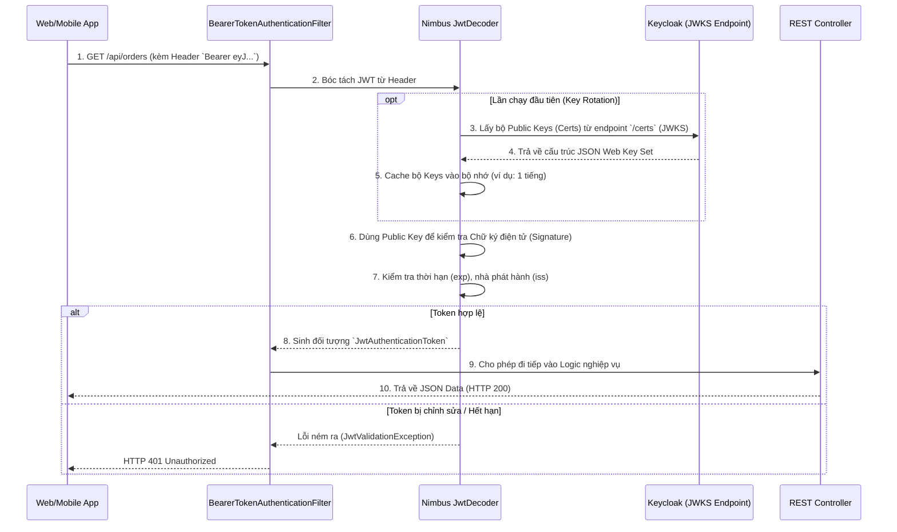

# Lesson 4: Project 04 - Spring Boot Resource Server

> [!NOTE]
> **Category:** Architecture/Design
> **Goal:** Cấu hình và thiết kế một API Backend (Resource Server) hoàn toàn vô trạng thái (Stateless) bằng Spring Boot. Backend này có khả năng tự động giải mã JWT, kiểm tra chữ ký điện tử, và bảo vệ tài nguyên thông qua các cơ chế phân quyền nâng cao.

## 1. Lý thuyết chuyên sâu (Detailed Theory)

Trong mô hình OAuth2, **Resource Server** (Máy chủ Tài nguyên) là nơi lưu trữ dữ liệu của người dùng và các API nghiệp vụ cốt lõi (ví dụ: `User Service`, `Payment Service`). Khác với OAuth2 Client, Resource Server có những đặc tính vô cùng đặc thù:

1. **Hoàn toàn vô trạng thái (Stateless):** Resource Server không quản lý Session. Nó không có form đăng nhập. Nó chỉ chấp nhận những Request HTTP có chứa header `Authorization: Bearer <Access_Token>`.
2. **Không giao tiếp trực tiếp với User:** User (Trình duyệt) không bao giờ chứng minh thân phận (nhập username/password) tại Resource Server. Trách nhiệm đó thuộc về Keycloak.
3. **Hai chiến lược xác thực (Validation Strategies):**
   - **Local JWT Validation:** Trích xuất Access Token (chuỗi JWT), tải Public Key của Keycloak về, và dùng thuật toán mã hóa (như RS256) để tự kiểm tra tính hợp lệ của chữ ký. Tốc độ cực nhanh và chịu tải cao.
   - **Remote Introspection:** Gửi Access Token ngược về một Endpoint của Keycloak (Introspection Endpoint) để hỏi xem Token này còn hiệu lực hay không. An toàn tuyệt đối nhưng độ trễ cao và phụ thuộc vào sự sống còn của Keycloak.

## 2. Luồng nội bộ & Cơ chế cấp thấp (Internal Workflow & Low-level Mechanisms)

Trong thực tế, kiến trúc **Local JWT Validation** được sử dụng trong 95% các dự án Microservices hiện đại nhờ khả năng chịu tải vượt trội (Decentralized Validation).

Luồng xác thực của Spring Security diễn ra tự động thông qua chuỗi Filter (Filter Chain) như sau:



## 3. Thực hành tốt nhất & Bảo mật (Best Practices & Security)

> [!IMPORTANT]
> **Kiểm tra đối tượng nhận Token (Audience Validation)**
> Một Access Token được cấp cho Client A (Ví dụ: Ứng dụng Di động) không được phép dùng để truy cập vào Resource Server B (Dịch vụ Thanh Toán) nếu B không nằm trong danh sách được phép. Mặc định Spring Boot **không kiểm tra** trường `aud` (Audience). Bạn bắt buộc phải cấu hình thêm một Custom Validator để kiểm tra trường `aud` trong JWT. Nếu không làm điều này, hệ thống của bạn sẽ mắc lỗi bảo mật cực kỳ nghiêm trọng mang tên *Confused Deputy Attack*.

> [!TIP]
> **Bộ nhớ đệm JWKS (JWKS Caching)**
> Mặc định thư viện Nimbus (nền tảng của Spring Security) đã có cơ chế tự động lấy và Cache JWKS (JSON Web Key Set). Tuy nhiên, bạn nên cấu hình lại thời gian lưu Cache (ví dụ 24h) và thời gian timeout kết nối mạng (Connect Timeout = 3s) để tránh trường hợp mạng nội bộ nghẽn khiến API của bạn bị treo (Hanging) khi cố gắng gọi Keycloak lấy Key.

> [!WARNING]
> **Cẩn trọng với Remote Introspection**
> Nếu dự án của bạn chọn cách gọi ngược về Keycloak (Opaque Token/Introspection) để check Token, bạn sẽ tạo ra **Nút thắt cổ chai (Bottleneck)**. Nếu hệ thống có 10,000 requests/s, Keycloak cũng phải nhận thêm 10,000 requests/s chỉ để hỏi "Token này sống hay chết". Nó có thể làm sập Keycloak. Luôn ưu tiên dùng Local JWT Validation.

## 4. Cấu hình minh họa thực tế (Configuration Examples)

### 4.1. Cấu hình `application.yml`
Thiết lập đường dẫn chứa Public Key (JWKS) từ Keycloak. Spring Boot sẽ tự động đến đây để tải Key.

```yaml
spring:
  security:
    oauth2:
      resourceserver:
        jwt:
          issuer-uri: http://localhost:8080/realms/myrealm
          # Spring Boot tự động suy ra JWKS URI là: http://localhost:8080/realms/myrealm/protocol/openid-connect/certs
```

### 4.2. Cấu hình Security Filter Chain
```java
@Configuration
@EnableWebSecurity
public class ResourceServerConfig {

    @Bean
    public SecurityFilterChain filterChain(HttpSecurity http) throws Exception {
        http
            .authorizeHttpRequests(authz -> authz
                .requestMatchers("/api/public/**").permitAll()
                .requestMatchers("/api/admin/**").hasRole("ADMIN")
                .anyRequest().authenticated()
            )
            .oauth2ResourceServer(oauth2 -> oauth2
                .jwt(Customizer.withDefaults()) // Kích hoạt bộ giải mã JWT
            )
            .sessionManagement(session -> session
                .sessionCreationPolicy(SessionCreationPolicy.STATELESS) // TUYỆT ĐỐI không tạo Session cho API
            );
            
        return http.build();
    }
}
```

## 5. Trường hợp ngoại lệ (Edge Cases)

### 5.1. Clock Skew (Sai lệch đồng hồ hệ thống)
- **Vấn đề:** Máy chủ Keycloak tạo ra Token có thời hạn (exp) 5 phút. Do máy chủ chạy Resource Server chạy sai đồng hồ (nhanh hơn máy chủ Keycloak 10 giây). Kết quả là ngay khi Token vừa được tạo ra, Spring Boot đã lập tức báo lỗi `JwtExpiredException`.
- **Giải pháp:** Sử dụng công cụ đồng bộ thời gian (NTP/Chrony) cho toàn bộ máy chủ. Ngoài ra, trong Spring Security, cấu hình bộ đệm thời gian (Clock Skew) khoảng 60 giây để cho phép độ trễ mạng và độ trễ đồng hồ: `OAuth2TokenValidator<Jwt> withClockSkew = new DelegatingOAuth2TokenValidator<>(new JwtTimestampValidator(Duration.ofSeconds(60)));`

### 5.2. Chìa khóa bị xoay vòng (Key Rotation)
- **Vấn đề:** Để tăng cường bảo mật, Quản trị viên thay đổi cặp khóa mã hóa RSA (Key Pairs) trên Keycloak. Những Access Token vừa được sinh ra sẽ dùng Key mới. Tuy nhiên Resource Server vẫn đang Cache Key cũ. Kết quả là mọi Request đều bị trả về `401 Unauthorized` vì sai chữ ký.
- **Giải pháp:** Cơ chế mặc định của thư viện Nimbus (Spring Boot) rất thông minh. Khi giải mã JWT, nó sẽ đọc trường `kid` (Key ID) trên Header của JWT. Nếu nó thấy `kid` này chưa từng tồn tại trong Cache, nó sẽ TỰ ĐỘNG bỏ Cache và gọi lại endpoint `/certs` của Keycloak để cập nhật danh sách Key mới ngay lập tức. Tính năng này gọi là *Lazy JWKS retrieval*.

## 6. Câu hỏi Phỏng vấn (Interview Questions)

**1. (Junior) Phân biệt sự khác nhau giữa vai trò của OAuth2 Client và Resource Server?**
- *Đáp án:* OAuth2 Client là ứng dụng chủ động khởi tạo quy trình xin cấp Token (redirect user đi đăng nhập, trao đổi mã lấy token). Ngược lại, Resource Server là một thực thể bị động; nó không xin cấp token, nó chỉ đứng im chờ các Request có đính kèm Access Token bay vào, sau đó phân tích tính hợp lệ của Token để quyết định có cho phép truy cập dữ liệu hay không.

**2. (Senior) Spring Boot Resource Server xác thực chữ ký (Signature) của JWT như thế nào mà không cần bạn phải copy file `public.pem` vào thư mục resources?**
- *Đáp án:* Thông qua cơ chế JWKS (JSON Web Key Set). Dựa vào cấu hình `issuer-uri`, Spring Boot sẽ truy cập vào endpoint chuẩn của OIDC (`/.well-known/openid-configuration`) để tìm đường dẫn tới endpoint `/certs`. Endpoint này cung cấp các Public Keys dưới định dạng JWK. Khi có Request, Spring Boot sẽ tải các Key này về lưu trong bộ nhớ (Cache). Khi nhận JWT, nó dùng trường `kid` trong Token Header để tìm Key tương ứng, sau đó dùng thuật toán (RS256) xác minh nội dung của Token có bị giả mạo hay không mà không cần bất kỳ file tĩnh nào.

## 7. Tài liệu tham khảo (References)
- **Spring Security Reference:** OAuth2 Resource Server JWT Architecture.
- **RFC 7517:** JSON Web Key (JWK).
- **RFC 9068:** JSON Web Token (JWT) Profile for OAuth 2.0 Access Tokens.
