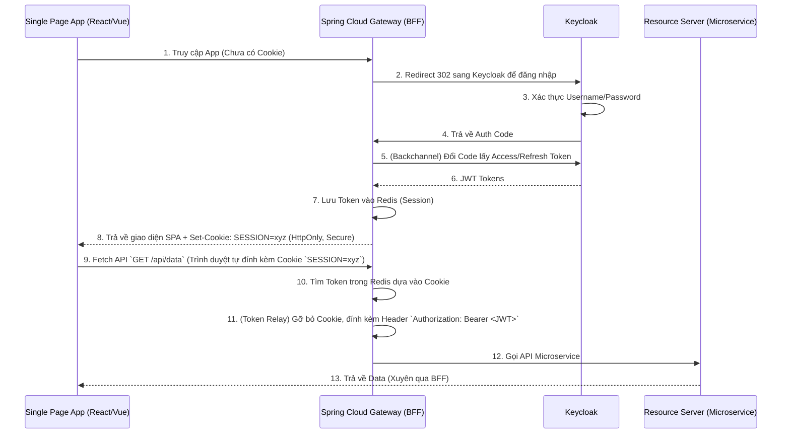

# Lesson 5: Project 05 - Backend-For-Frontend (BFF) Architecture

> [!NOTE]
> **Category:** Architecture/Design
> **Goal:** Thiết kế và ứng dụng kiến trúc Backend-For-Frontend (BFF) kết hợp mô hình Token Handler Pattern, nhằm khắc phục triệt để lỗ hổng bảo mật khi triển khai Single Page Applications (SPA - React, Angular, Vue) cùng với Keycloak.

## 1. Lý thuyết chuyên sâu (Detailed Theory)

Các ứng dụng Single Page Application (SPA) truyền thống khi tích hợp OAuth2/OIDC thường tự mình đóng vai trò là một **Public Client**. Chúng phải tự thực hiện luồng *Authorization Code Flow with PKCE*, lấy Access Token về và lưu trữ trực tiếp trên trình duyệt (thường là trong `LocalStorage` hoặc `SessionStorage`). 

Kiến trúc truyền thống này chứa đựng rủi ro chí mạng: **Trình duyệt không phải là két sắt**. Bất kỳ một lỗ hổng **XSS (Cross-Site Scripting)** nào (do bạn chèn nhầm thẻ script mã độc từ bên thứ ba, hoặc lỗ hổng từ thư viện npm) cũng có thể đọc được LocalStorage và đánh cắp Token của người dùng.

Để giải quyết vấn đề này, IETF và giới chuyên gia bảo mật đề xuất kiến trúc **BFF (Backend-For-Frontend)** kết hợp **Token Handler Pattern**:
1. Đẩy toàn bộ trách nhiệm giao tiếp với Keycloak ra khỏi trình duyệt. Đưa nó cho một Server đứng trung gian (BFF).
2. Khi User đăng nhập, BFF (đóng vai trò Confidential Client) sẽ làm việc với Keycloak để lấy JWT.
3. Thay vì gửi JWT về cho SPA, BFF giữ JWT lại trong Memory/Redis của mình. Nó chỉ gửi về cho SPA một mã định danh Session tĩnh thông qua **HttpOnly Cookie**.
4. Vì HttpOnly Cookie không thể bị đọc bởi JavaScript, SPA hoàn toàn miễn nhiễm với việc bị ăn cắp Token qua XSS.

## 2. Luồng nội bộ & Cơ chế cấp thấp (Internal Workflow & Low-level Mechanisms)

Kiến trúc BFF chuyển đổi sự phức tạp từ trình duyệt sang hạ tầng Backend. Dưới đây là sơ đồ luồng hoạt động chuẩn xác:



## 3. Thực hành tốt nhất & Bảo mật (Best Practices & Security)

> [!IMPORTANT]
> **Cấu hình Cookie Cực kỳ Nghiêm ngặt**
> Cookie trả về từ BFF phải luôn được đánh dấu là `HttpOnly` (chống XSS) và `Secure` (chỉ chạy trên HTTPS). Hơn nữa, để chống lại CSRF (Cross-Site Request Forgery), phải bật cờ `SameSite=Strict` hoặc `Lax`. Điều này ngăn chặn các trang web độc hại mượn danh Cookie của bạn để gửi Request tới BFF.

> [!WARNING]
> **Không nhồi nhét Business Logic vào BFF**
> Chữ "Backend" trong "Backend-For-Frontend" rất dễ gây hiểu lầm. BFF không nên chứa bất kỳ logic tính toán, truy xuất database hay nghiệp vụ cốt lõi nào. Hãy xem BFF đơn thuần như một chiếc **Proxy dịch dịch ngôn ngữ** (Dịch từ Cookie của Frontend thành JWT cho Backend). Hãy giữ BFF càng mỏng càng tốt.

> [!TIP]
> **Tránh kiến trúc Stateless BFF (Lưu Token trực tiếp vào Cookie)**
> Một số nơi thiết kế BFF bằng cách mã hóa Access Token + Refresh Token và nhét toàn bộ vào một Cookie trả về cho User để không phải dùng Redis. Đây là Bad Practice vì dung lượng Cookie có giới hạn 4KB. Nếu Token quá dài, Cookie sẽ bị cắt xén gây lỗi ứng dụng. Hãy dùng Stateful BFF (lưu Token trên Redis).

## 4. Cấu hình minh họa thực tế (Configuration Examples)

Ứng dụng **Spring Cloud Gateway** là ứng viên xuất sắc nhất cho vai trò BFF trong hệ sinh thái Java. Nó vừa đóng vai trò là OAuth2 Client (giao tiếp với Keycloak), vừa làm Proxy (chuyển tiếp Request).

Cấu hình `application.yml` cho Spring Cloud Gateway BFF:
```yaml
spring:
  cloud:
    gateway:
      routes:
        - id: resource-server-route
          uri: http://localhost:8081 # API đích (Microservice)
          predicates:
            - Path=/api/**
          filters:
            - TokenRelay= # PHÉP THUẬT NẰM Ở ĐÂY: Tự động đổi Cookie thành Bearer Token
  security:
    oauth2:
      client:
        registration:
          keycloak:
            client-id: bff-client
            client-secret: secret-123
            scope: openid
            authorization-grant-type: authorization_code
            redirect-uri: "{baseUrl}/login/oauth2/code/keycloak"
        provider:
          keycloak:
            issuer-uri: http://localhost:8080/realms/myrealm
```

Chỉ với Filter `TokenRelay`, Spring Cloud Gateway sẽ tự động phát hiện Cookie, tìm Access Token tương ứng trong Session, dán vào Header `Authorization` và chuyển tiếp cho Microservice.

## 5. Trường hợp ngoại lệ (Edge Cases)

### 5.1. CSRF Attack trong môi trường BFF
- **Vấn đề:** Mặc dù HttpOnly Cookie chống lại XSS xuất sắc, nhưng nó lại mở ra nguy cơ CSRF (Kẻ tấn công lừa trình duyệt gửi lệnh xóa tài khoản).
- **Giải pháp:** Nếu bạn sử dụng API dạng REST (Fetch/Axios) từ SPA gọi lên BFF, hãy áp dụng giải pháp **CSRF Token** truyền thống (Header `X-CSRF-TOKEN`), kết hợp với cờ `SameSite` trên Cookie. Đừng bỏ quên chống CSRF chỉ vì bạn dùng OAuth2.

### 5.2. CORS Conflict (Lỗi khác Nguồn gốc)
- **Vấn đề:** Nếu SPA của bạn host ở `https://app.mycompany.com` còn BFF host ở `https://api.mycompany.com`, trình duyệt sẽ coi đây là giao tiếp Cross-Origin. Khi đó, Cookie `SameSite=Strict` có thể không hoạt động hoặc bị thả rớt.
- **Giải pháp:** Xây dựng cấu trúc "Single Origin". Sử dụng Nginx cấu hình Reverse Proxy sao cho cả thư mục tĩnh của SPA và các API endpoint của BFF đều chung một domain. Ví dụ Nginx trỏ `/` vào file HTML của SPA, và trỏ `/api` vào BFF.

## 6. Câu hỏi Phỏng vấn (Interview Questions)

**1. (Junior) Tại sao các chuyên gia lại khuyên SPA không nên tự lấy JWT từ Keycloak nữa mà phải thông qua BFF?**
- *Đáp án:* Do trình duyệt không phải môi trường an toàn (Public Client). Các thư viện Frontend như `keycloak-js` lưu Token trong LocalStorage hoặc biến cục bộ. Nếu có lỗi XSS, mã độc có thể vét sạch token và chiếm quyền điều khiển tài khoản của user (Session Hijacking). BFF chuyển Token về môi trường Server an toàn và chỉ cung cấp cho trình duyệt một HttpOnly Cookie không thể bị mã độc JavaScript đọc.

**2. (Senior) Spring Cloud Gateway khi cấu hình làm BFF sử dụng `TokenRelayGatewayFilterFactory`. Nếu Access Token trong Session bị hết hạn, bộ Filter này xử lý như thế nào?**
- *Đáp án:* Filter `TokenRelay` hoạt động kết hợp với `OAuth2AuthorizedClientManager` của Spring Security. Khi một Request bay vào và nó thấy Access Token hiện tại đã hết hạn, Spring sẽ tự động "đóng băng" request đó lại, dùng Refresh Token (vốn đang cất trong Redis/Session) âm thầm gọi lên Keycloak lấy cặp Token mới. Sau khi có Token mới, nó lưu lại vào Cache và tiếp tục chuyển tiếp (Relay) request xuống Microservice. Toàn bộ quá trình này hoàn toàn trong suốt với Frontend (Silent Refresh).

## 7. Tài liệu tham khảo (References)
- **IETF OAuth 2.0 for Browser-Based Apps (BCP):** Best Current Practice recommendations for SPA security.
- **Spring Cloud Gateway:** Token Relay Documentation.
- **Pattern: Backend For Frontend:** by Sam Newman (Microservices.io).
