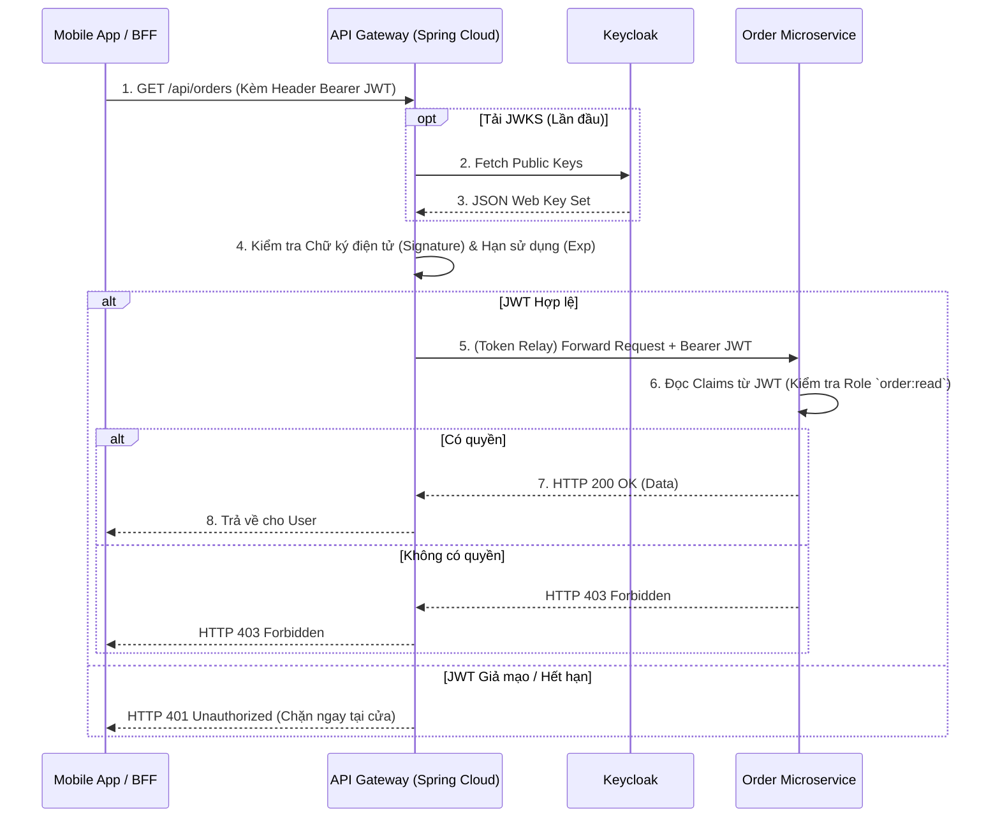

# Lesson 6: Project 06 - API Gateway Integration

> [!NOTE]
> **Category:** Architecture/Design
> **Goal:** Thiết kế và cấu hình API Gateway (như Spring Cloud Gateway) đóng vai trò làm điểm kiểm soát an ninh biên (Edge Security), tập trung hóa việc xác thực JWT từ Keycloak trước khi định tuyến luồng dữ liệu xuống các Microservices nội bộ.

## 1. Lý thuyết chuyên sâu (Detailed Theory)

Trong một hệ thống Microservices quy mô doanh nghiệp, việc để hàng chục, hàng trăm Microservices mở trực tiếp ra Internet là một thảm họa bảo mật. **API Gateway** ra đời để đóng vai trò là "Cửa ngõ duy nhất" (Single Entry Point) cho toàn bộ hệ thống. 

Khi kết hợp API Gateway với Keycloak, chúng ta áp dụng mô hình **Edge Security** (Bảo mật tại biên):
- **Tập trung hóa Xác thực (Centralized Authentication):** Thay vì mỗi Microservice tự tốn tài nguyên tải Public Key từ Keycloak về để kiểm tra JWT, API Gateway sẽ đứng ra làm nhiệm vụ gác cổng. Bất kỳ Request nào không có JWT, hoặc JWT hết hạn, sai chữ ký, sẽ bị chặn đứng ngay tại cửa ngõ.
- **Ủy quyền Phân quyền (Delegated Authorization):** API Gateway **chỉ nên** làm nhiệm vụ kiểm tra "Thẻ căn cước có giả mạo không?" (Authentication). Nó không nên và không được phép biết "Người này có quyền sửa hóa đơn không?". Việc phân quyền chi tiết (RBAC) phải được đẩy xuống cho từng Microservice tự quyết định dựa trên các Claims có trong Token.
- **Token Relay (Chuyển tiếp Token):** Sau khi xác nhận JWT là hàng thật, API Gateway sẽ đóng gói Request và mang nguyên xi JWT đó chuyển tiếp (Relay) xuống cho các Microservices nội bộ.

*Lưu ý:* Cần phân biệt rõ API Gateway và BFF (Backend-For-Frontend). BFF thường đi liền với một Frontend cụ thể để quản lý Cookie/Session. Còn API Gateway thuần túy nhận `Authorization: Bearer <JWT>` từ Mobile App, từ các đối tác thứ ba (B2B), hoặc từ chính các cụm BFF.

## 2. Luồng nội bộ & Cơ chế cấp thấp (Internal Workflow & Low-level Mechanisms)

Sơ đồ dưới đây mô tả sự phân chia trách nhiệm giữa API Gateway (Authentication) và Microservices (Authorization):



## 3. Thực hành tốt nhất & Bảo mật (Best Practices & Security)

> [!IMPORTANT]
> **Không cấu hình RBAC phức tạp tại API Gateway**
> Nếu bạn cố gắng nhét các cấu hình kiểu như "Đường dẫn `/api/orders` cần Role `admin`, đường dẫn `/api/payments` cần Role `finance`" vào API Gateway, file cấu hình của Gateway sẽ phình to thành một mớ hỗn độn (Spaghetti Config). Gateway sẽ bị Coupling (gắn chặt) với nghiệp vụ của Microservices. Hãy giữ Gateway "ngu ngốc" về mặt nghiệp vụ: Nó chỉ kiểm tra tính xác thực (Authentication). Việc ai được làm gì hãy để Microservice đó tự kiểm tra bằng mã lệnh Spring Security của riêng nó.

> [!TIP]
> **Kết hợp Rate Limiting theo User ID (sub)**
> Vì API Gateway đã bóc JWT để kiểm tra chữ ký, nó có thể dễ dàng lấy ra trường `sub` (User ID của Keycloak). Bạn nên kết hợp Redis Rate Limiter tại Gateway để giới hạn "Mỗi User ID chỉ được gọi tối đa 100 requests/giây". Điều này bảo vệ hệ thống khỏi các cuộc tấn công DDoS có chủ đích từ các tài khoản bị lộ.

> [!WARNING]
> **Bảo mật mạng nội bộ (Internal Network)**
> Mặc dù Gateway đã kiểm tra Token, các Microservice nằm phía sau nó vẫn KHÔNG ĐƯỢC PHÉP tin tưởng mù quáng. Kẻ thù có thể ở ngay bên trong mạng nội bộ (Zero Trust Architecture). Các Microservice vẫn phải tự cấu hình thành một Resource Server độc lập, tự xác thực lại chữ ký JWT một lần nữa. Đây là chuẩn an ninh quốc phòng (Defense in Depth).

## 4. Cấu hình minh họa thực tế (Configuration Examples)

Spring Cloud Gateway sử dụng kiến trúc WebFlux (Non-blocking). Việc cấu hình nó làm Resource Server sẽ hơi khác so với Spring Web MVC truyền thống.

### 4.1. Cấu hình `application.yml`
```yaml
spring:
  cloud:
    gateway:
      routes:
        - id: order-service
          uri: lb://order-service # Cân bằng tải nội bộ
          predicates:
            - Path=/api/orders/**
          filters:
            - TokenRelay= # Chuyển tiếp JWT xuống Order Service
  security:
    oauth2:
      resourceserver:
        jwt:
          issuer-uri: http://keycloak:8080/realms/myrealm # Nguồn tải JWKS
```

### 4.2. Java Config cho SecurityWebFilterChain (Reactive)
Bắt buộc toàn bộ các luồng đi qua Gateway đều phải có JWT hợp lệ.

```java
@Configuration
@EnableWebFluxSecurity
public class GatewaySecurityConfig {

    @Bean
    public SecurityWebFilterChain springSecurityFilterChain(ServerHttpSecurity http) {
        http
            .authorizeExchange(exchanges -> exchanges
                // Cho phép mở các endpoint Health Check hoặc Swagger
                .pathMatchers("/actuator/**", "/swagger-ui/**").permitAll()
                // Bắt buộc mọi Request đi vào Gateway phải có Token (Authentication)
                .anyExchange().authenticated() 
            )
            .oauth2ResourceServer(oauth2 -> oauth2
                .jwt(Customizer.withDefaults())
            )
            // Tắt CSRF vì API Gateway là Stateless (Chỉ xài Bearer Token)
            .csrf(ServerHttpSecurity.CsrfSpec::disable); 
            
        return http.build();
    }
}
```

## 5. Trường hợp ngoại lệ (Edge Cases)

### 5.1. Token phình to làm sập Gateway (Header Size Exceeded)
- **Vấn đề:** Khi ứng dụng thiết kế quá nhiều Role, Access Token có thể phình to lên 10KB. Spring Boot và Netty (Server ngầm của WebFlux) thường có giới hạn max header size là 8KB. Request sẽ bị từ chối với lỗi HTTP 431 (Request Header Fields Too Large).
- **Giải pháp:** Trong `application.yml` của Gateway, bạn cần tăng giới hạn kích thước Header của Netty/Tomcat lên: `server.max-http-request-header-size: 16384`. Đồng thời, tối ưu lại Keycloak Protocol Mappers để không nhét rác vào Token.

### 5.2. Mất kết nối tới Keycloak lúc khởi động
- **Vấn đề:** Nếu lúc Gateway vừa khởi động lên mà Keycloak đang bị sập hoặc chưa khởi động xong, Gateway không lấy được JWKS và sẽ văng lỗi Crash (Startup Failed).
- **Giải pháp:** Không sử dụng thư viện ép tải JWKS lúc khởi động. Mặc định Spring Boot sử dụng "Lazy loading" (chỉ tải Key khi có Request đầu tiên bay vào), giúp Gateway khởi động thành công và chịu đựng được khoảng thời gian Keycloak đang khởi động lại (Resilience).

## 6. Câu hỏi Phỏng vấn (Interview Questions)

**1. (Junior) Tại sao nên triển khai việc xác minh chữ ký điện tử (Authentication) ngay tại API Gateway thay vì để Request bay thẳng vào Microservice rồi mới xác minh?**
- *Đáp án:* Làm như vậy gọi là Edge Security. Nó giúp tiết kiệm tài nguyên mạng và băng thông nội bộ bằng cách "bóp chết" các Request độc hại, sai token, hoặc hết hạn ngay tại biên của hệ thống. Microservices phía sau sẽ không phải phí tài nguyên CPU để xử lý các request rác này.

**2. (Senior) Mọi người nói "Authentication ở Gateway, Authorization ở Microservice". Bạn có thể phân tích ưu và nhược điểm của triết lý này? Liệu tôi có thể đưa luôn Authorization (RBAC) lên Gateway được không?**
- *Đáp án:* 
  - **Ưu điểm:** Giúp Gateway giữ được tính Generic (Tổng quát), không bị Coupling với logic nghiệp vụ. Developer của từng Service tự quản lý quyền `hasRole('...')` trong code của mình, dễ maintain.
  - **Nhược điểm:** Mỗi Microservice vẫn phải tốn CPU để parse JWT và kiểm tra Role một lần nữa.
  - **Nếu đưa Authorization lên Gateway:** Được. Nhưng Gateway sẽ phình to thành một "cục Monolith" về mặt cấu hình. Mỗi khi Service A thêm một Role mới, DevOps lại phải nhảy vào sửa file Route của Gateway, vi phạm nguyên tắc tự trị (Autonomy) của Microservices. Trừ khi dùng Open Policy Agent (OPA), còn không thì không nên đưa Authorization lên Gateway.

## 7. Tài liệu tham khảo (References)
- **Spring Cloud Gateway:** Securing Services with Spring Cloud Gateway.
- **Microservices.io:** API Gateway Pattern.
- **OAuth 2.0:** Token Relay Pattern.
