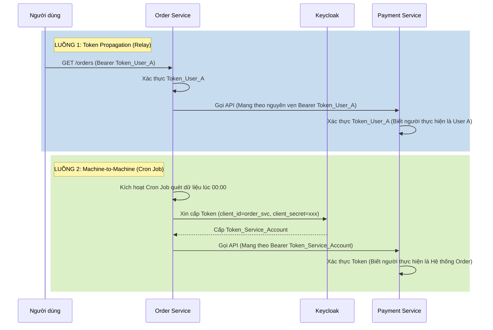

# Lesson 7: Project 07 - Microservices Integration

> [!NOTE]
> **Category:** Architecture/Design
> **Goal:** Thiết kế và triển khai cơ chế giao tiếp an toàn giữa các Microservices nội bộ (Service-to-Service Communication) sử dụng Keycloak, bao gồm hai chiến lược cốt lõi: Token Propagation (Chuyển tiếp Token) và Machine-to-Machine (M2M / Client Credentials).

## 1. Lý thuyết chuyên sâu (Detailed Theory)

Trong hệ thống Microservices, một yêu cầu (Request) từ người dùng có thể kích hoạt một chuỗi các lệnh gọi API nội bộ. Ví dụ: Người dùng gọi `Order Service` -> `Order Service` gọi `Payment Service` -> `Payment Service` gọi `Notification Service`.

Trọng tâm của bảo mật Microservices là giải quyết câu hỏi: **Khi Service A gọi Service B, làm sao Service B biết được ai đang thực hiện hành động này và có quyền hay không?** (Mô hình Zero Trust Architecture).

Để giải quyết, Keycloak và chuẩn OAuth2 cung cấp hai chiến lược:

1. **Token Propagation (Relay / Pass-through):** `Order Service` nhận được Access Token của User (Ví dụ: Nguyễn Văn A), nó sẽ lấy y nguyên chuỗi Token này và nhét vào Header khi gọi `Payment Service`. Chiến lược này bắt buộc khi Service B cần biết danh tính thực sự của User để thực thi nghiệp vụ (ví dụ: trừ tiền của anh A).
2. **Machine-to-Machine (M2M / Client Credentials):** Được dùng khi cuộc gọi không có sự tương tác của User (ví dụ: Một Cron Job chạy ban đêm trên `Order Service` để quét đơn hàng trễ hạn). Lúc này, `Order Service` sẽ đóng vai trò là một Hệ thống Độc lập, dùng `client_id` và `client_secret` của chính nó gọi lên Keycloak lấy một Access Token riêng (gọi là Service Account Token), rồi dùng Token này để gọi `Notification Service`.

## 2. Luồng nội bộ & Cơ chế cấp thấp (Internal Workflow & Low-level Mechanisms)

Sơ đồ dưới đây minh họa sự khác biệt rõ rệt giữa hai luồng Token Relay và Machine-to-Machine.



## 3. Thực hành tốt nhất & Bảo mật (Best Practices & Security)

> [!IMPORTANT]
> **Bộ đệm Token M2M (M2M Token Caching)**
> Khi áp dụng mô hình Client Credentials, nếu `Order Service` phải gọi `Payment Service` 1000 lần/giây, nó KHÔNG ĐƯỢC PHÉP gọi lên Keycloak 1000 lần/giây để lấy Access Token. Phải lưu Access Token này trong Memory (Cache) và sử dụng lại cho đến khi sắp hết hạn. Spring Boot cung cấp sẵn tính năng tự động này thông qua `OAuth2AuthorizedClientManager`.

> [!WARNING]
> **Bảo vệ Client Secret của Service Account**
> Trong mô hình M2M, `client_secret` chính là "Mật khẩu" của Microservice. Tuyệt đối không được Hardcode chuỗi này trong mã nguồn (Git). Hãy truyền nó qua Biến môi trường (Environment Variables) hoặc sử dụng các kho lưu trữ bảo mật như HashiCorp Vault, Kubernetes Secrets.

> [!TIP]
> **Nguyên tắc Đặc quyền tối thiểu (Least Privilege)**
> Khi tạo một Client trên Keycloak cho `Order Service` để gọi các Service khác, hãy tạo các Role thật sự hẹp (ví dụ: `payment:write`, `notification:send`). Không cấp quyền `admin` cho các Service Account này để tránh rủi ro "Leo thang đặc quyền" (Privilege Escalation) nếu `Order Service` bị hacker chiếm quyền điều khiển.

## 4. Cấu hình minh họa thực tế (Configuration Examples)

### 4.1. Cấu hình Token Relay với FeignClient (Spring Cloud)
Trong Spring Boot, thay vì code tay để bóc JWT ra và gắn vào Request gửi đi, ta cấu hình một `RequestInterceptor` để làm việc này tự động cho mọi lời gọi Feign:

```java
@Configuration
public class FeignConfig {
    @Bean
    public RequestInterceptor requestInterceptor() {
        return requestTemplate -> {
            // Lấy Authentication của Request đang chạy hiện tại
            Authentication authentication = SecurityContextHolder.getContext().getAuthentication();
            
            if (authentication instanceof JwtAuthenticationToken jwtAuth) {
                // Rút trích chuỗi Access Token nguyên bản
                String tokenValue = jwtAuth.getToken().getTokenValue();
                // Tự động gắn vào Header của lời gọi Feign
                requestTemplate.header(HttpHeaders.AUTHORIZATION, "Bearer " + tokenValue);
            }
        };
    }
}
```

### 4.2. Cấu hình Machine-to-Machine với WebClient
Sử dụng Spring WebClient để tự động gọi Keycloak lấy M2M Token và gửi request đi.
Cấu hình `application.yml`:
```yaml
spring:
  security:
    oauth2:
      client:
        registration:
          internal-m2m:
            client-id: order-service
            client-secret: ${ORDER_SVC_SECRET} # Lấy từ ENV
            authorization-grant-type: client_credentials
        provider:
          internal-m2m:
            token-uri: http://keycloak:8080/realms/myrealm/protocol/openid-connect/token
```

## 5. Trường hợp ngoại lệ (Edge Cases)

### 5.1. Lỗi hết hạn Token dọc đường (In-flight Expiration)
- **Vấn đề:** User gửi Token (còn 2 giây là hết hạn) tới API Gateway. Gateway check OK, đẩy sang Service A. Service A xử lý logic nghiệp vụ mất 3 giây. Sau đó A dùng Token này gọi sang Service B. Lúc này Token đã quá hạn, Service B từ chối và ném ra lỗi `401 Unauthorized`.
- **Giải pháp:** Nếu Service A nhận thấy Token sắp hết hạn (cần parse Claims trước), nó nên chủ động dùng Refresh Token (nếu có) để lấy Access Token mới trước khi gọi Service B. Tuy nhiên, đơn giản hơn là thêm một độ dung sai (Clock Skew) khoảng 60 giây ở tất cả các Resource Servers để cho phép các sai số nhỏ này.

### 5.2. Missing Audience (Thiếu đối tượng thụ hưởng)
- **Vấn đề:** Service B từ chối Token do trường `aud` (Audience) trong JWT không trỏ tới Service B. Token Relay bị thất bại dù chữ ký hoàn toàn hợp lệ.
- **Giải pháp:** Khi User đăng nhập ban đầu để lấy Access Token, User cần yêu cầu Keycloak cấp thêm các scope tương ứng với các Downstream Services (ví dụ: `scope=payment_api`). Keycloak sẽ dùng Protocol Mapper để chèn tên `payment_service` vào trường `aud` của Token, giúp Token hợp lệ khi Relay sang Service B.

## 6. Câu hỏi Phỏng vấn (Interview Questions)

**1. (Junior) Khi thiết kế 2 Microservices cần gọi nhau, làm sao để bạn quyết định lúc nào dùng Token Propagation, lúc nào dùng Client Credentials?**
- *Đáp án:* 
  - Dùng **Token Propagation** khi nghiệp vụ của hệ thống đích (Service B) phụ thuộc vào thông tin của User. Ví dụ: Service B cần biết "User ID nào đang mua hàng?" để lưu vào Database.
  - Dùng **Client Credentials** khi nghiệp vụ hoàn toàn diễn ra ở chế độ Background (nền), không có người dùng tương tác trực tiếp, như Hệ thống gửi Email hàng loạt, hoặc cron job tổng hợp báo cáo.

**2. (Senior) Bạn đang dùng Token Relay (mang JWT của User từ Service A sang Service B). Tuy nhiên JWT gốc quá lớn (chứa hàng đống Role rác). Giải pháp của bạn là gì để không làm nghẽn băng thông giữa các Microservices?**
- *Đáp án:* Sử dụng mô hình **Token Exchange** (RFC 8693) do Keycloak hỗ trợ. Thay vì lấy y nguyên cái JWT bự chảng truyền sang Service B, Service A sẽ gửi JWT đó cho Keycloak để "đổi" lấy một JWT mới nhỏ gọn hơn, được cắt xén riêng (downscoped) chỉ chứa những Role tối thiểu đủ để gọi Service B. Điều này tăng bảo mật (hạn chế bộc lộ thông tin) và giảm băng thông.

## 7. Tài liệu tham khảo (References)
- **Spring Cloud OpenFeign:** OAuth2 Support.
- **OAuth 2.0 Client Credentials Grant:** RFC 6749 Section 4.4.
- **Keycloak Documentation:** Service Accounts và Token Exchange.
