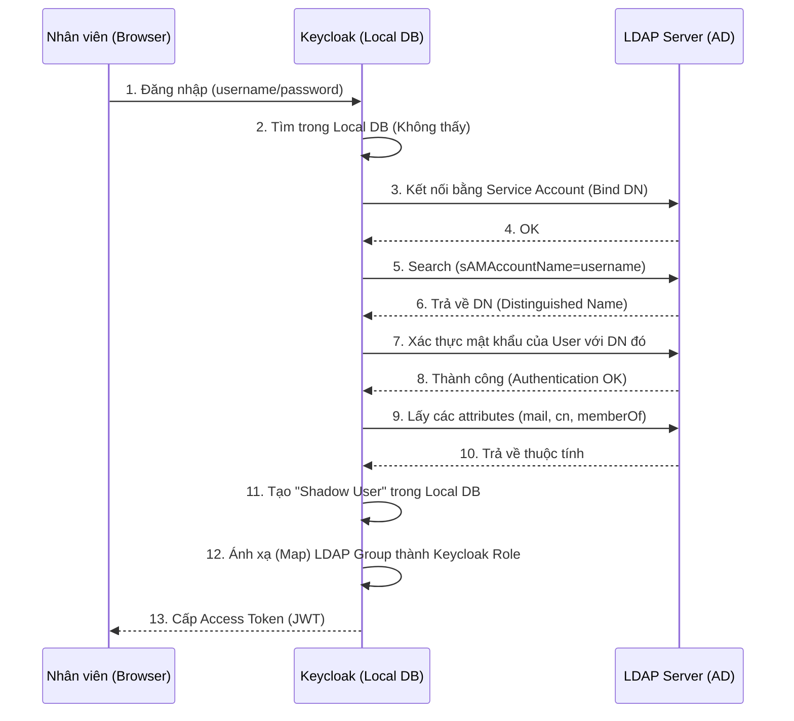

# Lesson 8: Project 08 - Enterprise LDAP Integration

> [!NOTE]
> **Category:** Integration/Enterprise
> **Goal:** Cấu hình và tích hợp Keycloak với hệ thống danh bạ chuẩn doanh nghiệp (Enterprise Directory) thông qua giao thức LDAP/Active Directory, bao gồm ánh xạ thuộc tính (Attribute Mapping) và đồng bộ hóa (Synchronization).

## 1. Lý thuyết chuyên sâu (Detailed Theory)

Trong các tập đoàn hoặc doanh nghiệp lớn, danh sách nhân viên thường được quản lý tập trung bằng **Microsoft Active Directory (AD)** hoặc **OpenLDAP**. Thay vì yêu cầu phòng IT phải tạo lại hàng nghìn tài khoản thủ công trên Keycloak, Keycloak cung cấp một tính năng cực kỳ mạnh mẽ gọi là **User Federation** (Liên kết Người dùng).

Thông qua User Federation bằng giao thức LDAP, Keycloak đóng vai trò như một cầu nối. Khi người dùng đăng nhập:
1. Keycloak có thể xác thực mật khẩu trực tiếp trên máy chủ LDAP (bằng cơ chế LDAP Bind).
2. Keycloak kéo các thông tin cá nhân (email, họ tên, phòng ban) từ LDAP về.
3. Chế độ **Edit Mode** quyết định chiều lưu lượng dữ liệu:
   - **READ_ONLY:** Keycloak chỉ được đọc. Người dùng không thể đổi mật khẩu qua Keycloak.
   - **WRITABLE:** Keycloak có thể ghi ngược dữ liệu (ví dụ đổi mật khẩu, sửa tên) về lại LDAP Server.
   - **UNSYNCED:** Import dữ liệu một lần duy nhất, sau đó hai hệ thống tự chạy song song không liên quan đến nhau.

Đặc tính quan trọng nhất của User Federation là khái niệm **"Shadow User"** (Người dùng bóng). Khi một nhân viên đăng nhập thành công qua LDAP, Keycloak sẽ tự động copy dữ liệu của người đó và tạo ra một bản ghi trong Database cục bộ của Keycloak. Điều này giúp Keycloak cấp token nhanh hơn ở lần sau mà không cần liên tục chọc vào LDAP.

## 2. Luồng nội bộ & Cơ chế cấp thấp (Internal Workflow & Low-level Mechanisms)

Sơ đồ sau mô tả luồng xác thực (Authentication) và Đồng bộ (Sync) diễn ra dưới hệ thống:

## 3. Thực hành tốt nhất & Bảo mật (Best Practices & Security)

> [!IMPORTANT]
> **Bộ lọc LDAP nghiêm ngặt (Custom User LDAP Filter)**
> Tuyệt đối KHÔNG cấu hình LDAP mà không có bộ lọc (Filter). Trong các doanh nghiệp, danh bạ LDAP chứa hàng chục nghìn thực thể bao gồm máy in, máy tính, tài khoản hệ thống (system accounts), tài khoản đã nghỉ việc. Nếu Keycloak kéo toàn bộ đống rác này về, Database sẽ bị phình to (Bloat) và làm chậm toàn bộ hệ thống. 
> *Ví dụ Filter tốt (chỉ lấy user đang hoạt động):* `(&(objectClass=person)(!(userAccountControl:1.2.840.113556.1.4.803:=2)))`

> [!WARNING]
> **Giới hạn số lượng kết nối (Connection Pooling)**
> Giao tiếp qua mạng với LDAP Server thường có độ trễ lớn. Nếu có 1000 users đăng nhập cùng lúc, Keycloak sẽ mở 1000 kết nối TCP tới LDAP làm sập luôn máy chủ LDAP của phòng IT. Luôn bật **Connection Pooling** trong cài đặt Provider và giới hạn Max Connections (thường từ 50 đến 100) để đảm bảo độ ổn định.

> [!TIP]
> **Chiến lược Đồng bộ (Sync Strategy)**
> Keycloak hỗ trợ **Full Sync** (kéo toàn bộ) và **Changed Users Sync** (chỉ kéo người bị thay đổi). Không nên chạy Full Sync vào ban ngày. Hãy cấu hình Full Sync chạy vào 2 giờ sáng (Cron: `0 2 * * *`), và Changed Sync chạy mỗi 15 phút.

## 4. Cấu hình minh họa thực tế (Configuration Examples)

Dưới đây là các thông số kinh điển khi tích hợp Microsoft Active Directory vào Keycloak.

### 4.1. Cài đặt LDAP Provider
- **Vendor:** `Active Directory`
- **Connection URL:** `ldaps://ad.mycompany.local:636` (BẮT BUỘC dùng LDAPS có mã hóa TLS)
- **Users DN:** `OU=Employees,DC=mycompany,DC=local` (Trỏ đúng vào thư mục chứa nhân viên)
- **Bind DN:** `CN=KeycloakService,OU=ServiceAccounts,DC=mycompany,DC=local`
- **Bind Credential:** `********` (Mật khẩu của tài khoản service)
- **Edit Mode:** `READ_ONLY`

### 4.2. Cấu hình Mappers (Ánh xạ)
Tạo các Mapper để biến dữ liệu thô của LDAP thành dữ liệu chuẩn của Keycloak:
1. **Email Mapper (User Attribute):** 
   - LDAP Attribute: `mail`
   - User Model Attribute: `email`
2. **First Name Mapper (User Attribute):**
   - LDAP Attribute: `givenName`
   - User Model Attribute: `firstName`
3. **Group Mapper (Chuyển AD Group thành Keycloak Group):**
   - LDAP Groups DN: `OU=Groups,DC=mycompany,DC=local`
   - Mapped Group Attributes: Lấy `memberOf` ánh xạ thành Group của User.

## 5. Trường hợp ngoại lệ (Edge Cases)

### 5.1. Người dùng đổi mật khẩu trên AD nhưng đăng nhập Keycloak bằng mật khẩu cũ vẫn vào được!
- **Vấn đề:** Do sự chậm trễ của bộ nhớ đệm (Cache) trong Keycloak. Hoặc nguy hiểm hơn, cấu hình Keycloak đang bật `Import Users` và `Sync Registrations` bị sai, khiến mật khẩu bị lưu (Hash) vào Database nội bộ của Keycloak thay vì đi hỏi lại LDAP.
- **Giải pháp:** Nếu muốn quản trị mật khẩu tập trung 100% tại LDAP, KHÔNG ĐƯỢC bật cờ cấu hình đồng bộ hóa mật khẩu xuống Keycloak. Hãy thiết lập chính sách Cache (Eviction Policy) cho Users về `Max Lifespan = 5 mins` để bắt Keycloak phải kiểm tra lại mật khẩu thường xuyên.

### 5.2. Chặn tài khoản nhân viên nghỉ việc
- **Vấn đề:** Một nhân viên đã nghỉ việc, phòng IT đã khóa tài khoản (Disabled) trên AD. Tuy nhiên Session của họ (Access Token và SSO Session) trên Keycloak vẫn còn hạn sử dụng (ví dụ 10 tiếng), họ vẫn có thể truy cập hệ thống.
- **Giải pháp:** Active Directory sử dụng thuộc tính `userAccountControl` để cờ hóa trạng thái Disabled. Bạn phải cấu hình một Mapper đặc biệt gọi là **MSAD User Account Control Mapper** trên Keycloak. Mapper này sẽ liên tục chớp trạng thái từ AD. Nếu thấy bị Disable, Keycloak sẽ lập tức Revoke toàn bộ các Session đang có của người dùng này trên hệ thống.

## 6. Câu hỏi Phỏng vấn (Interview Questions)

**1. (Junior) Sự khác biệt giữa Identity Provider (IdP) như Google/Facebook và User Federation (LDAP) trong Keycloak là gì?**
- *Đáp án:* 
  - Khi dùng **IdP (Google)**, Keycloak chuyển hướng (Redirect) trình duyệt của User sang Google. Google tự hiển thị giao diện bắt User nhập Username/Password. Keycloak không hề biết mật khẩu của User.
  - Khi dùng **User Federation (LDAP)**, Keycloak tự hiển thị giao diện bắt nhập Username/Password, sau đó Keycloak mang thông tin đó đâm xuyên qua hệ thống mạng nội bộ để hỏi máy chủ LDAP (Bind credentials).

**2. (Senior) Tại sao tính năng "Shadow User" (Copy dữ liệu từ LDAP về Local DB) lại là một con dao hai lưỡi khi thiết kế hệ thống?**
- *Đáp án:* 
  - **Lợi ích:** Keycloak có thể tùy ý gắn thêm các Roles nội bộ, gắn thêm các thuộc tính riêng (như Avatar URL) vào Shadow User mà không cần xin phép sửa đổi cấu trúc máy chủ LDAP gốc của phòng IT. Hơn nữa, nó giúp tăng tốc độ tìm kiếm User.
  - **Tác hại:** Rủi ro "Dữ liệu bị lỗi thời" (Stale Data). Nếu phòng IT đổi tên nhân viên trên LDAP, nhưng lịch đồng bộ của Keycloak (Sync) bị lỗi, thì tên trên các phần mềm dùng Keycloak vẫn sẽ là tên cũ. Ngoài ra, việc lưu trữ thông tin hàng triệu User từ LDAP vào Database của Keycloak (PostgreSQL) có thể tốn kém tài nguyên. Để giải quyết, Keycloak cho phép tắt cờ `Import Users`, tuy nhiên điều này sẽ làm sập tính năng tìm kiếm user trên màn hình Admin.

## 7. Tài liệu tham khảo (References)
- **Keycloak Documentation:** Server Administration Guide - User Storage Federation.
- **RFC 4511:** Lightweight Directory Access Protocol (LDAP) Version 3.
