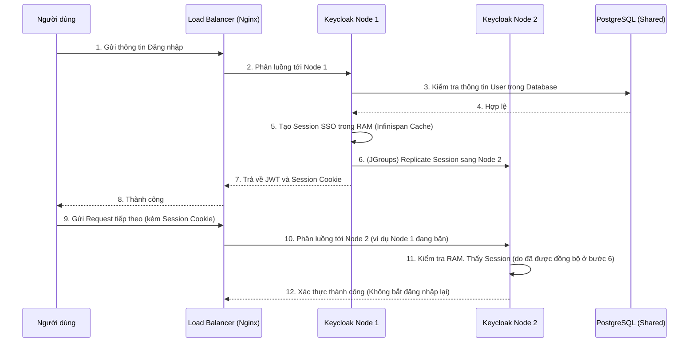

# Lesson 9: Project 09 - High Availability (HA) Cluster

> [!NOTE]
> **Category:** Infrastructure/Deployment
> **Goal:** Cấu hình và triển khai cụm Keycloak Sẵn sàng cao (High Availability - HA) với nhiều Node chạy song song, giải quyết bài toán đồng bộ Session thông qua bộ đệm phân tán Infinispan và JGroups.

## 1. Lý thuyết chuyên sâu (Detailed Theory)

Khi số lượng người dùng hệ thống (CCU - Concurrent Users) tăng cao, hoặc khi hệ thống yêu cầu độ tin cậy tuyệt đối (Zero Downtime), việc chạy một máy chủ Keycloak duy nhất (Standalone) là không thể chấp nhận được. Giải pháp là chạy nhiều phiên bản (Instances / Nodes) Keycloak phía sau một Load Balancer.

Tuy nhiên, thách thức lớn nhất khi chạy cụm (Cluster) là bài toán **Trạng thái (State)**:
- Nếu User đăng nhập ở Node A, Session (Phiên làm việc) của họ được lưu trong RAM của Node A.
- Nếu Load Balancer điều hướng request tiếp theo của User đó sang Node B, Node B không thấy Session trong RAM của mình, nó sẽ bắt User đăng nhập lại.

Để giải quyết, Keycloak không sử dụng Redis. Nó tích hợp sâu một công nghệ bộ nhớ đệm phân tán (Distributed Cache) cực kỳ mạnh mẽ của hệ sinh thái Java là **Infinispan**. 

Infinispan sử dụng giao thức mạng **JGroups** để các Node Keycloak tự động "nhìn thấy nhau" (Discovery) và kết nối với nhau thành một cụm. Mọi Session, Brute-force Login Logs, và Action Tokens được tạo ra ở Node A sẽ lập tức được JGroups đồng bộ mạng ngang hàng (P2P) sang Node B và Node C.

## 2. Luồng nội bộ & Cơ chế cấp thấp (Internal Workflow & Low-level Mechanisms)

Sơ đồ dưới đây mô tả sự tương tác giữa Load Balancer, các Node Keycloak và cơ chế đồng bộ Infinispan:



## 3. Thực hành tốt nhất & Bảo mật (Best Practices & Security)

> [!IMPORTANT]
> **Bắt buộc dùng Sticky Sessions trên Load Balancer**
> Dù Infinispan có khả năng đồng bộ dữ liệu tuyệt vời, tài liệu chính thức của Keycloak vẫn **khuyến cáo cực kỳ mạnh mẽ** việc bật Sticky Session (Session Affinity) trên Load Balancer. Khi bật tính năng này, Nginx sẽ ghi nhớ Node 1 đã phục vụ User A, và sẽ dồn mọi request tiếp theo của User A về đúng Node 1. Điều này giúp tránh được độ trễ mạng khi các Node phải chép dữ liệu cho nhau liên tục để phục vụ chéo.

> [!TIP]
> **Lựa chọn Giao thức khám phá (Discovery Protocol) đúng môi trường**
> Để các Node tìm thấy nhau, JGroups dùng các giao thức `PING`. Mặc định Keycloak dùng `PING` dựa trên UDP Multicast. Tuy nhiên, 99% các môi trường Public Cloud (AWS, Azure) hoặc Docker Bridge **chặn gói tin Multicast**. Trong môi trường Cloud/Docker, bắt buộc phải đổi sang **`JDBC_PING`** (Dùng chung Database làm điểm danh) hoặc **`DNS_PING`** (Dành riêng cho Kubernetes).

> [!WARNING]
> **Giới hạn số lượng bản sao (Number of Owners)**
> Mặc định, bộ đệm (Cache) của Keycloak được cấu hình với `owners=2`. Nghĩa là một Session chỉ được lưu trữ ở 2 Node, dù bạn có chạy cụm 10 Node đi chăng nữa. Đây là sự đánh đổi giữa hiệu năng và tính sẵn sàng cao. Đừng bao giờ cấu hình `owners=10` vì việc đồng bộ Session lên 10 máy chủ cùng lúc sẽ bóp nghẹt băng thông mạng và làm sập toàn bộ hệ thống.

## 4. Cấu hình minh họa thực tế (Configuration Examples)

Dưới đây là kiến trúc cấu hình cụm Keycloak sử dụng `JDBC_PING` (Hoạt động tốt trong mọi môi trường Docker/Cloud vì nó dùng chung Database để tìm nhau).

### 4.1. Khởi chạy Keycloak Node 1 và Node 2
Sử dụng các cờ cấu hình sau khi khởi động file `kc.sh`:

```bash
# Lệnh build bắt buộc phải khai báo bộ đệm là ispn (Infinispan)
bin/kc.sh build --cache=ispn

# Khởi động Node 1
bin/kc.sh start \
  --db=postgres --db-url=jdbc:postgresql://db:5432/keycloak \
  --cache-stack=tcp \
  -Dkc.spi-connections-jpa-default-migration-strategy=update \
  -Djgroups.dns.query=keycloak-cluster # Hoặc dùng cấu hình XML cho JDBC_PING

# Khởi động Node 2 tương tự
```

### 4.2. Cấu hình Nginx (Load Balancer) với Sticky Session
Sử dụng thuật toán `ip_hash` để định tuyến request của một IP cụ thể luôn trỏ vào một Node cố định.

```nginx
upstream keycloak_backend {
    ip_hash; # Sticky Session dựa trên IP của User
    server 192.168.1.10:8080; # Node 1
    server 192.168.1.11:8080; # Node 2
}

server {
    listen 443 ssl;
    server_name sso.mycompany.com;

    location / {
        proxy_pass http://keycloak_backend;
        proxy_set_header X-Forwarded-For $proxy_add_x_forwarded_for;
        proxy_set_header X-Forwarded-Proto $scheme;
    }
}
```

## 5. Trường hợp ngoại lệ (Edge Cases)

### 5.1. Hội chứng Phân não (Split-Brain Syndrome)
- **Vấn đề:** Mạng LAN nội bộ chập chờn, khiến kết nối JGroups giữa Node 1 và Node 2 bị đứt, nhưng cả hai Node vẫn kết nối được tới Load Balancer và Database. Cụm Keycloak bị chẻ làm hai (Split-Brain). Mỗi Node tự bầu mình làm "Trưởng cụm" (Coordinator) và tiếp tục tạo Session mới. Khi mạng LAN có lại, hai cụm gộp lại gây xung đột Cache khủng khiếp, làm văng toàn bộ người dùng đang online.
- **Giải pháp:** Cấu hình luật ghép cụm (Merge Policy) cẩn thận trong file cấu hình XML của Infinispan. Đồng thời theo dõi sát sao biểu đồ mạng. Một kiến trúc tốt yêu cầu phải có ít nhất 3 Node để thuật toán "Đa số biểu quyết" (Quorum) có thể loại bỏ Node bị lỗi mạng ra khỏi cụm.

### 5.2. Chết cụm vì quá tải Database (Connection Pool Exhaustion)
- **Vấn đề:** Bạn chạy cụm 5 Node Keycloak. Mỗi Node cấu hình `db-pool-max-size=100`. Tổng cộng 5 Node có thể chiếm dụng tới 500 kết nối đồng thời vào PostgreSQL. Máy chủ PostgreSQL mặc định chỉ cho phép `max_connections=100`. Kết quả là các Node Keycloak bị tranh giành kết nối Database và treo toàn tập.
- **Giải pháp:** Sử dụng công cụ Pooling trung gian như `PgBouncer` đặt trước PostgreSQL. Đồng thời tính toán lại: `Total Keycloak Connections` không bao giờ được vượt quá `DB max_connections`.

## 6. Câu hỏi Phỏng vấn (Interview Questions)

**1. (Junior) Tại sao Keycloak không dùng Redis làm bộ nhớ đệm phân tán (Distributed Cache) như các ứng dụng Node.js hay Spring Boot khác mà lại dùng Infinispan?**
- *Đáp án:* Infinispan là một giải pháp In-Memory Data Grid viết bằng Java, tích hợp siêu sâu (embedded) vào bên trong chính tiến trình (process) chạy Keycloak. Nó sử dụng RAM của chính máy chủ Keycloak để đồng bộ với nhau qua JGroups. Không cần phải bảo trì thêm một cụm máy chủ Redis riêng biệt rườm rà. Ngoài ra, độ trễ khi lấy dữ liệu trên RAM cục bộ của Infinispan là cực thấp so với việc gọi mạng ra Redis.

**2. (Senior) Bạn thiết lập một cụm Keycloak 3 nodes bằng Docker Compose. Bạn cấu hình Load Balancer chĩa vào 3 nodes. Nhưng bạn nhận thấy cứ thi thoảng F5 trang web, User lại bị văng ra yêu cầu đăng nhập lại. Chuyện gì đang xảy ra?**
- *Đáp án:* Có 2 nguyên nhân đang cùng xảy ra. 
  1. Các Node Keycloak **chưa thực sự kết nối được với nhau thành cụm**. Môi trường Docker Bridge mặc định không hỗ trợ UDP Multicast, nên giao thức PING không hoạt động. Giải pháp là chuyển sang JDBC_PING.
  2. Load Balancer **không có Sticky Session**. Nginx đang dùng thuật toán Round Robin. Request 1 chọc vào Node A (đăng nhập thành công, session nằm trên RAM Node A). Request 2 chọc vào Node B. Do Node B chưa nối cụm với Node A nên nó không thấy session, bắt đăng nhập lại. Giải pháp là bật `ip_hash` hoặc khắc phục ngay vấn đề kết nối cụm JGroups.

## 7. Tài liệu tham khảo (References)
- **Keycloak Documentation:** Configuring highly available clusters.
- **JGroups Documentation:** Reliable Multicast Communication.
- **Infinispan:** Distributed In-Memory Key/Value Data Store.
